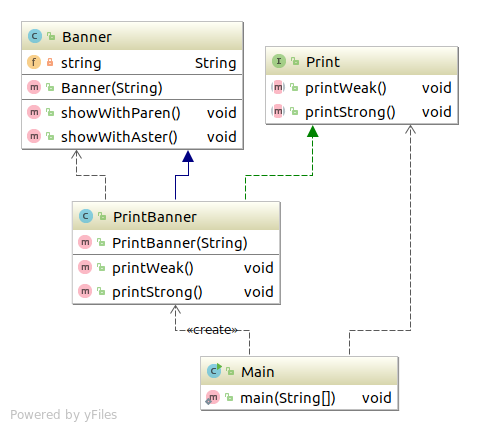
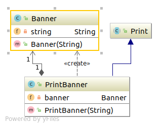

# Adapter模式
加个 "适配器" 以便复用
Adapter模式也被称为Wrapper(包装器)模式。

Adapter模式
	类适配器模式(使用继承的适配器)
	对象适配器模式(使用委托的适配器)

***
## 类适配器模式(使用继承的适配器)
### 类图


### code
#### Print
``` java
package com.sean.Adapter.a;

public interface Print {
	public abstract void printWeak();
	public abstract void printStrong();
}
```
#### Banner
``` java
package com.sean.Adapter.a;

public class Banner {
	private String string;
	public Banner(String string){
		this.string=string;
	}
	public void showWithParen(){
		System.out.println("("+string+")");
	}
	public void showWithAster(){
		System.out.println("*"+string+"*");
	}
}
```
#### PrintBanner
``` java
package com.sean.Adapter.a;

public class PrintBanner extends Banner implements Print {

	public PrintBanner(String string){
		super(string);
	}
	public void printWeak() {
		showWithParen();
	}

	public void printStrong() {
		showWithAster();
	}

}
```

#### Main

``` java
package com.sean.Adapter.a;

public class Main {
	
	public static void main(String[] args) {
		Print print =  new PrintBanner("Hello");
		print.printWeak();
		print.printStrong();

	}

}

```

## 对象适配器模式(使用委托的适配器)

### 类图


### code

#### Banner
``` java
package com.sean.Adapter.b;

public class Banner {
	private String string;
	public Banner(String string){
		this.string=string;
	}
	public void showWithParen(){
		System.out.println("("+string+")");
	}
	public void showWithAster(){
		System.out.println("*"+string+"*");
	}

}

```
#### Print
``` java
package com.sean.Adapter.b;

public abstract class Print {
	public abstract void printWeak();
	public abstract void printStrong();
}

```
#### PrintBanner
``` java
package com.sean.Adapter.b;

public class PrintBanner extends Print {
	private Banner banner;
	public PrintBanner(String string){
		this.banner = new Banner(string);
	}
	@Override
	public void printWeak() {
		// TODO Auto-generated method stub
		banner.showWithParen();

	}

	@Override
	public void printStrong() {
		// TODO Auto-generated method stub
		banner.showWithAster();
	}

}
```

## 要点

Adapter模式会对现有的类进行适配，生成行的类。
版本的升级与兼容需要用到Adapter模式。
适配！适配！就是给需要的类配对一个合适的插口。

## 参照
> 《图解设计模式》


写这个只是为了加深自己对设计模式的理解，如不明白，可以看 《图解设计模式》。
程序类图使用idea 生成的
