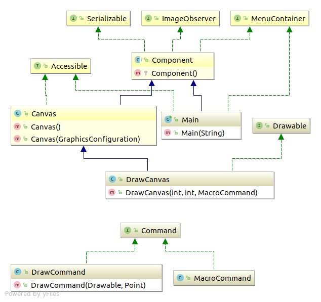
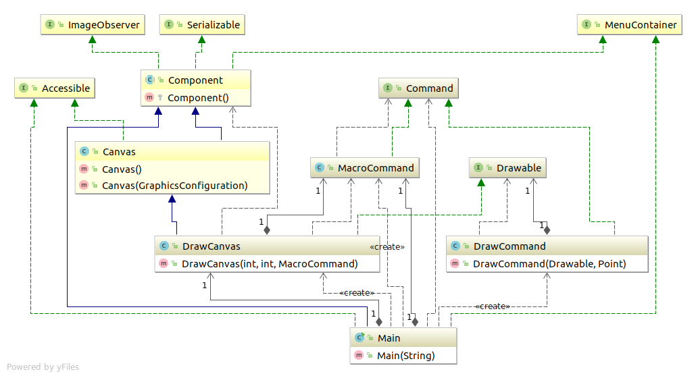

# Command模式
命令也是类

---

## 类表
| 包 | 类名 | 说明 |
|-----|--------|-------|
| command | Command | 表示**命令**的接口 |
| command | MacroCommand | 表示 **由多条命令整合成的命令** 的类 |
| drawer | DrawCommand | 表示 **绘制一个点的命令** 的类 |
| drawer | Drawable | 表示 **绘制对象** 的接口 |
| drawer | DrawCanvas | 实现 **绘制对象** 的类 |
|  无名 | Main | 测试程序行为的类 |


## 类图
粗略一点的


详细一点


## code
### Command
``` java
package com.sean.Command.command;

public interface Command {

	public abstract void execute(); 
}

```
### MacroCommand
``` java
package com.sean.Command.command;

import java.util.Iterator;
import java.util.Stack;

public class MacroCommand implements Command {
	private Stack commands = new Stack();
	
	public void execute() {
		Iterator it=commands.iterator();
		while(it.hasNext()){
			((Command)it.next()).execute();
		}

	}
	public void append(Command command){
		if(command != this){
			commands.push(command);
		}
	}
	//删除最后一条命令
	public void undo(){
		if(!commands.empty()){
			commands.pop();
		}
	}
	//删除所有命令
	public void clear(){
		commands.clear();
	}

}
```

### Drawable
``` java
package com.sean.Command.drawer;

public interface Drawable {
	public abstract void draw(int x,int y);
}

```
### DrawCanvas
``` java
package com.sean.Command.drawer;

import java.awt.Canvas;
import java.awt.Color;
import java.awt.Graphics;

import com.sean.Command.command.MacroCommand;

public class DrawCanvas extends Canvas implements Drawable {
	//颜色
	private Color color =Color.red;
	//绘制圆点半径
	private int radius=6;
	//命令的历史记录
	private MacroCommand history;
	public DrawCanvas(int width,int height,MacroCommand history){
		setSize(width, height);
		setBackground(Color.WHITE);
		this.history=history;
	}
	//重新全部绘制
	public void paint(Graphics g){
		history.execute();
	}
	public void draw(int x, int y) {
		Graphics g=getGraphics();
		g.setColor(color);
		g.fillOval(x-radius, y-radius, radius*2, radius*2);
	}

}

```
### DrawCommand
``` java
package com.sean.Command.drawer;

import java.awt.Point;

import com.sean.Command.command.Command;

public class DrawCommand implements Command {

	//绘制对象
	protected Drawable drawable;
	//绘制位置
	private Point position;
	public DrawCommand(Drawable drawable,Point position ){
		this.drawable=drawable;
		this.position=position;
	}
	public void execute() {
		
		drawable.draw(position.x, position.y);
	}

}

```
### Main
``` java
package com.sean.Command;

import java.awt.event.ActionEvent;
import java.awt.event.ActionListener;
import java.awt.event.MouseEvent;
import java.awt.event.MouseMotionListener;
import java.awt.event.WindowEvent;
import java.awt.event.WindowListener;

import javax.swing.Box;
import javax.swing.BoxLayout;
import javax.swing.JButton;
import javax.swing.JFrame;

import com.sean.Command.command.Command;
import com.sean.Command.command.MacroCommand;
import com.sean.Command.drawer.DrawCanvas;
import com.sean.Command.drawer.DrawCommand;

public class Main extends JFrame implements ActionListener,
		MouseMotionListener, WindowListener {

	//绘制的历史记录
	private MacroCommand history=new MacroCommand();
	//绘制区域
	private DrawCanvas canvas=new DrawCanvas(400,400,history);
	
	//删除按钮
	private JButton clearButton=new JButton("clear");
	
	//构造函数
	public Main(String title){
		super(title);
		
		this.addWindowListener(this);
		canvas.addMouseMotionListener(this);
		clearButton.addActionListener(this);
		
		Box buttonBox=new Box(BoxLayout.X_AXIS);
		buttonBox.add(clearButton);
		Box mainBox=new Box(BoxLayout.Y_AXIS);
		
		mainBox.add(buttonBox);
		mainBox.add(canvas);
		getContentPane().add(mainBox);
		
		pack();
		show();
	}
	
	public void windowOpened(WindowEvent e) {
		
	}
	public void windowClosing(WindowEvent e) {
		System.exit(0);
	}
	public void windowClosed(WindowEvent e) {
		

	}
	public void windowIconified(WindowEvent e) {
		
	}
	public void windowDeiconified(WindowEvent e) {
	
	}
	public void windowActivated(WindowEvent e) {
		

	}
	public void windowDeactivated(WindowEvent e) {
		

	}

	public void mouseDragged(MouseEvent e) {
		Command command=new DrawCommand(canvas,e.getPoint());
		history.append(command);
		command.execute();

	}

	public void mouseMoved(MouseEvent e) {
	

	}

	public void actionPerformed(ActionEvent e) {
		if(e.getSource()==clearButton){
			history.clear();
			canvas.repaint();
		}
	}
	public static void main(String[] args){
		new Main("Command Pattern");
	}
}

```

## 参照
> 《图解设计模式》


写这个只是为了加深自己对设计模式的理解，如不明白，可以看 《图解设计模式》。
程序类图使用idea 生成的
