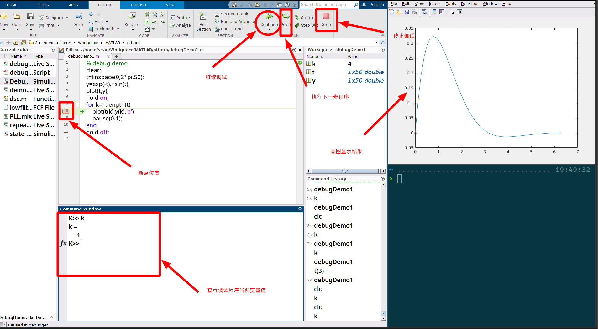
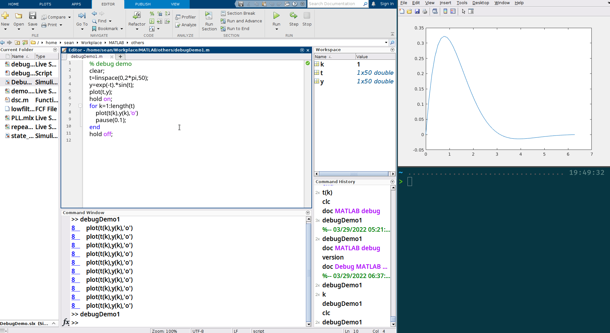
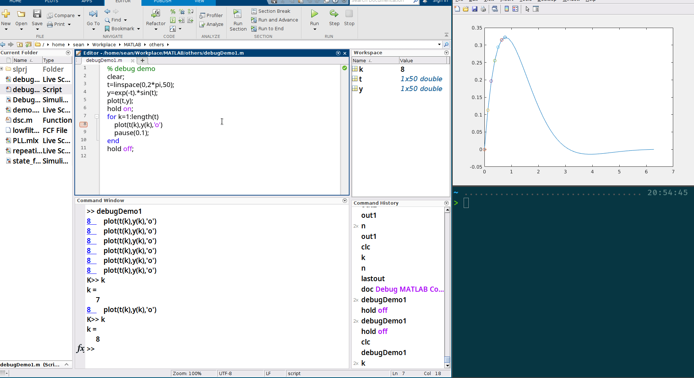
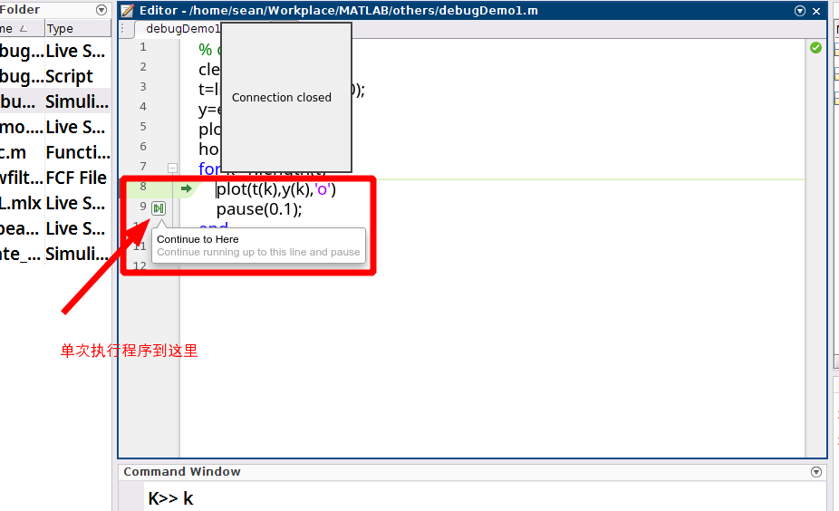
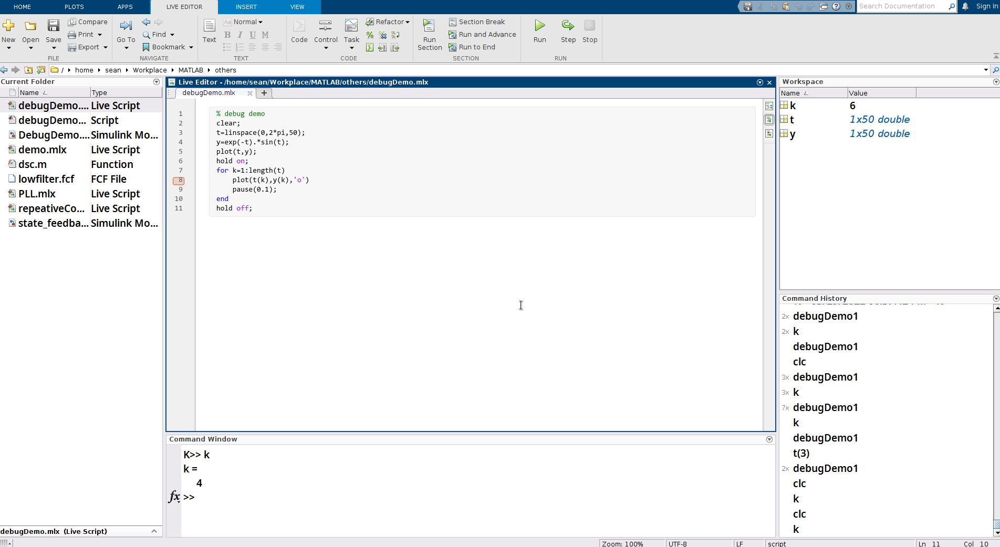
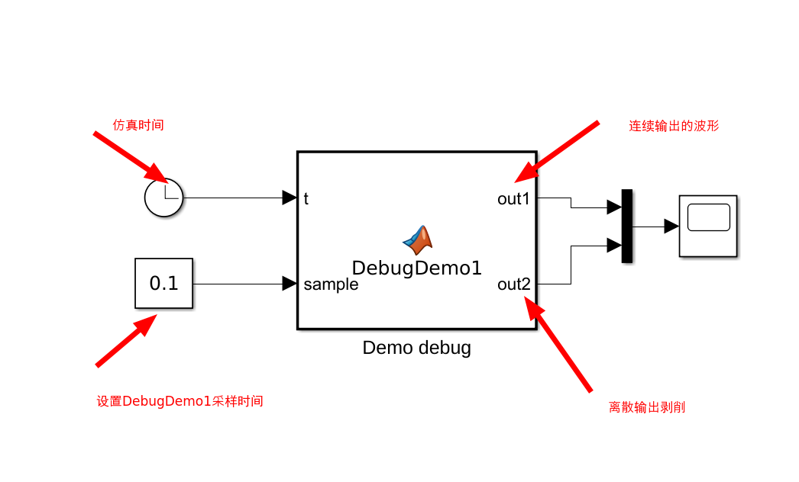
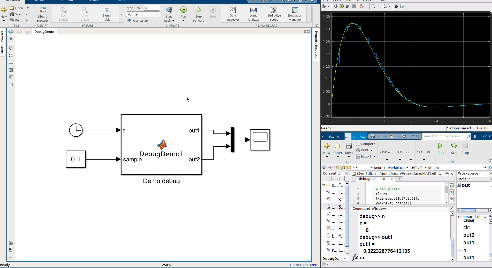
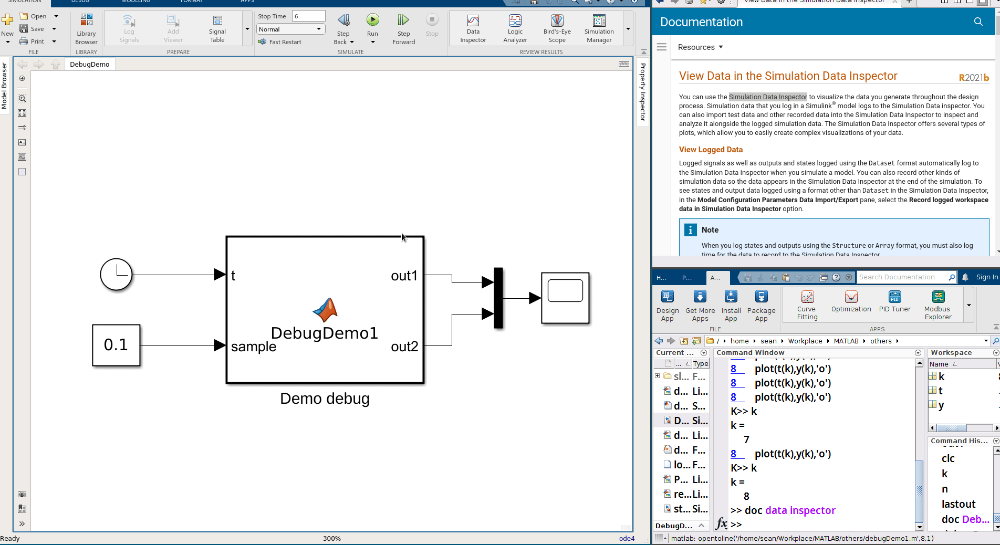

---

# Debug MATLAB Code Tutorial


## 为什么需要 Debug MATLAB 代码

讲讲自己使用 MATLAB 的遭遇吧！最近在写一个仿真程序，其中的核心代码我是用 MATLAB Code 实现的。然后在 simulink 中使用示波器查看自己的仿真程序的输出结果是否正确。输出结果的波形趋势是正确的，但是在边界处和我设想的有偏差。因此需要进一步优化代码。在出现偏差的地方，我需要用仿真示波器查看结果，每次需要精确到具体的时刻，才能比较自己程序的输出结果和理论结果。有时我需要查看代码中另一个变量的值。如果用示波器的来显示结果，就需要再定义一个输出端口，然后再用示波器连接刚才定义的输出端口。同时，每个示波器都要调节到同一时刻，才能比对此时的仿真结果。这样用示波器来调试 simulink 中的代码方式属实麻烦。实际我使用示波器调试使用了接近一天，感觉自己这样调试的效率太低了。晚上，回寝室就向室友吐槽这样调试 simulink 代码太麻烦了。室友来了一句，"可以 debug MATLAB code 呀！" 问题是在 `.m` 文件书写的 MATLAB Code 可以进行 debug，在 simulink 中可行吗？第二天，尝试了一下在 simulink 中尝试了一下打断点，是可行的！因此用 debug 的方式调试 simulink 程序是一个可行的方案。这样调试的效率就提高了。

操作环境：
---
MATLAB: R2021B
OS: OS: Debian GNU/Linux 11 (bullseye) x86\_64
Kernel: 5.10.0-13-amd64

---

$$
e^{x}=1+\frac{1}{1!}x+\frac{1}{2!}x^2+\frac{1}{3!}x^3+\frac{1}{4!}x^4+\cdots
$$

值得注意的是 MATLAB R2021B Linux 版本可能无法启动 simulink。出现闪退，并出现如下日志：

```bash
Inconsistency detected by ld.so: ../elf/dl-tls.c: 597: _dl_allocate_tls_init: Assertion `listp != NULL' failed!
```

该问题是因为 glibc 自身的 bug 所致，具体修复方案请参考 [MATLAB Bug Report](https://ww2.mathworks.cn/support/bugreports/2632298) 的解决方案。


Debug MATLAB Code Files 无论在 `.m` 文件（script），还是在 `.mlx` 文件（live script）或者 simulink 中的 `MATLAB function` debug 逻辑都是类似的。理论上只要会一种文件的调试，在其他类型文件 debug 都会无师自通。如果你使用过 C 语言等编程语言调试工具，自然的，你也会特别适应在 MATLAB 中 debug 程序。有一个 debug 的专业术语 **断点**，意思是程序执行到**断点**处，程序暂时冻结在此处，然后手动的点击继续运行，可跳过该断点。尽管在 `.m`，`.mlx` 和 `MATLAB function` 中的 debug 操作类似，但是接下来为了充分熟悉 debug 方式，会在上述三种环境中都会有演示教程。

---

## Debug `.m` 文件

Debug `.m` 文件的事例程序如下：

```C
% debug demo
clear;
t=linspace(0,2*pi,50);
y=exp(-t).*sin(t);
plot(t,y);
hold on;
for k=1:length(t)
    plot(t(k),y(k),'o'); % breakpoint
    pause(0.1);
end
hold off;

```

简单的调试流程：

---

1. 设置断点：在需要打断点的位置的数字行号单击鼠标左键即可添加断点
2. 执行程序：点击 `Run`
3. 继续运行：点击 `Continue`，程序直到遇到下一个断点才停止。
4. 执行下一步：点击 `Step`
5. 查看当前运行程序变量值：在 `Command Window` 输入需要你需要查看的变量名，然后回车。
6. 停止调试：点击 `Stop`

---


Debug `.m` 文件各窗口或按钮功能解释




debug 动态演示 gif 图



除了使用 `Command Window` 窗口来查看当前变量，可以在程序调试程序处，鼠标移动到需要查看的变量，会自动显示当前变量值。感觉是不是特别方便呀！




如果只需执行一次断点调试操作，可以把鼠标放置在数字行号右侧，会出现一个视频播放器，播放或暂停的符号。鼠标左键点击一下，便可执行单次的调试操作。



## Debug `.mlx` 文件

Debug '.mlx' 文件的方法和 `.m` 文件类似，只是程序的结果在 `.mlx` 文件内部显示而已。

debug live script 演示动图



---

## Debug simulink `MATLAB function`

简单的 debug simulink 仿真整体架构。



`MATLAB function` DebugDemo1 的程序如下：

```C DebugDemo1
function [out1,out2] = DebugDemo1(t,sample)

persistent n lastout;
if isempty(n)
    n=1;
end

if isempty(lastout)
    lastout=0;
end

out1=exp(-t).*sin(t);

if t>n*sample
    out2=out1;
    lastout=out2;
    n=n+1;
else
    out2=lastout;
end
```

simulink debug 演示效果



Debug 操作内容可以参看官方帮助文档。在 `Command Window` 输入如下命令，然后点击 `Debug MATLAB Code Files` 即可查看本地帮助文档 debug 内容。

```bash
doc Debug MATLAB Code Files
```
---

## matlab simulink tip

最近，使用 MATLAB R2021b 仿真，发现一个新功能，十分不错。我个人把他称为*便捷版的示波器*，当然他有专业的名字 **Simulation Data Inspector**。有是需要在仿真中比对多组数据，尤其是比对的数据比较多时，用仿真示波器来比对数据比较麻烦。需要连线，设置 `mux` 输入端口数等等操作。而使用 **Simulation Data Inspector** 就方便太多了。具体使用流程，请参考下面的动态图。



上面的动态演示只是演示了 Data Inspector 一些基本功能，更多功能请使用在 `Command Window` 中使用 `doc View Data in the Simulation Data Inspector`。


## 备注

I would greatly appreciate hearing about any error in this article, even minor ones.
I welcome your suggestions for improvements, even tiny one. Please contact me by email 😏! Have fun!

---

## 参考

[Debug MATLAB Code Files](https://ww2.mathworks.cn/help/matlab/matlab_prog/debugging-process-and-features.html?lang=en)

[Simulation Data Inspector](https://ww2.mathworks.cn/help/simulink/ug/populate-sdi-with-your-data.html?lang=en)

