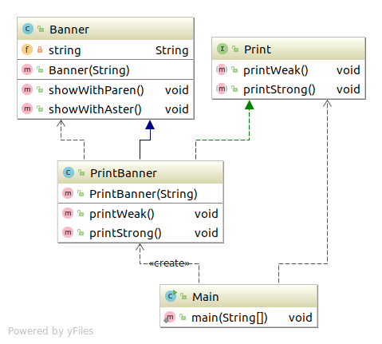

# 设计模式

本篇的设计模式记录，主要是参考书籍 《图解设计模式》做的学习记录笔记！ 回想一下，那都是多年以前的事了。最开始每个设计模式
用一片博客记录。最近，突然发现这样有点分散，想了一想，干脆直接整合到一篇博文吧。有点长，但是有目录可以快速定位到具体的设计
模式，也算方便。

---

## Facade模式

简单窗口&ensp; 使用Facade模式可以为相互关联在一起的错中复杂的类整理出高层的接口。其中的Facade角色可以让系统对外只有一个简单的接口。

---

### 演示程序类图


---

### 代码
#### Database类
``` java
package com.sean.Facade.pagemaker;

import java.io.FileInputStream;
import java.io.FileNotFoundException;
import java.io.IOException;
import java.util.Properties;

public class Database {
	private Database(){
		//防止外部new出Database对象，所以声明为private
	}
	public static Properties getProperties(String dbname){
		String filename=dbname+".txt";
		Properties prop=new Properties();
		try {
			prop.load(new FileInputStream("/home/sean/Documents/"+filename));
		} catch (FileNotFoundException e) {
			
			e.printStackTrace();
		} catch (IOException e) {
			e.printStackTrace();
		}
		return prop;
	}
}

```
#### HtmlWriter类
``` java
package com.sean.Facade.pagemaker;

import java.io.IOException;
import java.io.Writer;

public class HtmlWriter {
	private Writer writer;
	public HtmlWriter(Writer writer){
		this.writer=writer;
	}
	public void title(String title){
		//输出标题
		try {
			writer.write("<html>");
			writer.write("<head>");
			writer.write("<title>"+title+"</title>");
			writer.write("</head>");
			writer.write("<body>\n");
			writer.write("<h1>"+title+"</h1>");
		} catch (IOException e) {
			e.printStackTrace();
		}
	}
	public void paragraph(String msg){
		//输出段落
		try {
			writer.write("<p>"+msg+"</p>");
		} catch (IOException e) {
			e.printStackTrace();
		}
	}
	public void link(String href,String caption){
		//输出超链接
		paragraph("<a href=\"" +href +"\">"+caption+"</a>");
	}
	public void mailto(String mailaddr,String username){
		//输出邮件地址
		link("mailto:"+mailaddr,username);
	}
	public void close(){
		//结束输出html
		try {
			writer.write("</body>");
			writer.write("</html>\n");
			writer.close();
		} catch (IOException e) {
			
			e.printStackTrace();
		}
		
	}
}

```

#### PageMaker类
``` java
package com.sean.Facade.pagemaker;

import java.io.FileWriter;
import java.io.IOException;
import java.util.Properties;

public class PageMaker {
	private PageMaker(){
		//防止外部new出PageMaker实例，所以声明为private方法
	}
	public static void makeWelcomePage(String mailaddr,String filename){
		try {
			Properties mailprop=Database.getProperties("maildata");
			String username=mailprop.getProperty(mailaddr);
			HtmlWriter writer=new HtmlWriter(new FileWriter("/home/sean/Documents/"+filename));
			writer.title("Welcome to "+username+"'s page!");
			writer.paragraph(username+"欢迎到来"+username+"的主页。");
			writer.paragraph("等你的邮件喔！");
			writer.mailto(mailaddr, username);
			writer.close();
			System.out.println(filename+"is created for "+mailaddr +" ("+username+")");
		} catch (IOException e) {
			e.printStackTrace();
		}
	}

}

```

#### Main类
``` java
package com.sean.Facade;

import com.sean.Facade.pagemaker.PageMaker;

public class Main {

	/**
	 * @param args
	 */
	public static void main(String[] args) {
		PageMaker.makeWelcomePage("seanchristspc@gmail.com", "welcome.html");

	}

}
```

---

### 要点
#### Facade(窗口)
Facade角色向系统外部提供高层接口。在实例程序中由**PageMaker**扮演此角色。

#### 构成系统的许多其他角色
这些角色各自完成自己的工作，他们并不知道Facade角色。Facade角色调用其他角色进行工作，但是其他角色不会调用Facade角色。代码中 **Database**和**HtmlWriter**扮演其他角色。

#### Client
Client角色负责调用Facade角色

---

### 个人理解

Facade模式就是把复杂的系统变**看起来**简单。所谓看起来简单就是指在编写代码的时候还是挺复杂的，只是在使用某个功能是对外的接口比较少而且明确。
该模式还是挺好理解的，代码也不复杂。


---

## Mediator模式
只有一个仲裁者&ensp; 要调用多个对象之间的关系时，就需要使用Mediator模式。将控制的逻辑处理交给仲裁者。

---


### 类和接口表
|  名字   | 说明                                   |
| -------  | -----------------------------------|
| Mediator | 定义 "仲裁者" 的接口(API)的接口 |
| Colleague | 定义"组员"的接口(API)的接口 |
| ColleagueButton | 表示按钮的类。它实现Colleague接口 |
| ColleagueTextField | 表示文本输入框的类。它实现了Colleague接口 |
| ColleagueCheckbox | 表示勾选框的类。实现了Colleague接口 |
| LoginFrame | 表示登录对话框类。实现了Mediator接口 |
| Main | 测试程序行为的类 |
 


### 程序的类图
有点复杂喔！ 不急。慢慢看！！


### 代码
#### Colleague接口(组员接口)
``` java
package com.sean.Mediator;

public interface Colleague {

	public abstract void setMediator(Mediator mediator);
	public abstract void setColleagueEnabled(boolean enabled);
}


```

#### Mediator接口(仲裁者接口)
``` java
package com.sean.Mediator;

public interface Mediator {
	//生成Mediator要管理的组员.
	public abstract void createColleagues();
	//被各个Colleague组员调用，让组员向仲裁者进行报告
	public abstract void colleagueChanged();
}

```

#### ColleagueButton(具体的组员)
``` java
import java.awt.Button;
import java.awt.HeadlessException;

public class ColleagueButton extends Button implements Colleague {
	private Mediator mediator;
	public ColleagueButton(String caption) {
		super(caption);
	}
	
	public void setMediator(Mediator mediator) {
		//保存Mediator
		this.mediator=mediator;

	}

	public void setColleagueEnabled(boolean enabled) {
		//Mediator下达启用禁用的指示
		setEnabled(enabled);
	}

}

```

#### ColleagueCheckbox(具体的组员)
``` java
package com.sean.Mediator;

import java.awt.Checkbox;
import java.awt.CheckboxGroup;
import java.awt.event.ItemEvent;
import java.awt.event.ItemListener;

public class ColleagueCheckbox extends Checkbox implements Colleague,
		ItemListener {
	private Mediator mediator;
	public ColleagueCheckbox(String caption,CheckboxGroup group,boolean state){
		super(caption,group,state);
	}
	public void itemStateChanged(ItemEvent e) {
		mediator.colleagueChanged();

	}

	public void setMediator(Mediator mediator) {
		this.mediator=mediator;

	}

	public void setColleagueEnabled(boolean enabled) {
		setEnabled(enabled);

	}

}

```

#### ColleagueTextField(具体的组员)
``` java
import java.awt.Color;
import java.awt.TextField;
import java.awt.event.TextEvent;
import java.awt.event.TextListener;

public class ColleagueTextField extends TextField implements Colleague,
		TextListener {
	private Mediator mediator;
	public ColleagueTextField(String text,int columns){
		super(text,columns);
	}

	public void textValueChanged(TextEvent e) {
		//文字发生变化时通知Mediator
		mediator.colleagueChanged();

	}

	public void setMediator(Mediator mediator) {
		this.mediator=mediator;

	}

	public void setColleagueEnabled(boolean enabled) {
		setEnabled(enabled);
		setBackground(enabled ? Color.white : Color.lightGray);
	}

}

```

#### LoginFrame(具体的仲裁者)
代码有点多加油看看！
``` java
package com.sean.Mediator;

import java.awt.CheckboxGroup;
import java.awt.Color;
import java.awt.Frame;
import java.awt.GridLayout;
import java.awt.Label;
import java.awt.event.ActionEvent;
import java.awt.event.ActionListener;

public class LoginFrame extends Frame implements ActionListener, Mediator {
	private ColleagueCheckbox checkGuest;
	private ColleagueCheckbox checkLogin;
	private ColleagueTextField textUser;
	private ColleagueTextField textPass;
	private ColleagueButton buttonOK;
	private ColleagueButton buttonCancle;
	//构造函数
	//生成并配置各个Colleague后，显示对话框
	public LoginFrame(String title){
		super(title);
		setBackground(Color.lightGray);
		//使用布局管理器生成4×2窗格
		setLayout(new GridLayout(4,2));
		//生成各个Colleague
		createColleagues();
		add(checkGuest);
		add(checkLogin);
		add(new Label("username"));
		add(textUser);
		add(new Label("Password"));
		add(textPass);
		add(buttonOK);
		add(buttonCancle);
		//设置初始的启用/禁用状态
		colleagueChanged();
		//显示
		pack();
		show();
	}
	public void createColleagues() {
		//生成各个Colleague
		CheckboxGroup g= new CheckboxGroup();
		checkGuest = new ColleagueCheckbox("Guest",g,true);
		checkLogin = new ColleagueCheckbox("Login",g,false);
		textUser = new ColleagueTextField("",10);
		textPass = new ColleagueTextField("",10);
		textPass.setEchoChar('*');
		buttonOK = new ColleagueButton("OK");
		buttonCancle = new ColleagueButton("Cancle");
		//设置Mediator
		checkGuest.setMediator(this);
		checkLogin.setMediator(this);
		textUser.setMediator(this);
		textPass.setMediator(this);
		buttonOK.setMediator(this);
		buttonCancle.setMediator(this);
		//设置Listener
		checkGuest.addItemListener(checkGuest);
		checkLogin.addItemListener(checkLogin);
		textUser.addTextListener(textUser);
		textPass.addTextListener(textPass);
		buttonOK.addActionListener(this);
		buttonCancle.addActionListener(this);

	}

	public void colleagueChanged() {
		if(checkGuest.getState()){
			textUser.setColleagueEnabled(false);
			textPass.setColleagueEnabled(false);
			buttonOK.setColleagueEnabled(true);
		}else {
			textUser.setColleagueEnabled(true);
			userpassChanged();
		}

	}
	public void userpassChanged(){
		if(textUser.getText().length()>0){
			textPass.setColleagueEnabled(true);
			if(textPass.getText().length()>0){
				buttonOK.setColleagueEnabled(true);
			}else{
				buttonOK.setColleagueEnabled(false);
			}
		}else {
			textPass.setColleagueEnabled(false);
			buttonOK.setColleagueEnabled(false);
		}
	}
	public void actionPerformed(ActionEvent e) {
		System.out.println(e.toString());
		System.exit(0);

	}

}

```

#### 主函数 调用者 客户
代码比较少！放松！放松！放松！
``` java
package com.sean.Mediator;

public class Main {

	/**
	 * @param args
	 */
	public static void main(String[] args) {
		LoginFrame lf=new LoginFrame("Mediator Sample");

	}

}

```

### 个人理解

Mediator模式就如同在一个集体中需要一个管理者，没管理者就是一团乱麻！有管理者，能让程序有序的进行！虽然我们崇尚自由！但是没有管理的世界更可怕！生活中需要管理者，程序中也需要管理者！程序来源于生活。

---


## Command模式
命令也是类

---

### 类表
| 包 | 类名 | 说明 |
|-----|--------|-------|
| command | Command | 表示**命令**的接口 |
| command | MacroCommand | 表示 **由多条命令整合成的命令** 的类 |
| drawer | DrawCommand | 表示 **绘制一个点的命令** 的类 |
| drawer | Drawable | 表示 **绘制对象** 的接口 |
| drawer | DrawCanvas | 实现 **绘制对象** 的类 |
|  无名 | Main | 测试程序行为的类 |


### 类图
粗略一点的


详细一点


### code
#### Command
``` java
package com.sean.Command.command;

public interface Command {

	public abstract void execute(); 
}

```
#### MacroCommand
``` java
package com.sean.Command.command;

import java.util.Iterator;
import java.util.Stack;

public class MacroCommand implements Command {
	private Stack commands = new Stack();
	
	public void execute() {
		Iterator it=commands.iterator();
		while(it.hasNext()){
			((Command)it.next()).execute();
		}

	}
	public void append(Command command){
		if(command != this){
			commands.push(command);
		}
	}
	//删除最后一条命令
	public void undo(){
		if(!commands.empty()){
			commands.pop();
		}
	}
	//删除所有命令
	public void clear(){
		commands.clear();
	}

}
```

#### Drawable
``` java
package com.sean.Command.drawer;

public interface Drawable {
	public abstract void draw(int x,int y);
}

```
#### DrawCanvas
``` java
package com.sean.Command.drawer;

import java.awt.Canvas;
import java.awt.Color;
import java.awt.Graphics;

import com.sean.Command.command.MacroCommand;

public class DrawCanvas extends Canvas implements Drawable {
	//颜色
	private Color color =Color.red;
	//绘制圆点半径
	private int radius=6;
	//命令的历史记录
	private MacroCommand history;
	public DrawCanvas(int width,int height,MacroCommand history){
		setSize(width, height);
		setBackground(Color.WHITE);
		this.history=history;
	}
	//重新全部绘制
	public void paint(Graphics g){
		history.execute();
	}
	public void draw(int x, int y) {
		Graphics g=getGraphics();
		g.setColor(color);
		g.fillOval(x-radius, y-radius, radius*2, radius*2);
	}

}

```
#### DrawCommand
``` java
package com.sean.Command.drawer;

import java.awt.Point;

import com.sean.Command.command.Command;

public class DrawCommand implements Command {

	//绘制对象
	protected Drawable drawable;
	//绘制位置
	private Point position;
	public DrawCommand(Drawable drawable,Point position ){
		this.drawable=drawable;
		this.position=position;
	}
	public void execute() {
		
		drawable.draw(position.x, position.y);
	}

}

```
#### Main
``` java
package com.sean.Command;

import java.awt.event.ActionEvent;
import java.awt.event.ActionListener;
import java.awt.event.MouseEvent;
import java.awt.event.MouseMotionListener;
import java.awt.event.WindowEvent;
import java.awt.event.WindowListener;

import javax.swing.Box;
import javax.swing.BoxLayout;
import javax.swing.JButton;
import javax.swing.JFrame;

import com.sean.Command.command.Command;
import com.sean.Command.command.MacroCommand;
import com.sean.Command.drawer.DrawCanvas;
import com.sean.Command.drawer.DrawCommand;

public class Main extends JFrame implements ActionListener,
		MouseMotionListener, WindowListener {

	//绘制的历史记录
	private MacroCommand history=new MacroCommand();
	//绘制区域
	private DrawCanvas canvas=new DrawCanvas(400,400,history);
	
	//删除按钮
	private JButton clearButton=new JButton("clear");
	
	//构造函数
	public Main(String title){
		super(title);
		
		this.addWindowListener(this);
		canvas.addMouseMotionListener(this);
		clearButton.addActionListener(this);
		
		Box buttonBox=new Box(BoxLayout.X_AXIS);
		buttonBox.add(clearButton);
		Box mainBox=new Box(BoxLayout.Y_AXIS);
		
		mainBox.add(buttonBox);
		mainBox.add(canvas);
		getContentPane().add(mainBox);
		
		pack();
		show();
	}
	
	public void windowOpened(WindowEvent e) {
		
	}
	public void windowClosing(WindowEvent e) {
		System.exit(0);
	}
	public void windowClosed(WindowEvent e) {
		

	}
	public void windowIconified(WindowEvent e) {
		
	}
	public void windowDeiconified(WindowEvent e) {
	
	}
	public void windowActivated(WindowEvent e) {
		

	}
	public void windowDeactivated(WindowEvent e) {
		

	}

	public void mouseDragged(MouseEvent e) {
		Command command=new DrawCommand(canvas,e.getPoint());
		history.append(command);
		command.execute();

	}

	public void mouseMoved(MouseEvent e) {
	

	}

	public void actionPerformed(ActionEvent e) {
		if(e.getSource()==clearButton){
			history.clear();
			canvas.repaint();
		}
	}
	public static void main(String[] args){
		new Main("Command Pattern");
	}
}

```

---


## State模式
用类表示状态

***
### 类图
有点复杂！但只有部分是自己写的，其他是java类库内的类。


粗略简单一点的类图


### 代码
####  State
``` java
package com.sean.State;

public interface State {
	
	public abstract void doClock(Context context,int hour);
	public abstract void doUse(Context context);
	public abstract void doAlarm(Context context);
	public abstract void doPhone(Context context);
}
```

#### NightState(具体的状态)

``` java
package com.sean.State;

public class NightState implements State {

	private static NightState singleton = new NightState();
	private NightState(){
		
	}
	public static State getInstance(){
		return singleton;
	}
	public void doClock(Context context, int hour) {
		if(9<=hour || hour<17){
			context.changeState(DayState.getInstance());
		}

	}

	public void doUse(Context context) {
		
		context.callSecurityCenter("紧急！晚上使用金库！");
	}

	public void doAlarm(Context context) {
		context.callSecurityCenter("按下警铃（晚上）");

	}

	public void doPhone(Context context) {
		context.callSecurityCenter("晚上通话录音");
	}
	public String toString(){
		return "[晚上]";
	}

}

```

#### DayState(具体的状态)
``` java
package com.sean.State;

public class DayState implements State {

	private static DayState singleton = new DayState();
	private DayState(){
		
	}
	public static State getInstance(){
		return singleton;
	}
	public void doClock(Context context, int hour) {
		if(hour<9 || 17<=hour){
			context.changeState(NightState.getInstance());
		}
	}

	public void doUse(Context context) {
		context.recordLog("使用金库（白天）");

	}

	public void doAlarm(Context context) {
		context.callSecurityCenter("按下警铃（白天）");

	}

	public void doPhone(Context context) {
		context.callSecurityCenter("正常通话（白天）");

	}
	
	public String toString(){
		return "[白天]";
	}
}

```
#### Context
``` java
package com.sean.State;

public interface Context {
	public abstract void setClock(int hour);
	public abstract State changeState(State state);
	public abstract void callSecurityCenter(String msg);
	public abstract void recordLog(String msg);
}

```

#### SafeFrame
``` java
package com.sean.State;

import java.awt.BorderLayout;
import java.awt.Button;
import java.awt.Color;
import java.awt.Frame;
import java.awt.Panel;
import java.awt.TextArea;
import java.awt.TextField;
import java.awt.event.ActionEvent;
import java.awt.event.ActionListener;

public class SafeFrame extends Frame implements ActionListener, Context {
	
	private TextField textClock = new TextField(60);
	private TextArea textScreen=new TextArea(10,60);
	private Button buttonUse=new Button("使用金库");
	private Button buttonAlarm=new Button("按下警铃");
	private Button buttonPhone=new Button("正常通话");
	private Button buttonExit=new Button("结束");
	private State state=DayState.getInstance();
	//构造函数
	public SafeFrame(String title){
		super(title);
		setBackground(Color.lightGray);
		setLayout(new BorderLayout());
		//配置textClock
		add(textClock,BorderLayout.NORTH);
		textClock.setEditable(false);
		//配置textScreen
		add(textScreen,BorderLayout.CENTER);
		textScreen.setEditable(false);
		//为界面添加按钮
		Panel panel=new Panel();
		panel.add(buttonUse);
		panel.add(buttonAlarm);
		panel.add(buttonPhone);
		panel.add(buttonExit);
		//配置界面
		add(panel,BorderLayout.SOUTH);
		//显示
		pack();
		show();
		//设置监听器
		buttonUse.addActionListener(this);
		buttonAlarm.addActionListener(this);
		buttonPhone.addActionListener(this);
		buttonExit.addActionListener(this);
	}
	public void setClock(int hour) {
		String clockstring="现在时间是:";
		if(hour<10){
			clockstring+="0"+hour+":00";
		}else {
			clockstring+=hour+":00";
		}
		System.out.println(clockstring);
		textClock.setText(clockstring);
		state.doClock(this, hour);
	}

	public State changeState(State state) {
        System.out.println("从"+this.state+"状态变为了"+state+"状态");
		this.state=state;	
		return state;
	}

	public void callSecurityCenter(String msg) {
		textScreen.append("Call!"+msg+"\n");

	}

	public void recordLog(String msg) {
		textScreen.append("record ... "+msg+"\n");

	}

	public void actionPerformed(ActionEvent e) {
		System.out.println(e.toString());
		if(e.getSource()==buttonUse){
			state.doUse(this);
		}else if (e.getSource()==buttonAlarm) {
			state.doAlarm(this);
		}else if (e.getSource()==buttonPhone) {
			state.doPhone(this);
		}else if (e.getSource()== buttonExit) {
			System.exit(0);
		}else {
			System.out.println("?");
		}

	}

}

```

#### Main

``` java
package com.sean.State;

public class Main {

	/**
	 * @param args
	 */
	public static void main(String[] args) {
		SafeFrame frame=new SafeFrame("state module");
		while(true){
			for(int hour=0;hour<24;hour++){
				frame.setClock(hour);	//设置时间
				try{
					Thread.sleep(1000);
				}catch(InterruptedException e){
					e.printStackTrace();
				}
			}
		}

	}

}
```
### 要点
采用分而治之方针。
**定义接口，声明抽象方法**
**定义多个类，实现具体的方法**

---


## Memento模式
**保存对象状态**
### 类表
| 名字 | 说明 |
|--------|--------|
| Memento | 表示Gamer状态的类 |
| Gamer | 表示游戏主人公的类，他会生成Memento实例 |
| Main | 进行游戏的类。他会事先保存Memento的实例，之后会根据需要回复Gamer的状态 |

### 类图


### 代码

#### Memento类
``` java 

import java.util.ArrayList;
import java.util.List;

import com.sean.AbstractFactory.listfactory.ListLink;

public class Memento {
	int money;
	ArrayList fruits;
	public int getMoney(){
		return money;
	}
	Memento(int money){
		this.money=money;
		this.fruits=new ArrayList();
	}
	void addFruit(String fruit){
		fruits.add(fruit);
	}
	List getFruits(){
		return (List) fruits.clone();
	}
}

```

#### Gamer类
``` java
package com.sean.Memento;

import java.util.ArrayList;
import java.util.Iterator;
import java.util.List;
import java.util.Random;


public class Gamer {
	private int money;
	private List fruits=new ArrayList();
	private Random random=new Random();
	private static String[] fruitsname={"苹果","葡萄","香蕉","橘子"};
	public Gamer(int money){
		this.money=money;
	}
	public int getMoney(){
		return money;
	}
	public void bet(){
		int dice = random.nextInt(6)+1;
		if(dice==1){
			money+=100;
			System.out.println("所持金币增加了。");
		}else if (dice==2) {
			money/=2;
			System.out.println("所持金币减半。");
		}else if (dice==6) {
			String f=getFruit();
			System.out.println("获得的水果"+f+")。");
		}else{
			System.out.println("什么都没发生。");
		}
	}
	public Memento createMemento(){
		Memento m=new Memento(money);
		Iterator it=fruits.iterator();
		while(it.hasNext()){
			String f=(String)it.next();
			if(f.startsWith("好吃的")){
				m.addFruit(f);
			}
		}
		
		return m;
	}
	public void restoreMemento(Memento memento){
		this.money=money;
		this.fruits=memento.getFruits();
	}
	public String toString(){
		return "[money= "+money+",fruits= "+fruits+"]";
	}
	private String getFruit(){ 
		String prefix="";
		if(random.nextBoolean()){
			prefix="好吃的";
		}
		return prefix+fruitsname[random.nextInt(fruitsname.length)];
	}
}

```

#### Main

``` java
package com.sean.Memento;

public class Main {

	/**
	 * @param args
	 */
	public static void main(String[] args) {
		Gamer gamer=new Gamer(100);
		Memento memento=gamer.createMemento();
		for(int i=0;i<100;i++){
			System.out.println("========"+i);
			System.out.println("当前状态："+gamer);
			gamer.bet(); //进行游戏
			System.out.println("所持金钱为"+gamer.getMoney()+"元");
			if(gamer.getMoney()>memento.getMoney()){
				System.out.println("（所持金钱增加许多，因此保存游戏当前状态）");
				memento=gamer.createMemento();
			}else if (gamer.getMoney()<memento.getMoney()/2) {
				System.out.println("（所持金钱减少许多，因此要恢复至以前状态）");
				gamer.restoreMemento(memento);
			}
			try{
				Thread.sleep(100);
			}catch(InterruptedException e){
				e.printStackTrace();
			}
			System.out.println("");
		}
		
	}

}

```
### 个人理解
Memento模式就是实现对象状态的恢复，而设置的。

---


## Observe模式
在Observe模式中，当观察对象的状态发生变化，会通知给观察者。Observe模式适用于根据对象状态进行相应的处理场景。

---

### 类和接口的表
| 名字 | 说明 |
|--------|--------|
| Observer | 表示观察者接口 |
| NumberGenerator | 表示生成数值的对象的抽象类 |
| RandomNumberGenerator | 生成随机数的类 |
| DigitObserver | 表示以数字形式显示数值类 |
| GraphObserver | 表示以简单的图形显示数值类 |
| Main | 测试程序行为的类 |

### 程序类图


### 代码
#### Observer接口(定义抽象方法)
``` java
package com.sean.Observer;

public interface Observer {
	public abstract void update(NumberGenerator generator);
}
```

#### NumberGenerator抽象类
``` java
package com.sean.Observer;

import java.util.ArrayList;
import java.util.Iterator;

public abstract class NumberGenerator {
	private ArrayList observers = new ArrayList();
	public void addObserver(Observer observer){
		observers.add(observer);
	}
	public void deleteObserver(Observer observer){
		observers.remove(observer);
	}
	public void notifyObservers(){
		Iterator it=observers.iterator();
		while(it.hasNext()){
			Observer o=(Observer) it.next();
			o.update(this);
		}	
	}
	public abstract int getNumber();
	public abstract void exeute();
}

```

####  DigitObserver具体的观察者

``` java
package com.sean.Observer;

public class DigitObserver implements Observer {
	
	public void update(NumberGenerator generator) {
		System.out.println("DigitObserver："+generator.getNumber());
		try{
			Thread.sleep(100);
		}catch(InterruptedException e){
			e.printStackTrace();
		}
	}

}

```

#### GraphObserver具体的观察者

``` java
package com.sean.Observer;

public class GraphObserver implements Observer {

	public void update(NumberGenerator generator) {
		System.out.println("GraphObserver:");
		int count = generator.getNumber();
		for(int i=0;i<count;i++){
			System.out.print("*");
		}
		System.out.println("");
		try{
			Thread.sleep(100);
		}catch(InterruptedException e){
			e.printStackTrace();
		}

	}

}

```
#### RandomNumberGenerator具体的被观察对象 

``` java
package com.sean.Observer;

import java.util.Random;

public class RandomNumberGenerator extends NumberGenerator {
	private Random random= new Random();
	private int number;
	@Override
	public int getNumber() {
		
		return number;
	}

	@Override
	public void exeute() {
		for(int i=0;i<20;i++){
			number=random.nextInt(50);
			notifyObservers();
		}
	}

}

```
#### 测试方法
``` java
ackage com.sean.Observer;

public class Main {

	/**
	 * @param args
	 */
	public static void main(String[] args) {
		NumberGenerator generator=new RandomNumberGenerator();
		Observer observer1=new DigitObserver();
		Observer observer2=new GraphObserver();
		generator.addObserver(observer1);
		generator.addObserver(observer2);
		generator.exeute();

	}

}

```
### 要点
Observer角色并非主动去观察，而是被动去观察，被动的接受观察对象的通知。


---


## Flyweight 模式

**共享**对象，避免浪费。

---

### 类表
| 名字 | 说明 |
|--------|--------|
|BigChar | 表示"大型字符"类 |
| BigCharFactory | 表示生成和共用BigChar类的实例的类 |
| BigString | 表示多个BigChar组成的 "大型字符串" 的类 |
| Main | 测试程序行为的类 |

### 程序类图


### 代码 
#### BigChar类
``` java
import java.io.BufferedReader;
import java.io.FileNotFoundException;
import java.io.FileReader;
import java.io.IOException;

public class BigChar {
	private char charname;
	private String fontdata;
	public BigChar(char charname){
		this.charname=charname;
		try {
			BufferedReader reader=new BufferedReader(new FileReader("/home/sean/Documents/"+"big"+charname+".txt"));
			String line;
			StringBuffer buf=new StringBuffer();
			while((line=reader.readLine())!=null){
				buf.append(line);
				buf.append("\n");
			}
			reader.close();
			this.fontdata=buf.toString();
		} catch (FileNotFoundException e) {
			e.printStackTrace();
		} catch (IOException e) {
			this.fontdata=charname+"?";
			e.printStackTrace();
		}
		
		
		
	}
	
	public void print(){
		System.out.print(fontdata);
	}
}

```
#### BigCharFactory类
``` java
package com.sean.Flyweight;

import java.util.HashMap;

public class BigCharFactory {
	private HashMap pool=new HashMap();
	//Singleton模式
	private static BigCharFactory singleton=new BigCharFactory();
	private BigCharFactory(){
		
	}
	//获取唯一实例
	public static BigCharFactory getInstance(){
		return singleton;
	}
	//生成（共享)BigChar类实例
	public synchronized BigChar getBigChar(char charname){
		BigChar bc=(BigChar) pool.get(""+charname);
		if(bc==null){
			bc=new BigChar(charname);
			pool.put(""+charname, bc);
		}
		return bc;
	}

}

```
#### BigString类

``` java
package com.sean.Flyweight;

public class BigString {
	private BigChar[] bigChars;
	public BigString(String string){
		bigChars=new BigChar[string.length()];
		BigCharFactory factory=BigCharFactory.getInstance();
		for(int i=0;i<bigChars.length;i++){
			bigChars[i]=factory.getBigChar(string.charAt(i));
		}
	}
	//显示
	public void print(){
		for(int i=0;i<bigChars.length;i++){
			bigChars[i].print();
		}
	}
	
}

```
#### Main类
``` java
package com.sean.Flyweight;

public class Main {

	/**
	 * @param args
	 */
	public static void main(String[] args) {
		BigString bs=new BigString("10101");
		bs.print();
		

	}

}
```


### 要点

Flyweight模式会对**多个地方产生影响**。

**Intrinsic:**  应当被共享的信息  
**Extrinsic:** 不应当被共享的信息

|名字 | 解释 |
|-----|------|
| Instrinsic信息 | 不依赖位置状况，可以共享 |
| Extrinsic信息  |依赖位置与状况，不能共享 |

**不要让被共享的实例被垃圾回收机器回收**
Flyweight优点：共享实例能减少对内存的使用，并且能提高运行的速度。


---


## Adapter模式
加个 "适配器" 以便复用
Adapter模式也被称为Wrapper(包装器)模式。

Adapter模式
	类适配器模式(使用继承的适配器)
	对象适配器模式(使用委托的适配器)

---

### 类适配器模式(使用继承的适配器)
#### 类图


#### code
##### Print
``` java
package com.sean.Adapter.a;

public interface Print {
	public abstract void printWeak();
	public abstract void printStrong();
}
```
##### Banner
``` java
package com.sean.Adapter.a;

public class Banner {
	private String string;
	public Banner(String string){
		this.string=string;
	}
	public void showWithParen(){
		System.out.println("("+string+")");
	}
	public void showWithAster(){
		System.out.println("*"+string+"*");
	}
}
```
##### PrintBanner
``` java
package com.sean.Adapter.a;

public class PrintBanner extends Banner implements Print {

	public PrintBanner(String string){
		super(string);
	}
	public void printWeak() {
		showWithParen();
	}

	public void printStrong() {
		showWithAster();
	}

}
```

##### Main

``` java
package com.sean.Adapter.a;

public class Main {
	
	public static void main(String[] args) {
		Print print =  new PrintBanner("Hello");
		print.printWeak();
		print.printStrong();

	}

}

```

### 对象适配器模式(使用委托的适配器)

#### 类图


#### code

##### Banner
``` java
package com.sean.Adapter.b;

public class Banner {
	private String string;
	public Banner(String string){
		this.string=string;
	}
	public void showWithParen(){
		System.out.println("("+string+")");
	}
	public void showWithAster(){
		System.out.println("*"+string+"*");
	}

}

```
##### Print
``` java
package com.sean.Adapter.b;

public abstract class Print {
	public abstract void printWeak();
	public abstract void printStrong();
}

```
##### PrintBanner
``` java
package com.sean.Adapter.b;

public class PrintBanner extends Print {
	private Banner banner;
	public PrintBanner(String string){
		this.banner = new Banner(string);
	}
	@Override
	public void printWeak() {
		// TODO Auto-generated method stub
		banner.showWithParen();

	}

	@Override
	public void printStrong() {
		// TODO Auto-generated method stub
		banner.showWithAster();
	}

}
```

### 要点

Adapter模式会对现有的类进行适配，生成行的类。
版本的升级与兼容需要用到Adapter模式。
适配！适配！就是给需要的类配对一个合适的插口。


## FactoryMethod模式

将实例的生成交给子类用TemplateMethod模式来构建 **生成的实例的工厂** ，
就是FactoryMethod模式。

### 类图


### code
#### Factory
``` java
package com.sean.FactoryMethod.framework;

public abstract class Factory {
	public final Product create(String owner){
		Product product=createProduct(owner);
		registerProduct(product);
		return product;
	}
	protected abstract Product createProduct(String owner);
	protected abstract void registerProduct(Product product);
	
}

```
#### Product
``` java

package com.sean.FactoryMethod.framework;

public abstract class Product {
	public abstract void use();
}

```
#### IDCard
``` java
package com.sean.FactoryMethod.idcard;

import com.sean.FactoryMethod.framework.Product;

public class IDCard extends Product {
	private String owner;
	IDCard(String owner){
		System.out.println("制作"+owner+"的ID卡。");
		this.owner=owner;
	}
	@Override
	public void use() {
		System.out.println("使用"+owner+"的ID卡。");

	}
	public String getOwner(){
		return owner;
	}

}
```
#### IDCardFactory
``` java
package com.sean.FactoryMethod.idcard;


import java.util.ArrayList;
import java.util.List;

import com.sean.FactoryMethod.framework.Factory;
import com.sean.FactoryMethod.framework.Product;

public class IDCardFactory extends Factory {
	private List owners = new ArrayList(); 
	@Override
	protected Product createProduct(String owner) {
		
		return new IDCard(owner);
	}
	@Override
	protected void registerProduct(Product product) {
		owners.add(((IDCard)product).getOwner());
	}
	public List getOwners(){
		return owners;
	}

}

```
#### Main
``` java
package com.sean.FactoryMethod;

import com.sean.FactoryMethod.framework.Factory;
import com.sean.FactoryMethod.framework.Product;
import com.sean.FactoryMethod.idcard.IDCardFactory;

public class Main {
	public static void main(String[] args) {
		Factory factory=new IDCardFactory();
		Product card1= factory.create("小明");
		Product card2=factory.create("小红");
		Product card3=factory.create("小刚");
		card1.use();
		card2.use();
		card3.use();
	}

}
```
### 要点
工厂产生产品
具体的工厂产生具体的产品
这两者形成一一对应的关系。


---


## TemplateMethod模式
将具体处理交给子类
带有模板功能的模式。
在父类中定义处理流程的框架，在子类中实现具体处理的模式就称为TemplateMethod模式。
在抽象类阶段确定处理的流程非常重要。

---

### 类图


### 代码

#### AbstractDisplay

``` java
package com.sean.TemplateMethod;
/**
 * 抽象类中可有具体的方法实现
 * 但是如果用接口是不行的（原因：接口不能有具体的方法实现）
 * @author sean
 *
 */
public abstract class AbstractDisplay {
	//修改修饰符可以改变抽象类方法的访问权限问题
	public abstract void open();
	public abstract void print();
	public abstract void close();
	public final void display(){
		open();
		for(int i=0;i<5;i++){
			print();
		}
		close();
	}
}

```

#### CharDisplay
``` java
package com.sean.TemplateMethod;

public class CharDisplay extends AbstractDisplay {
	private char ch;
	public CharDisplay(char ch){
		this.ch=ch;
	}
	@Override
	public void open() {
		System.out.print("<<");

	}

	@Override
	public void print() {
		System.out.print(ch);

	}

	@Override
	public void close() {
		System.out.println(">>");

	}

}

```

#### StringDisplay
``` java
package com.sean.TemplateMethod;

public class StringDisplay extends AbstractDisplay {
	private String string;
	private int width;
	public StringDisplay(String string){
		this.string=string;
		this.width=string.getBytes().length;
	}
	@Override
	public void open() {
		printLine();
	}

	@Override
	public void print() {
		System.out.println("|"+string+"|");
	}

	@Override
	public void close() {
		printLine();

	}
	
	private void printLine(){
		System.out.print("+");
		for(int i=0;i<width;i++){
			System.out.print("-");
		}
		System.out.println("+");
	}

}

```

#### Main
``` java
package com.sean.TemplateMethod;

public class Main {
	public static void main(String[] args) {
		AbstractDisplay d1=new CharDisplay('H');
		AbstractDisplay d2=new StringDisplay("Hello,world");
		d1.display();
		d2.display();

	}

}

```

### 要点

Template Method模式中，父类与子类是紧密联系，共同工作的。在子类中实现父类的抽象方法。


---


## Proxy模式

**只在必要时生成实例**

---

### 类表

| 名字 | 说明 |
|--------|--------|
| Printer | 表示带名字的打印机类(本人) |
| Printable | Printer和PrinterProxy的共同接口 |
| PrinterProxy | 表示带名字的打印机类(代理人) |
| Main | 测试程序行为的类 |


### 类图


### 代码
#### Printable接口
``` java
package com.sean.Proxy;

public interface Printable {

	public abstract void setPrinterName(String name);
	public abstract String getPrintName();
	public abstract void print(String string);
}

```
#### Printer
``` java
package com.sean.Proxy;

public class Printer implements Printable {
	private String name;
	public Printer(){
		
	}
	public Printer(String name){
		this.name=name;
		heavyJob("正在生成Printer实例（"+name+")");
	}
	public void setPrinterName(String name) {
		this.name=name;

	}

	public String getPrintName() {
		
		return name;
	}

	public void print(String string) {
		System.out.println("===="+name+"====");
		System.out.println(string);

	}
	public void heavyJob(String msg){
		System.out.print(msg);
		for(int i=0;i<5;i++){
			try{
				Thread.sleep(1000);
			}catch(InterruptedException e){
				e.printStackTrace();
			}
			System.out.print(".");
		}
		System.out.println("结束。");
	}

}

```
#### PrinterProxy
``` java
package com.sean.Proxy;

public class PrinterProxy implements Printable {
	private String name;
	private Printer real;
	public PrinterProxy(){
		
	}
	public PrinterProxy(String name){
		this.name=name;
	}
	public synchronized void setPrinterName(String name) {
		
			if(real!=null){
				real.setPrinterName(name);
			}
			this.name=name;
	}

	public String getPrintName() {
		
		return name;
	}

	public void print(String string) {
		realize();
		real.print(string);

	}
	public synchronized void realize(){
		if(real==null){
			real=new Printer(name);
		}
	}

}
```
#### Main
``` java
package com.sean.Proxy;

public class Main {

	/**
	 * @param args
	 */
	public static void main(String[] args) {
		Printable p=new PrinterProxy("Alice");
		System.out.println("现在的名字是"+p.getPrintName()+"。");
		p.setPrinterName("Bob");
		System.out.println("现在的名字是"+p.getPrintName()+"。");
		p.print("Hello,world!");

	}

}
```


---


##  Iterator模式
一个一个遍历    **迭代器**

---

### 类图


### code

#### Aggregate
``` java
package com.sean.Iterator;

public interface Aggregate {
		public abstract Iterator iterator();
}
```
#### Iterator
``` java
package com.sean.Iterator;

public interface Iterator {
		public abstract boolean hasNext();
		public abstract Object next();
}

```

#### Book
``` java
package com.sean.Iterator;

public class Book {
	private String name;
	public Book(String name){
		this.name=name;
	}
	public String getName(){
		return name;
	}
}

```

#### BookShelf
``` java
package com.sean.Iterator;

import java.util.ArrayList;


public class BookShelf implements Aggregate {

	//private Book[] books;
	private ArrayList<Book> bookList = new ArrayList<Book>();
	private int last=0;
//	public BookShelf(int maxsize){
//		this.books = new Book[maxsize];
//	}
	public Book getBookAt(int index)
	{
		return bookList.get(index);
	}
	public void appendBook(Book book){
		bookList.add(book);
		last++;
	}
	public int getLength(){
		return last;
	}
	public Iterator iterator() {
		return  new BookShelfIterator(this);
	}

}

```

#### BookShelfIterator
``` java
package com.sean.Iterator;

public class BookShelfIterator implements Iterator {

	private BookShelf bookShelf;
	private int index;
	public  BookShelfIterator(BookShelf bookShelf){
		this.bookShelf = bookShelf;
		this.index=0;
	}
	public boolean hasNext() {
		// TODO Auto-generated method stub
		if(index < bookShelf.getLength()){
			return true;
		}else{
			return false;
		}
		
	}

	public Object next() {
		// TODO Auto-generated method stub
		Book book = bookShelf.getBookAt(index);
		index++;
		return book;
	}

}

```
#### Main
``` java
package com.sean.Iterator;

public class Main {

	public static void main(String[] args) {
		//BookShelf bookShelf = new BookShelf(4);
		BookShelf bookShelf = new BookShelf();
		bookShelf.appendBook(new Book("Around the World in 80 Days"));
		bookShelf.appendBook(new Book("Bible"));
		bookShelf.appendBook(new Book("Cinderella"));
		bookShelf.appendBook(new Book("Dady-Long-Legs"));
		bookShelf.appendBook(new Book("Gone with the wind!"));
		Iterator it = bookShelf.iterator();
		while(it.hasNext()){
			Book book = (Book) it.next();
			System.out.println(book.getName());
		}
		
	}

}

```

---


## 参照
> 《图解设计模式》


写这个只是为了加深自己对设计模式的理解，如不明白，可以看 《图解设计模式》。
程序类图使用idea 生成的

## 备注

I would greatly appreciate hearing about any error in this article, even minor ones.
I welcome your suggestions for improvements, even tiny one. Please email to me! 😤 

