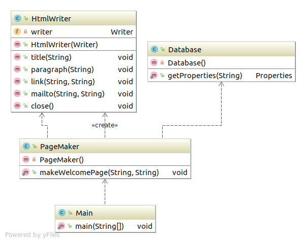

# FactoryMethod模式

将实例的生成交给子类

用TemplateMethod模式来构建**生成的实例的工厂**，就是FactoryMethod模式。

## 类图



## code
### Factory
``` java
package com.sean.FactoryMethod.framework;

public abstract class Factory {
	public final Product create(String owner){
		Product product=createProduct(owner);
		registerProduct(product);
		return product;
	}
	protected abstract Product createProduct(String owner);
	protected abstract void registerProduct(Product product);
	
}

```
### Product
``` java

package com.sean.FactoryMethod.framework;

public abstract class Product {
	public abstract void use();
}

```
### IDCard
``` java
package com.sean.FactoryMethod.idcard;

import com.sean.FactoryMethod.framework.Product;

public class IDCard extends Product {
	private String owner;
	IDCard(String owner){
		System.out.println("制作"+owner+"的ID卡。");
		this.owner=owner;
	}
	@Override
	public void use() {
		System.out.println("使用"+owner+"的ID卡。");

	}
	public String getOwner(){
		return owner;
	}

}
```
### IDCardFactory
``` java
package com.sean.FactoryMethod.idcard;


import java.util.ArrayList;
import java.util.List;

import com.sean.FactoryMethod.framework.Factory;
import com.sean.FactoryMethod.framework.Product;

public class IDCardFactory extends Factory {
	private List owners = new ArrayList(); 
	@Override
	protected Product createProduct(String owner) {
		
		return new IDCard(owner);
	}
	@Override
	protected void registerProduct(Product product) {
		owners.add(((IDCard)product).getOwner());
	}
	public List getOwners(){
		return owners;
	}

}

```
### Main
``` java
package com.sean.FactoryMethod;

import com.sean.FactoryMethod.framework.Factory;
import com.sean.FactoryMethod.framework.Product;
import com.sean.FactoryMethod.idcard.IDCardFactory;

public class Main {
	public static void main(String[] args) {
		Factory factory=new IDCardFactory();
		Product card1= factory.create("小明");
		Product card2=factory.create("小红");
		Product card3=factory.create("小刚");
		card1.use();
		card2.use();
		card3.use();
	}

}
```
## 要点
工厂产生产品
具体的工厂产生具体的产品
这两者形成一一对应的关系。

## 参照
> 《图解设计模式》


写这个只是为了加深自己对设计模式的理解，如不明白，可以看 《图解设计模式》。
程序类图使用idea 生成的


