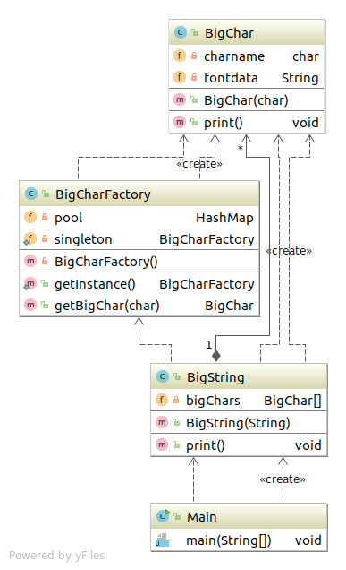

# Flyweight 模式

**共享**对象，避免浪费。

---

## 类表
| 名字 | 说明 |
|--------|--------|
|BigChar | 表示"大型字符"类 |
| BigCharFactory | 表示生成和共用BigChar类的实例的类 |
| BigString | 表示多个BigChar组成的 "大型字符串" 的类 |
| Main | 测试程序行为的类 |

## 程序类图



## 代码 
### BigChar类
``` java
import java.io.BufferedReader;
import java.io.FileNotFoundException;
import java.io.FileReader;
import java.io.IOException;

public class BigChar {
	private char charname;
	private String fontdata;
	public BigChar(char charname){
		this.charname=charname;
		try {
			BufferedReader reader=new BufferedReader(new FileReader("/home/sean/Documents/"+"big"+charname+".txt"));
			String line;
			StringBuffer buf=new StringBuffer();
			while((line=reader.readLine())!=null){
				buf.append(line);
				buf.append("\n");
			}
			reader.close();
			this.fontdata=buf.toString();
		} catch (FileNotFoundException e) {
			e.printStackTrace();
		} catch (IOException e) {
			this.fontdata=charname+"?";
			e.printStackTrace();
		}
		
		
		
	}
	
	public void print(){
		System.out.print(fontdata);
	}
}

```
### BigCharFactory类
``` java
package com.sean.Flyweight;

import java.util.HashMap;

public class BigCharFactory {
	private HashMap pool=new HashMap();
	//Singleton模式
	private static BigCharFactory singleton=new BigCharFactory();
	private BigCharFactory(){
		
	}
	//获取唯一实例
	public static BigCharFactory getInstance(){
		return singleton;
	}
	//生成（共享)BigChar类实例
	public synchronized BigChar getBigChar(char charname){
		BigChar bc=(BigChar) pool.get(""+charname);
		if(bc==null){
			bc=new BigChar(charname);
			pool.put(""+charname, bc);
		}
		return bc;
	}

}

```
### BigString类

``` java
package com.sean.Flyweight;

public class BigString {
	private BigChar[] bigChars;
	public BigString(String string){
		bigChars=new BigChar[string.length()];
		BigCharFactory factory=BigCharFactory.getInstance();
		for(int i=0;i<bigChars.length;i++){
			bigChars[i]=factory.getBigChar(string.charAt(i));
		}
	}
	//显示
	public void print(){
		for(int i=0;i<bigChars.length;i++){
			bigChars[i].print();
		}
	}
	
}

```
### Main类
``` java
package com.sean.Flyweight;

public class Main {

	/**
	 * @param args
	 */
	public static void main(String[] args) {
		BigString bs=new BigString("10101");
		bs.print();
		

	}

}
```


## 要点

Flyweight模式会对**多个地方产生影响**。

**Intrinsic:**  应当被共享的信息  
**Extrinsic:** 不应当被共享的信息

|名字 | 解释 |
|-----|------|
| Instrinsic信息 | 不依赖位置状况，可以共享 |
| Extrinsic信息  |依赖位置与状况，不能共享 |

**不要让被共享的实例被垃圾回收机器回收**
Flyweight优点：共享实例能减少对内存的使用，并且能提高运行的速度。

## 参照
> 《图解设计模式》


写这个只是为了加深自己对设计模式的理解，如不明白，可以看 《图解设计模式》。
程序类图使用idea 生成的
