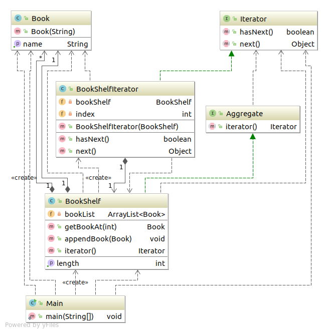

#  Iterator模式
一个一个遍历    **迭代器**

---

## 类图



## code

### Aggregate
``` java
package com.sean.Iterator;

public interface Aggregate {
		public abstract Iterator iterator();
}
```
### Iterator
``` java
package com.sean.Iterator;

public interface Iterator {
		public abstract boolean hasNext();
		public abstract Object next();
}

```

### Book
``` java
package com.sean.Iterator;

public class Book {
	private String name;
	public Book(String name){
		this.name=name;
	}
	public String getName(){
		return name;
	}
}

```

### BookShelf
``` java
package com.sean.Iterator;

import java.util.ArrayList;


public class BookShelf implements Aggregate {

	//private Book[] books;
	private ArrayList<Book> bookList = new ArrayList<Book>();
	private int last=0;
//	public BookShelf(int maxsize){
//		this.books = new Book[maxsize];
//	}
	public Book getBookAt(int index)
	{
		return bookList.get(index);
	}
	public void appendBook(Book book){
		bookList.add(book);
		last++;
	}
	public int getLength(){
		return last;
	}
	public Iterator iterator() {
		return  new BookShelfIterator(this);
	}

}

```

### BookShelfIterator
``` java
package com.sean.Iterator;

public class BookShelfIterator implements Iterator {

	private BookShelf bookShelf;
	private int index;
	public  BookShelfIterator(BookShelf bookShelf){
		this.bookShelf = bookShelf;
		this.index=0;
	}
	public boolean hasNext() {
		// TODO Auto-generated method stub
		if(index < bookShelf.getLength()){
			return true;
		}else{
			return false;
		}
		
	}

	public Object next() {
		// TODO Auto-generated method stub
		Book book = bookShelf.getBookAt(index);
		index++;
		return book;
	}

}

```
### Main
``` java
package com.sean.Iterator;

public class Main {

	public static void main(String[] args) {
		//BookShelf bookShelf = new BookShelf(4);
		BookShelf bookShelf = new BookShelf();
		bookShelf.appendBook(new Book("Around the World in 80 Days"));
		bookShelf.appendBook(new Book("Bible"));
		bookShelf.appendBook(new Book("Cinderella"));
		bookShelf.appendBook(new Book("Dady-Long-Legs"));
		bookShelf.appendBook(new Book("Gone with the wind!"));
		Iterator it = bookShelf.iterator();
		while(it.hasNext()){
			Book book = (Book) it.next();
			System.out.println(book.getName());
		}
		
	}

}

```
## 参照
> 《图解设计模式》


写这个只是为了加深自己对设计模式的理解，如不明白，可以看 《图解设计模式》。
程序类图使用idea 生成的
