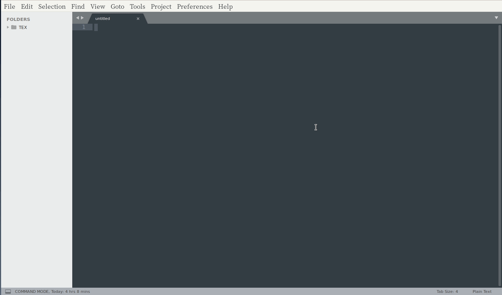
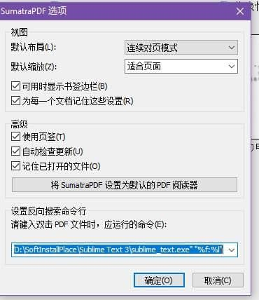
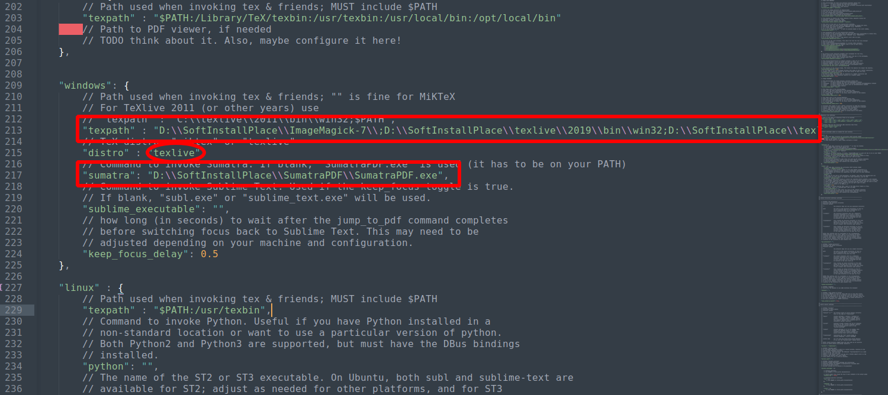
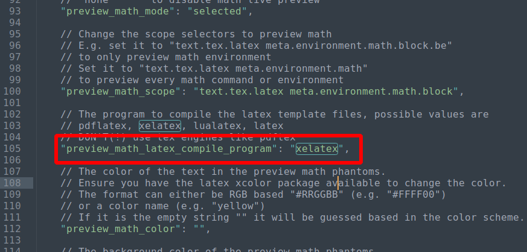
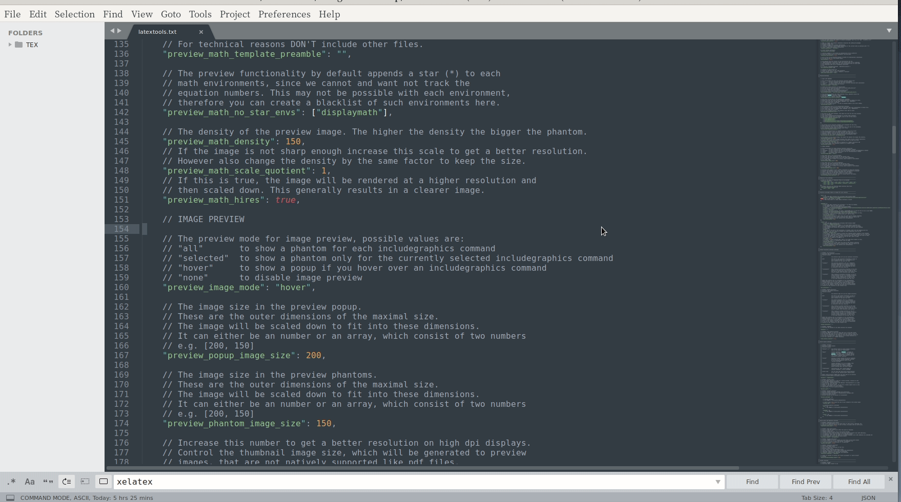
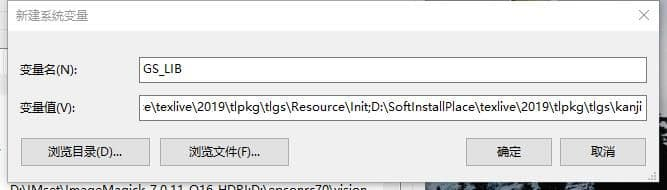
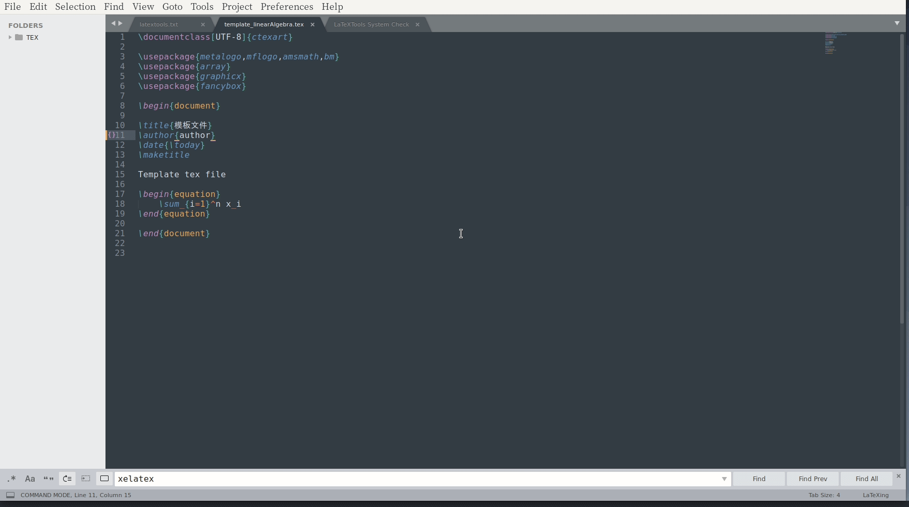
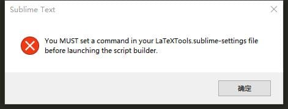
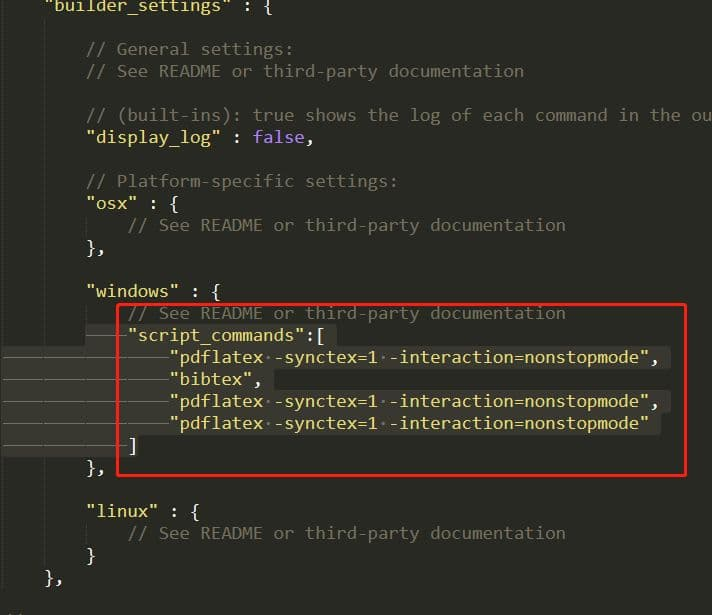
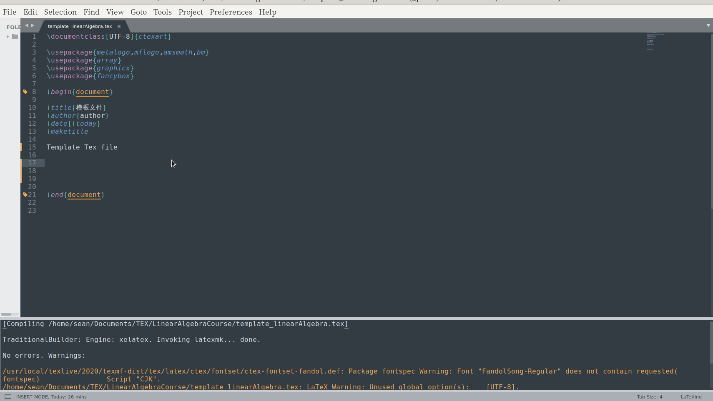

# sublime editor configure

## 安装 sublime editor

在讲述 sublime editor 配置之前，说一点无关紧要的话，缓解缓缓烦闷的气氛！
想必大家都爱用巨硬的[VS Code](https://code.visualstudio.com/)吧！不过，
目前我还没有去尝试！主要是没有时间和当前使用的代码编辑器足够我使用就没有
尝试VS code。据我了解，VS Code 的插件 **异常丰富**（插件更新快），开发者 
**特别活跃**。如果有时间和精力，以后可能会去尝试吧！

说了这么多题外话，开始步入正题，sublime editor 安装。安装sublime,对于windows
使用的朋友来说，相当简单，首先去官网 [Sublime Offical](http://www.sublimetext.com/) 
下载，然后只管点点点！哇晒！安装成功了！你开心就好！对于linux用户，官网上也有安装
[教程](http://www.sublimetext.com/docs/3/linux_repositories.html)，对于mac用户，
去官网找找， [百度百度](https://baidu.com)  [bing!bing!](https:bing.com/)或者 
[Goole!Google](https://google.com)当然可以[DuckDuckGo](https://duckduckgo.com/)! 

对于注册码部分，可以去百度！不过好像 sublime 添加了联网检测机制。对于重复多人使用的
注册码会无效！魔高一尺道高一丈，当然是有方法的，可以通过修改 `host`文件解决问题。
不注册也能用，只是偶尔会提醒你注册，提醒频率极低！如果你有闲钱，欢迎你支持正版。
支持一下，软件开发者！哈哈！好像有打广告嫌疑！

## 安装 Package Control

使用 Sublime editor, 不安装 Package Control, 你将会失去Sublime的乐趣和方便性。
方便指的是 使用 **Package Control** 安装 Sublime 的插件十分方便！至于安装教程
可参考 [Package Control](https://packagecontrol.io/installation)官方教程。怎么
老是给我推荐官方教程？主要是自己懒，其次官方教程比较可靠！推荐使用官方教程的
第二种方法 **Menu**，直接 **点点点**就OK啦！第一种方法也简单，使用命令板。调出
命令板的快捷键方法`ctrl+shit+p`，以后你会经常使用它。提前学习了！


## 使用 Package Control 安装插件

1. 调出 Sublime 的命令行面板，按下 **快捷键** `ctrl+shit+p` or `cmd+shit+p`。
如下图所是,按下快捷键`ctrl+shit+p`
2. 输入需要安装插件的名字，比如我门需要安装**Latextools**,来配置latex写作环
境。然后等待安装即可！


3. 我常用的插件，请看下图！实际是你需要什么，就安装什么，按需使用！




---


# Latextools 配置

Latextools的配置，需要安装其他软件,比如Tex,ImageMagick,Ghostscript.... 
怎么需要安装这么多软件？你有捆绑销售的嫌疑！如果不需要公式预览功能，ImageMagick是
不需要安装的，Ghostscprit在安装Tex时，就顺带安装了！最后只剩下孤单的Tex一人，但是
它还有其他伙伴！不然太孤单了，Tex的其他朋友，请继续往下阅读！


## Latextools 软件依赖

### Tex 安装

1. 下载Tex安装包！国内用户，建议使用清华mirror源下载 [TexLive](https://mirrors.tuna.tsinghua.edu.cn/CTAN/systems/texlive/Images/texlive2020-20200406.iso),
这是2020版。建议安装TexLive安装最新版本。

2. 安装TexLive。因为是iso文件，可能需要限**挂载**，然后去找其中含有 **install**的安装程序。点击安装即可。
同样的是点点点，注意记住自己的安装路径！


### ImageMagick 安装

1. 下载 ImageMagick 安装包，去官网下载吧！ [ImageMagick Download](https://imagemagick.org/script/download.php)

2. 直接点击安装即可！ **点点点！**

3. 如果你想在 **Powershell** 命令行使用，需要自己配置环境变量！


### GhostScript

如果安装的TexLive,是自带有Ghostscript,无需额外安装！


### sumatra 安装

安装这个是用于,sublime 编译后，可以自动弹出阅览pdf效果。反向搜索目的在于可以从编译后生成的pdf文件，
双击击你需要查看的内容，会自动跳转到sublime对应的编辑位置。

1. sumatra [下载地址](https://www.sumatrapdfreader.org/download-free-pdf-viewer.html)

2. 配置反向搜索

```cmd

SumatraPDF.exe -inverse-search "\"D:\SoftInstallPlace\Sublime Text 3\sublime_text.exe\" \"%f:%l\""

```

3. 如果上述命令执行不成功，显示无法找到该命令。第一种方法是用于配置 sumatra 环境变量; 第二种方法是用 **Powershell**
切换到 sumatra 安装目录，然后执行上述命令。注意对应的 exe 文件名要和你安装的SumatraPDF程序相对应！


4. 结果如下




## Latextools 配置开始

### 打开LatexTools 配置文件

1. 点击菜单栏的 `Preferences`

2. 点击 `Package Settings`

3. 点击 `Latextools`

4. 点击 `Settings-user`

实际看图片更简单明了！如下为操作的具体过程！如果打开文件为空白(null)，可以把默认
的配置文件复制过来！


###  windows 配置项

大概在209行左右，也可以用 `Ctrl+F`搜索关键词 **windows**,我们以windows平台介绍！



1. **texpath** 配置。需要添加安装**texlive安装环境**，例如我的是 

```cmd

D:\\SoftInstallPlace\\texlive\\2019\\bin\\win32;

```

根据你自己安装路径，修改一下，各环境变量用分号隔开！添加 **ImageMagick安装环境**，例如我的
```cmd

D:\\SoftInstallPlace\\ImageMagick-7\\;

```
添加**Ghostscript 安装环境**,texlive 自带，因此为 
```cmd

D:\\SoftInstallPlace\\texlive\\2019\\tlpkg\\tlgs\\bin

```

2. **distro**配置。因为前面我们安装的是texlive，因此要修改为`texlive`。

```cmd
distro: "texlive"

```


3. **sumatra**配置。例如我配置项为 
```cmd

D:\\SoftInstallPlace\\SumatraPDF\\SumatraPDF.exe

```


### preview math latex compile program 配置

公式预览编译器的设置，`xelatex`挺不错的，就改成这个Tex编译引擎。





# 其他问题说明

## Math Equation 预览功能无法使用

1. 使用 LatexTools:check system 查看 tex宏包是否安装完全，以及环境是否配置正确！



像 **biber** 和 **convert** 或 **magick** 显示不可用可以忽略！使用check system
有一定的参考价值，实际它是有bug的，因为自己确实安装并配置了环境变量，而他显示未
检测到其他需要软件！具有一定的误导作用！记得以前为了解决未检测其他软件，自己反复
重新安装软件，并配置环境变量，它给我的反馈都一样！最后发现是插件作者写的该检测环
境脚本鲁棒性不够！

2. Windows 用户的朋友需要添加 环境变量 `GS_LIB`,环境变量的值为:
```cmd

D:\SoftInstallPlace\texlive\2019\tlpkg\tlgs\Resource\Init;D:\SoftInstallPlace\texlive\2019\tlpkg\tlgs\kanji

```
当时安装配置完环境，公式预览无法实现，也自己查了以下 sublime 在实现公式预览生成的临时文件，
发现并未有生成pdf文件，和生成pdf有关的软件为Ghostscript,定位到出问题的大致位置。你可能会问
Imagemagick软件是干嘛的呢？请看软件名，Image，处理图片的。**实际预览的公式为图片文件**。
对应修改自己的安装目录！ [参考网址](https://www.jianshu.com/p/fee3fa234626)





## 首次使用 tex 编译文件

1. 使用 命令板方式



3. 快捷键编译 `Ctrl+B`

 
2. 使用`Ctrl+B`可能出现问题，如下



解决方案,从提示的错误来解释，便是你使用的是 **script builder**脚本编译文件，
因此你需要添加在脚本编译设置处添加如下内容。



```json
"script_commands":[
    "pdflatex -synctex=1 -interaction=nonstopmode",
    "bibtex",
    "pdflatex -synctex=1 -interaction=nonstopmode",
    "pdflatex -synctex=1 -interaction=nonstopmode"
   ]
```

# 配置后的效果演示

## latex 简单文件模板

```json

\documentclass[UTF-8]{ctexart}

\usepackage{metalogo,mflogo,amsmath,bm}
\usepackage{array}
\usepackage{graphicx} 
\usepackage{fancybox}

\begin{document}

\title{模板文件}
\author{author}
\date{\today}
\maketitle

Template Tex file


\end{document}

```

## 操作演示




# 更多技巧

更多技巧和定制化的设置，请参考官方教程。

# 备注

I would greatly appreciate hearing about any error in this article, even minor ones. 
I welcome your suggestions for improvements, even tiny one. You can give advice on 
the following comment area and email to me!. Have fun!

# 主要参考网址

[LatexTools](https://latextools.readthedocs.io/en/latest/install/)

[Sublime](http://www.sublimetext.com/)

[Imagemagick](http://www.sublimetext.com/)


