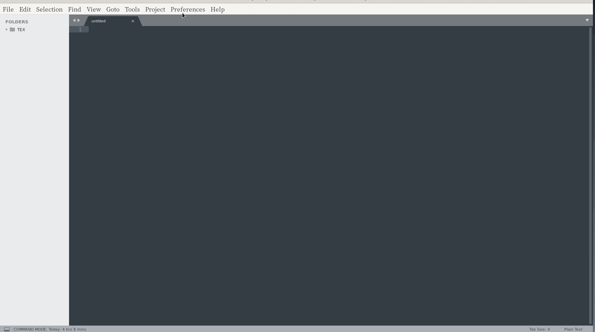

# sublime editor configure

## 安装 sublime editor

在讲述 sublime editor 配置之前，说一点无关紧要的话，缓解缓缓烦闷的气氛！想必大家都爱用巨硬的[VS Code](https://code.visualstudio.com/)吧！不过，目前我还没有去尝试！主要是没有时间和当前使用的代码编辑器足够我使用就没有尝试 VS code。据我了解，VS Code 的插件 **异常丰富**（插件更新快），开发者**特别活跃**。如果有时间和精力，以后可能会去尝试吧！

说了这么多题外话，开始步入正题，sublime editor 安装。安装 sublime，对于 windows 使用的朋友来说，相当简单，首先去官网 [Sublime Offical](http://www.sublimetext.com/) 下载，然后只管点点点！哇晒！安装成功了！你开心就好！对于linux用户，官网上也有安装[教程](http://www.sublimetext.com/docs/3/linux_repositories.html)，对于mac用户，去官网找找，[百度百度](https://baidu.com)，[bing!bing!](https:bing.com/)或者 [Goole!Google!](https://google.com)，当然可以[DuckDuckGo](https://duckduckgo.com/)! 

对于注册码部分，自己可以去百度！不过好像 sublime 添加了联网检测机制。对于重复多人使用的注册码会无效！魔高一尺道高一丈，当然是有方法的，可以通过修改 `host` 文件解决问题。不注册也能用，只是偶尔会提醒你注册，提醒频率极低！如果你有闲钱，欢迎你支持正版。支持一下，软件开发者！哈哈！好像有打广告嫌疑！

## 安装 Package Control

使用 Sublime editor，不安装 Package Control，你将会失去 Sublime 的乐趣和方便性。方便指的是使用 **Package Control** 安装 Sublime 的插件十分方便！至于安装教程可参考 [Package Control Install](https://packagecontrol.io/installation) 官方教程。怎么老是给我推荐官方教程？主要是自己懒，其次官方教程比较可靠！推荐使用官方教程的第二种方法 **Menu**，直接 **点点点**就OK啦！第一种方法也简单，使用命令行。调出 Sublime 命令行的快捷键方法 `ctrl+shit+p`，以后你会经常使用它。提前学习了！


## 使用 Package Control 安装插件

1. 调出 Sublime 的命令行面板，按下 **快捷键** `ctrl+shit+p` or `cmd+shit+p`。如下图所是，按下快捷键`ctrl+shit+p`

2. 输入需要安装插件的名字，比如我门需要安装**Latextools**，来配置latex写作环境。然后等待安装即可！


3. 我常用的插件，请看下图！实际是你需要什么，就安装什么，按需使用！


---


# Latextools 配置

Latextools 的配置，需要安装其他软件，比如 Tex，ImageMagick，Ghostscript....怎么需要安装这么多软件？你有捆绑销售的嫌疑哈！如果不需要公式预览功能，ImageMagick 是不需要安装的，Ghostscprit 在安装 TexLive 时，就顺带安装了！最后只剩下孤单的 Tex 一人。如果你需要公式预览功能，它就有其他伙伴！不然 Tex 太孤单了！Tex 的其他朋友，请继续往下阅读！


## Latextools 软件依赖

### Tex 安装

1. 下载 Tex 安装包！国内用户，建议使用[清华 mirror 源](https://mirrors.tuna.tsinghua.edu.cn/)下载 TexLive。下载提示：`获取下载链接` -> `应用软件` -> `Tex 排版系统` -> `Tex Live`。建议安装 TexLive 安装最新版本。其中的 MikTex 是针对 MacOSd 的。

2. 安装 TexLive。因为是 ISO 文件，可能需要**挂载**，然后去找其中含有 **install** 的安装程序。点击安装即可。同样的操作，点点点，注意记住自己的安装路径！


### ImageMagick 安装

1. 下载 ImageMagick 安装包，去官网下载吧！ [ImageMagick Download](https://imagemagick.org/script/download.php)

2. 直接点击安装即可！ **点点点！**

3. 如果你想在 **Powershell** 命令行使用，需要自己配置环境变量！


### GhostScript

如果安装的 TexLive，是自带有 Ghostscript，无需额外安装！


### sumatra 安装

安装这个是用于， sublime 编译后，可以自动弹出阅览pdf效果。反向搜索目的在于可以从编译后生成的pdf文件，双击击你需要查看的内容，会自动跳转到 sublime 对应的编辑位置。

1. sumatra [下载地址](https://www.sumatrapdfreader.org/download-free-pdf-viewer.html)

2. 配置反向搜索

```cmd
SumatraPDF.exe -inverse-search "\"D:\SoftInstallPlace\Sublime Text 3\sublime_text.exe\" \"%f:%l\""
```

3. 如果上述命令执行不成功，显示无法找到该命令。第一种方法是配置 sumatra 环境变量; 第二种方法是用 **Powershell**，切换到 sumatra 安装目录，然后执行上述命令。注意对应的 exe 文件名要和你安装的 SumatraPDF 程序相对应！


4. 结果如下


## Latextools 配置开始

### 打开LatexTools 配置文件

1. 点击菜单栏的 `Preferences`

2. 点击 `Package Settings`

3. 点击 `Latextools`

4. 点击 `Settings-user`

实际看图片更简单明了！如下为操作的具体过程！如果打开文件为空白(null)，可以把默认的配置文件复制过来！




###  windows 配置项

大概在209行左右，也可以用 `Ctrl+F`搜索关键词 **windows**，我们以 windows 平台介绍！


1. **texpath** 配置。需要添加安装**texlive安装环境**，例如我的是 

```cmd
D:\\SoftInstallPlace\\texlive\\2019\\bin\\win32;
```

根据你自己安装路径，修改一下，各环境变量用分号隔开！添加 **ImageMagick 安装环境**，例如我的
```cmd
D:\\SoftInstallPlace\\ImageMagick-7\\;
```
添加 **Ghostscript 安装环境**，texlive 自带，因此为 
```cmd
D:\\SoftInstallPlace\\texlive\\2019\\tlpkg\\tlgs\\bin
```

2. **distro** 配置。因为前面我们安装的是 texlive，因此要修改为 `texlive`。

```cmd
distro: "texlive"
```


3. **sumatra**配置。例如我配置项为 
```cmd
D:\\SoftInstallPlace\\SumatraPDF\\SumatraPDF.exe
```


### preview math latex compile program 配置

公式预览编译器的设置，`xelatex`挺不错的，就改成这个 Tex 编译引擎。


# 其他问题说明

## Math Equation 预览功能无法使用

1. 使用 `LatexTools:check system` 查看 tex 宏包是否安装完全，以及环境是否配置正确！


像 **biber** 和 **convert** 或 **magick** 显示不可用是可以忽略！使用 check system 有一定的参考价值，实际它是有 bug 的，因为自己确实安装并配置了环境变量，而他显示未检测到其他需要软件！具有一定的误导作用！记得以前为了解决未检测其他软件，自己反复重新安装软件，并配置环境变量，它给我的反馈都一样！最后发现是插件作者写的该检测环境脚本鲁棒性不够，至少对于我使用是有问题的！

2. Windows 用户的朋友需要添加 环境变量 `GS_LIB`，环境变量的值为:
```cmd
D:\SoftInstallPlace\texlive\2019\tlpkg\tlgs\Resource\Init;D:\SoftInstallPlace\texlive\2019\tlpkg\tlgs\kanji
```
当时安装配置完环境，公式预览无法实现，也自己查了以下 sublime 在实现公式预览生成的临时文件，发现并未有生成 pdf 文件，和生成pdf有关的软件为 Ghostscript，定位到出问题的大致位置。你可能会问Imagemagick软件是干嘛的呢？请看软件名中的Image->处理图片的。**实际预览的公式为图片文件**。对应修改自己的安装目录！ [参考网址](https://www.jianshu.com/p/fee3fa234626)


## 首次使用 tex 编译文件

1. 使用 命令板方式


3. 快捷键编译 `Ctrl+B`

 
2. 使用`Ctrl+B`可能出现问题，如下


解决方案，从提示的错误来解释，便是你使用的是 **script builder**脚本编译文件，因此你需要添加在脚本编译设置处添加如下内容。


```json
"script_commands":[
    "pdflatex -synctex=1 -interaction=nonstopmode",
    "bibtex",
    "pdflatex -synctex=1 -interaction=nonstopmode",
    "pdflatex -synctex=1 -interaction=nonstopmode"
   ]
```
上面的 `pdflatex` 你可以替换成 `xelatex` 等 Tex 编译引擎。

# 配置后的效果演示

## latex 简单文件模板

```tex

\documentclass[UTF-8]{ctexart}

\usepackage{metalogo,mflogo,amsmath,bm}
\usepackage{array}
\usepackage{graphicx} 
\usepackage{fancybox}

\begin{document}

\title{模板文件}
\author{author}
\date{\today}
\maketitle

Template Tex file


\end{document}

```

## 操作演示


# 更多技巧

更多技巧和定制化的设置，请参考 sublime 官方网站。

# 备注

I would greatly appreciate hearing about any error in this article, even minor ones. 
I welcome your suggestions for improvements, even tiny one. Please email to me!😝

# 主要参考网址

[LatexTools](https://latextools.readthedocs.io/en/latest/install/)

[Sublime](http://www.sublimetext.com/)

[Imagemagick](http://www.sublimetext.com/)


