# linux
Linux是一套免费使用和自由传播的[类Unix](https://baike.baidu.com/item/%E7%B1%BBUnix)[操作系统](https://baike.baidu.com/item/%E6%93%8D%E4%BD%9C%E7%B3%BB%E7%BB%9F/192)，是一个基于[POSIX](https://baike.baidu.com/item/POSIX)和[UNIX](https://baike.baidu.com/item/UNIX)的多用户、[多任务](https://baike.baidu.com/item/%E5%A4%9A%E4%BB%BB%E5%8A%A1)、支持[多线程](https://baike.baidu.com/item/%E5%A4%9A%E7%BA%BF%E7%A8%8B)和多[CPU](https://baike.baidu.com/item/CPU)的操作系统。它能运行主要的UNIX工具软件、应用程序和网络协议。它支持[32位](https://baike.baidu.com/item/32%E4%BD%8D/5812218)和[64位](https://baike.baidu.com/item/64%E4%BD%8D)硬件。Linux继承了[Unix](https://baike.baidu.com/item/Unix)以网络为核心的设计思想，是一个性能稳定的多用户网络操作系统。


Linux操作系统诞生于1991 年10 月5 日（这是第一次正式向外公布时间）。Linux存在着许多不同的Linux版本，但它们都使用了[Linux内核](https://baike.baidu.com/item/Linux%E5%86%85%E6%A0%B8)。Linux可安装在各种计算机硬件设备中，比如手机、平板电脑、路由器、视频游戏控制台、台式计算机、大型机和超级计算机。

---

## linux简介

linux的核心是由 **Linus Torvads** 在1991年的时候开发出来的。

讲linux的必须先讲它的大哥**Unix**

**Unix**是以高阶的C语言在贝尔实验室(AT&T)写成的。总之Unix是一个很6的系统,可以查阅Unix的源代码。刚开发时，大家都可以免费使用。后来由于AT&T由于商业的考虑，于是将Unix的版权回收。特别提到 **不可对学生提供源代码**。版权的收回，影响到学校教Unix源代码的教授！Andrew Tanenbaum(谭宁邦)教授自己动手写了Minix这个Unix Like的核心代码！在编写源代码过程中，为了避免版权纷争，教授完全不看Unix核心源代码！并且强调Minix要完全和Unix兼容才行！1984开始写代码，到1986年结束。

1984年的GNU计划。（Richard Mathew Stallman 史托曼）
软件分享
GCC(GNU C Complier )

后来就是Linus Torvads  在Minix的基础上编写了linux。于1991年发布。

大概就讲这么多吧！

---

## linux 发行版本

自己看图吧！

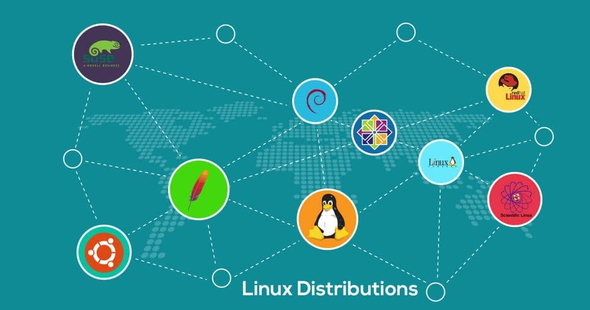


如果看的不清楚可以去这个网站 [linux发行图](http://futurist.se/gldt/) 

[linux发行图](http://futurist.se/gldt/wp-content/uploads/12.10/gldt1210.svg)

是不是太多了！看的都眼花了！自己选择一款喜欢的发行版本。

友情链接

[Redhat](https://www.redhat.com)   [Centos](https://www.centos.org/)      [Debian](https://www.debian.org/)   [ubuntu](https://www.ubuntu.com)  [SUSE](https://download.suse.com)   [openSUE](https://www.opensuse.org/) 

自己可以玩玩！当然还有很多其他版本！也有一些酷炫的版本！

---

## linux安装

我们安装Ubuntu版的linux系统。安装桌面版的。易于个人使用。

### 首先去官网下载ubuntu镜像

[Ubuntu下载地址](https://www.ubuntu.com/download/desktop)

[Ubuntu安装教程](https://tutorials.ubuntu.com/tutorial/tutorial-install-ubuntu-desktop?_ga=2.9209781.1862713034.1521263401-1655017864.1521263401#0)

### 提醒要点

1.要使用刻录盘刻录镜像。刻录完镜像，就可以像安装win10系统一样安装，当然需要修改bios.记得自己分一个干净的盘来安装linux系统。
2.安装要注意分区表格式。
3.系统只能安装在主分区不能安装在逻辑分区。

---

## linux简单的使用

linux不同版本的linux命令有一些不同的地方，但是大部分是相同的。

下面是Ubuntu系统使用的命令。

希望你们在学习linux时**多敲命令**！如同windows上的**cmd**

### 常见命令使用

打开终端

鼠标右击 -> 选择 `Open Terminal`

如下图

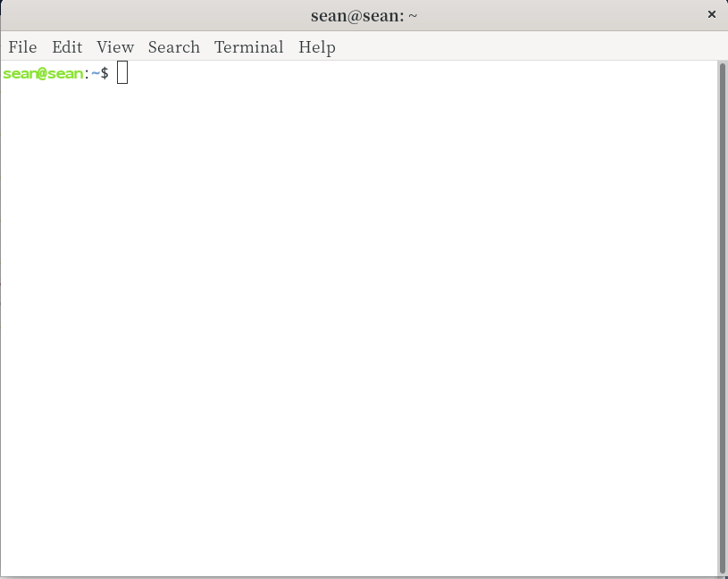


首先讲一个特别有用的命令 **man**这个命令是挺厉害的！比如想知道 `ls`命令怎么用？可以使用

``` bash
man ls
```


最后回车键 `Enter`键 执行命令

按回车或移动鼠标，可以看`ls`的帮助文档。

不需要阅读帮助文档，看上面截屏的提示。按 `q` 建退出帮助文档


当然还有一种查看帮助文档的命令: `command --help`

``` bash
ls --help
```
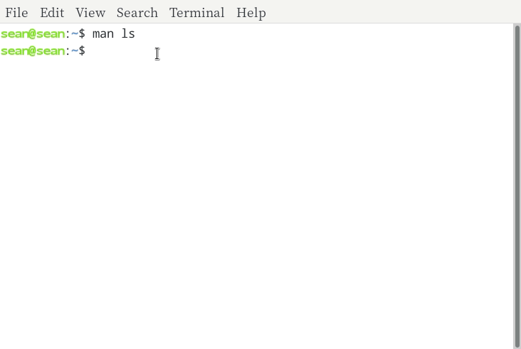

**记住命令之间一定要有空格！大小写也很重要！**

关机命令

``` bash
poweroff
```
重启命令

``` bash
reboot
```

切换目录的命令 `cd` 显示当前目录下文件命令 `ls` 

``` bash
cd /home/sean/
ls
```

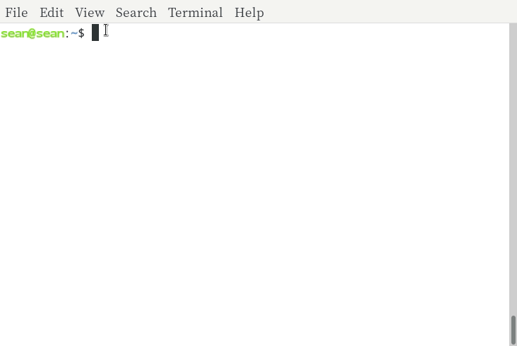


如果输入 `ls -al` 就会显示更多信息

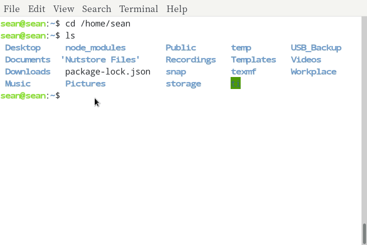

 
`top`命令就如同windows上的资源管理器

``` bash
top
```

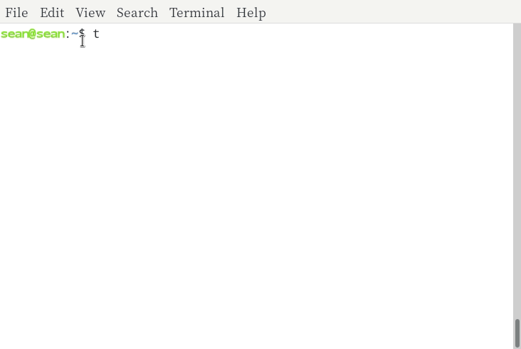

`ctr + z`停止这个命令

### 安装软件

各个linux发行版本的安装软件的方法不一样。ubuntu有一个应用商店.

看图
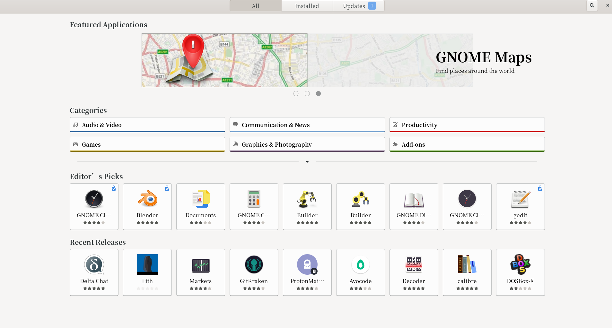

还有其他安装软件的方法，就是使用命令行。

`sudo apt install softname`

例如安装 `vim ` 文本编辑软件。挺好用的。

Ubuntu不自带`vim`,需要额外安装。Centos自带vim

``` bash
sudo apt install vim
```

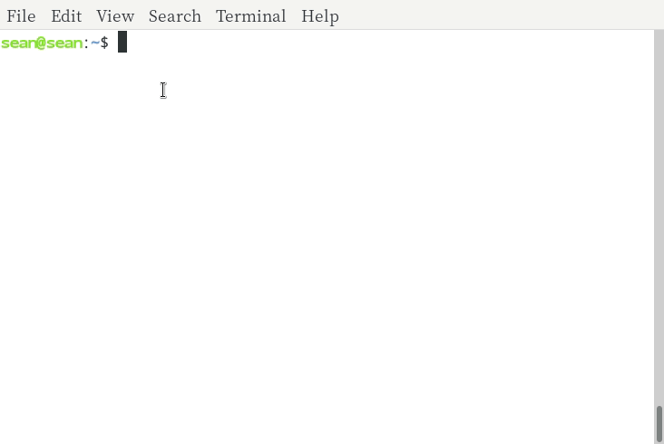

会叫你输入密码：

你输入时不会显示 `*******`,输入完成回车，OK！

我的是已经安装了。你们安装时一路回车就安装了。


**vim简单使用**

``` bash
vim vim.txt
```

按 `a`,就可以写文本了。
输入 `:w` 保存
输入 `:q` 退出

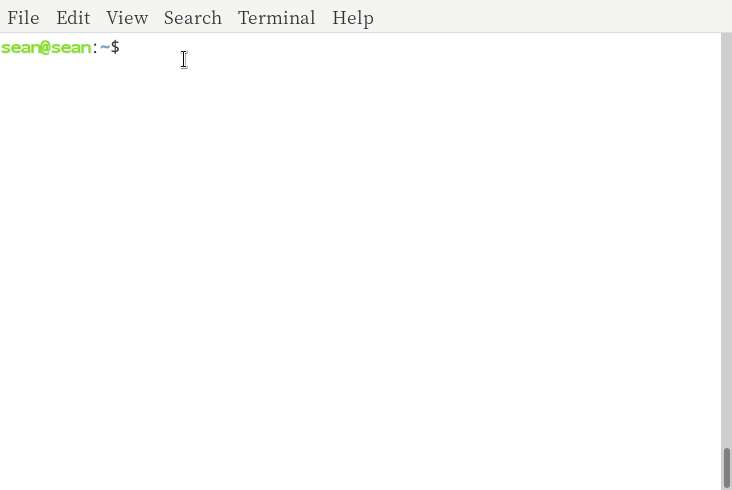

vim 官方教程，可以在终端输入`vimtutor` 或者 在终端输入`vim`,然后输入`:h vimtutor`。


vim 其他学习网站 [viemu](http://www.viemu.com/a_vi_vim_graphical_cheat_sheet_tutorial.html)

再贴一点vim的使用表，没事可以看看。多用就会了。


Ubuntu 是用`apt` 或 `apt-get` 命令安装软件，而Centos使用`yum`安装软件。

**源代码安装**
还有一种安装软件的方法就是源代码编译安装。使用 `make`命令。这里我就不多说了。因为这涉及库的问题。该方法能安装新版的软件，但是也是最难使用的，不是因为命令复杂，而是因为不容易安装所需要的库！可能各个软件版本所需要的库有所不同，同时库之间可能有冲突，一个库依赖另一个库，可能你需要的就不是单纯安装所提示的库，而是一系列库，简单的说就是 **库之间存在依赖**。哈哈！如果爱折腾，倒是可以折腾一下。当然也有一些软件源码安装比较容易，前提是你已具备所需要的库环境。对于需要使用最新版本的软件，尝试新鲜功能，还是需要使用源码安装。


### 一些trick命令

#### 终端获取天气

天气的获取当然可以用网页，或天气软件获得天气，在终端依旧可以获得天气。
首先你需要`curl`命令。通过前面讲的命令`sudo apt install curl`安装。
然后使用 `curl wttr.in/beijing`, 你也可以试试 `curl wttr.in/chengdu?format=2`。

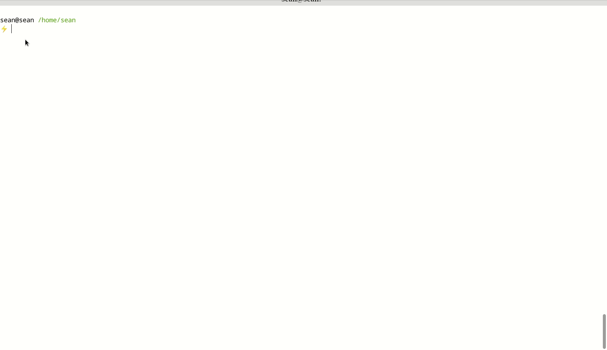

#### 获取系统信息
当前我使用的已经不是ubuntu了，所以截取的gif图片显示信息不是ubuntu。
但是ubuntu依旧适用。 安装软件命令 `sudo apt install screenfetch`,
然后直接运行 `screenfetch`就可以得到如下信息。

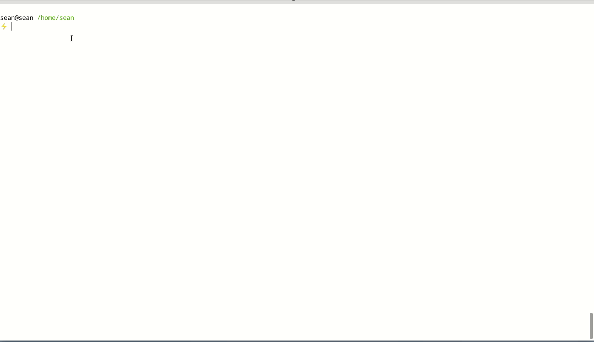


# 备注

I would greatly appreciate hearing about any error in this article, even minor ones.
I welcome your suggestions for improvements, even tiny one. You can give advice on
the following comment area and email to me!. Have fun!
