# Matlab Live Editor 基本介绍 #

Matlab [Live Editor](https://www.mathworks.com/products/matlab/live-editor.html) 是 matlab R2016a 引入的新matlab实时编辑器，也就是说 **Matlab R2016a**的版本都可以使用live editor。官方给出你可以用 R2014b,R2015a和R2015b打开live script. 使用live editor最好使用高版本的Matlab。我用的R2017b是基本没有问题的。实际在Linux下的MatlabR2017b在使用live editor还是有点问题的，具体在运行大量符号计算的时候，会出现卡机或一直运行，可能Linux(Debian)下的符号运算所使用的库有Bug吧！最近，Matlab更换到MATLAB2021b,运算速度就大幅度提高，对符号运算可以完全运行。上述符号运算问题在Windows不存在。 因此建议使用高版本的MATLAB，最好近一两年的。顺便提一句，MATLAB R2021b 完全安装大概需要30G磁盘空间。

下面是matlab官方给的 live script 解释。翻译一下：live script可以把代码和代码运行的结果保存在一个文件，更强大的功能可以处理文本格式，可以插入公式、插入图片添加超链接等。简单的说更像一个笔记本，功能更强大，使用更方便，比以前的m文件方便多了。个人使用也感受到m文件在各个平台存在中文乱码问题，但是live script不存在中文乱码问题。更多live editor技巧和功能请继续阅读下文。

> you can create live scripts that show output together with the code that produced it. Add formatted text, equations, images, and hyperlinks to enhance your narrative, and share the live script with others as an interactive document.

---

$E=mc^2$

# Matlab Live Editor 基本使用 #

## 创建 live script ##

创建live script文件有两种方法，一种是鼠标点点点，另一种当然是键盘敲敲敲。

1. 鼠标点点点方法
   - 首先点击菜单栏 **HOME**,然后在matlab左上角点击 **New Live Script** 
   - 首先点击菜单栏 **HOME**,也可以点击 **New**, 下拉菜单选择 **Live Script**。

   

2. 键盘敲敲敲方法
   在matlab的Command窗口输入命令`edit filename.mlx`

   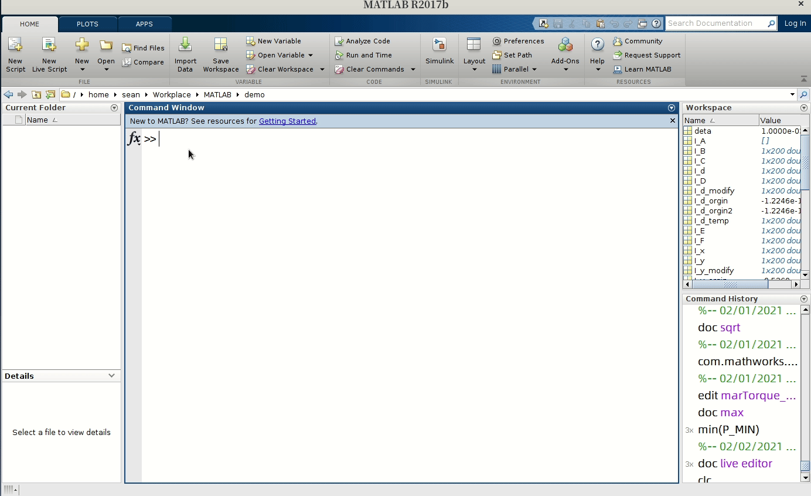

## Live Editor 简单使用 ##
   
1. live Editor使用演示, 请看gif图，编程使用和m文件基本相同，主要有自动补全功能，可以防止自己输入代码出错。
   
   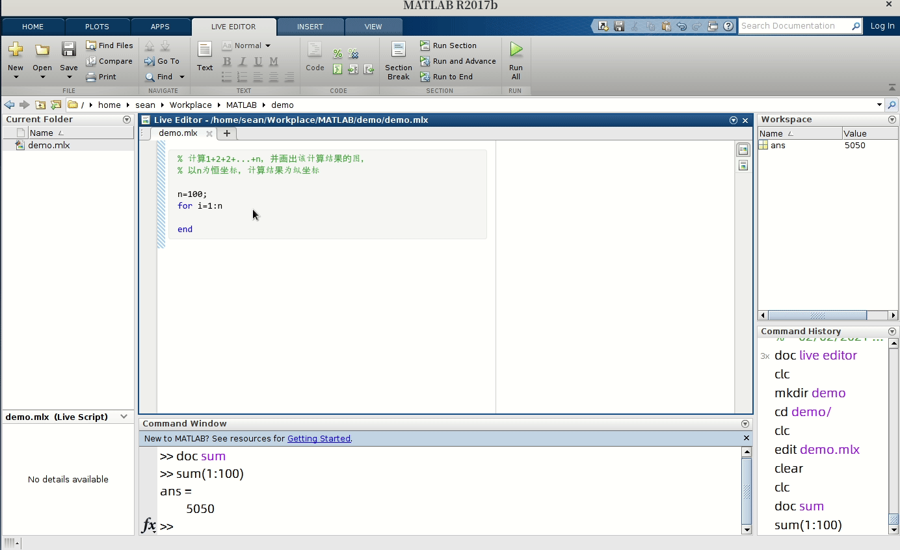 

2. 两种显示代码运行结果的方式

   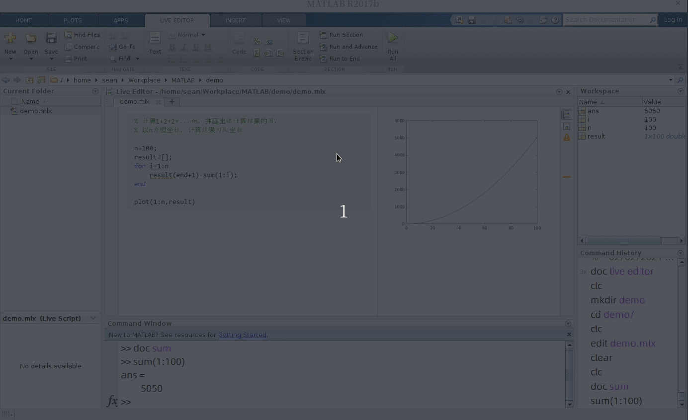

3. 运行代码
   可以点击 **Run All** 该mlx 文件的代码全部运行。也可以仅仅运行当前节的代码，点击 **Run Section**,运行当前节的代码，可以点击单击live editor左侧边栏。
   
   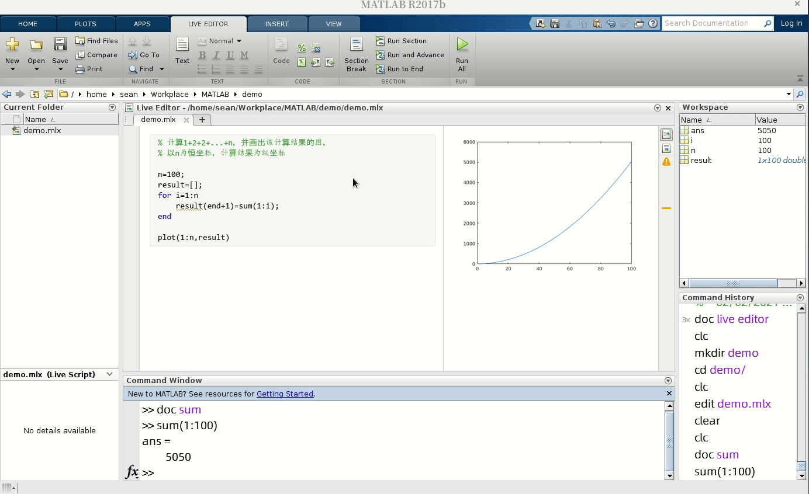

4. 代码分节
   上面讲了代码的分节运行，那么怎么分节呢？ 可以点击Live editor **Section Break**, 或者快捷键`Ctrl+Alt+Enter`,解放你的鼠标！
   
   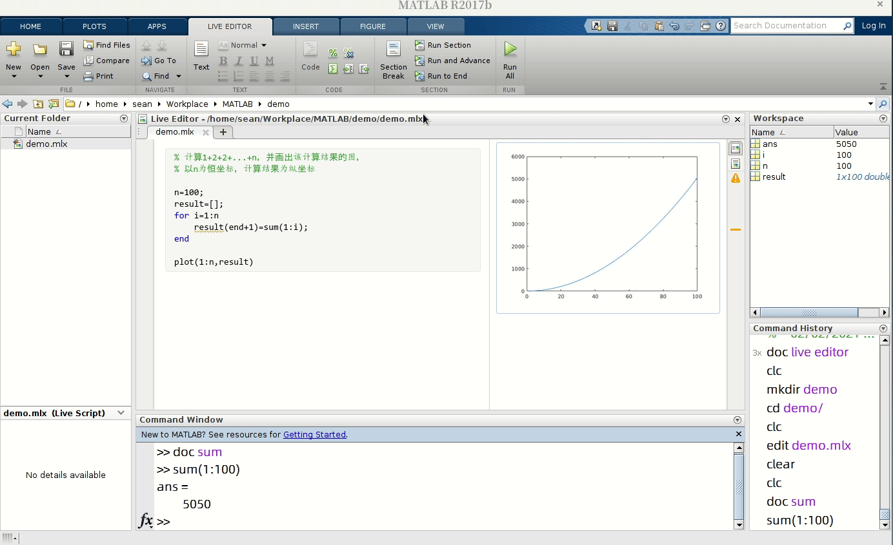

5. 运行图片放大
   
   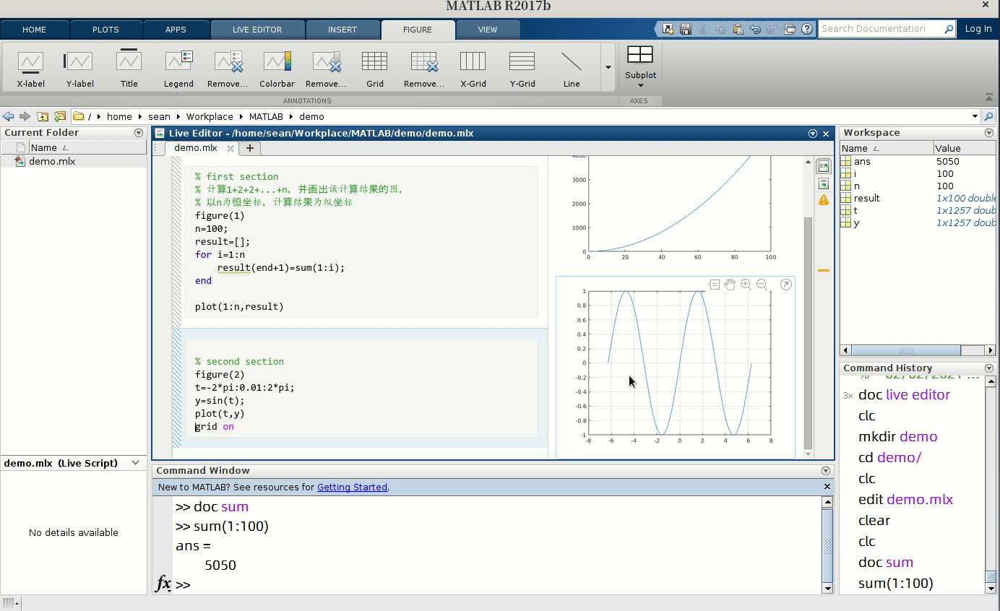

6. 插入文本
   live editor可以插入文本，并有一定的格式化功能，可以把matlab代码写成文档的形式。首先你要切换到文本模式，当然可以鼠标点点点，也可以快捷键`Alt+Enter`,可以再按一次快捷键切换到code模式。
   
   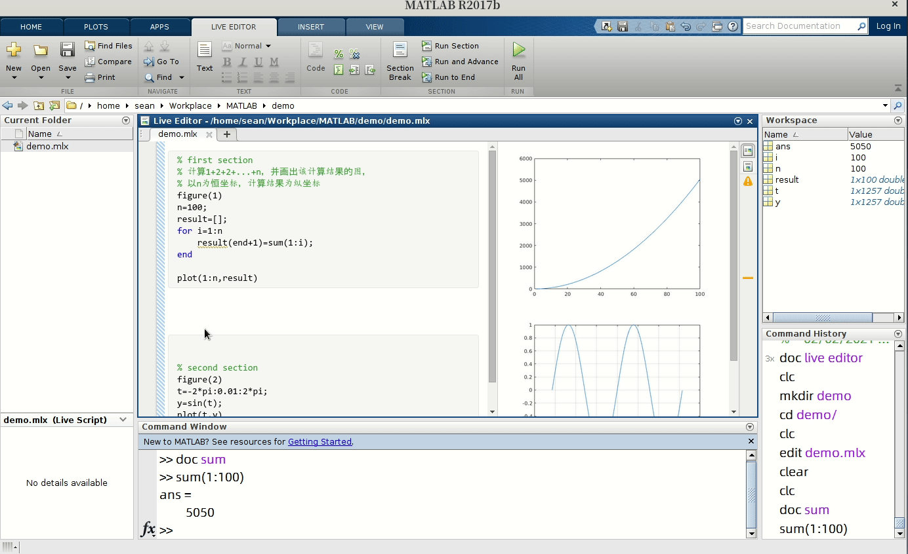

   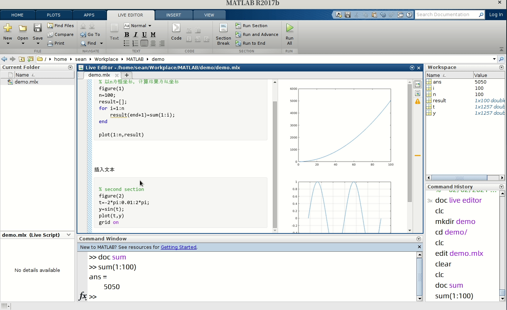

7. 文本格式化
   live editor文本格式化的功能是有限的，不像 MS word 功能强大，但是基本满足需求。还是值得使用的。可以用鼠标点点点实现格式化，我更偏爱用快捷键方式，速度更快。只要你把鼠标悬浮在每个功能上面，就会自动显示对应功能快捷键。下图演示基本的文本操作。

   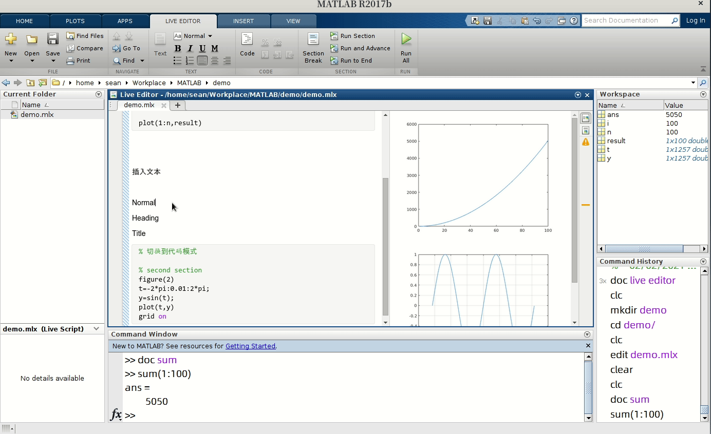

8. 插入图片和超链接
   Matlab live editor 插入图片和超链接十分方便，简单。 首先在matlab菜单栏选择 **INSERT**, 然后点击 **Image** **Hyperlink**

   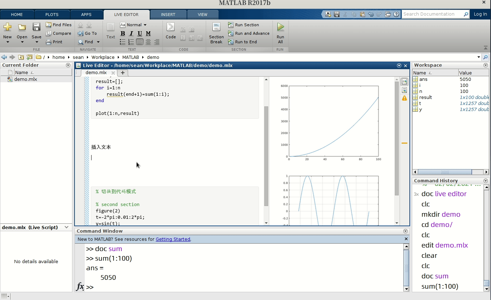

9. 插入公式
   插入公式是一个特别方便的功能，尤其是支持Latex公式，且可以实时预览公式。快捷键插入公式可以提高你的编辑效率，比如`Ctrl+ALt+G`,Latex模式的公式输入。

   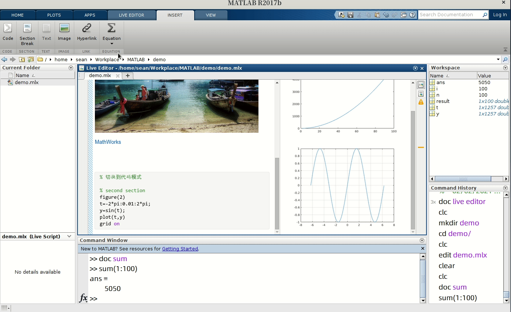

10. 清除显示结果
    有时可能结果出错，想清除live script运行结果。操作如下。
    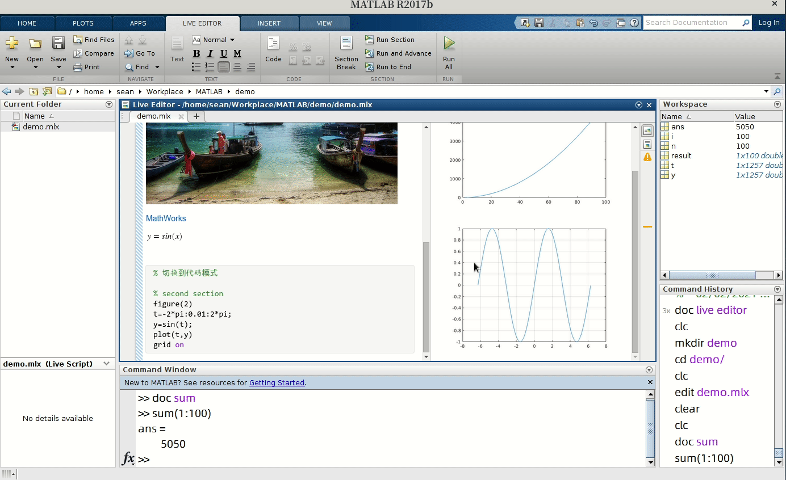

11. 保存为其他文件
    你可以把mlx文件另存为m文件，也可以保存为pdf文件等等。最舒适的pdf文件，可以分享给其他人。pdf文件基本不存在格式问题，具有较好的格式兼容性。
    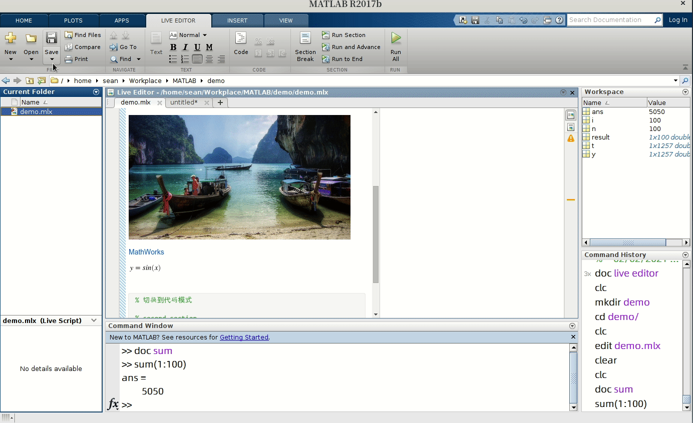

# 更多技巧 #
更多使用技巧可以使用 `doc live editor`来查找！ 相当有用，以上内容全部通过这个帮助文档学习！

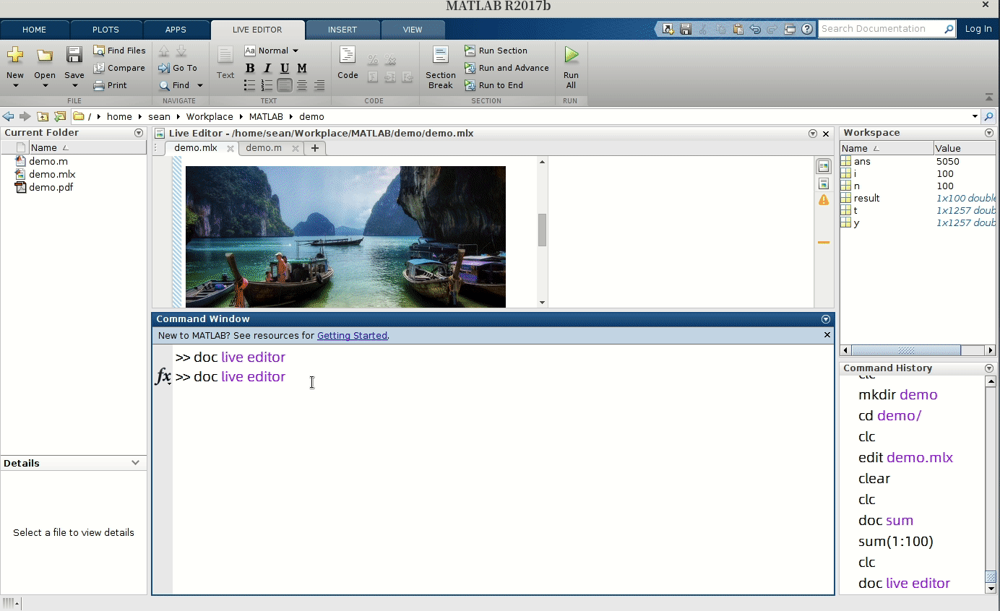

