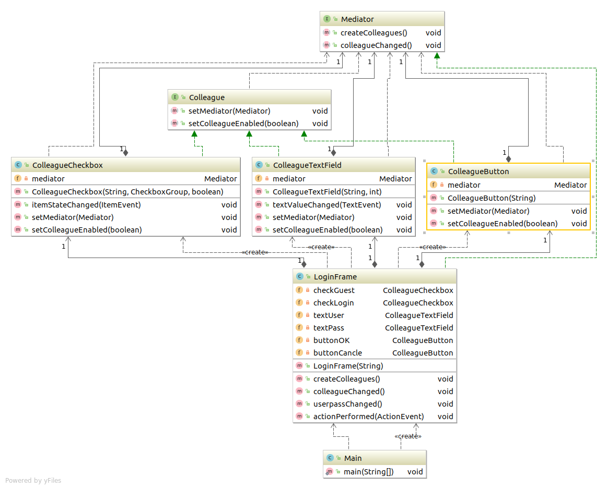

# Mediator模式
只有一个仲裁者
&ensp; 要调用多个对象之间的关系时，就需要使用Mediator模式。将控制的逻辑处理交给仲裁者。

---


## 类和接口表
|  名字   | 说明                                   |
| -------  | -----------------------------------|
| Mediator | 定义 "仲裁者" 的接口(API)的接口 |
| Colleague | 定义"组员"的接口(API)的接口 |
| ColleagueButton | 表示按钮的类。它实现Colleague接口 |
| ColleagueTextField | 表示文本输入框的类。它实现了Colleague接口 |
| ColleagueCheckbox | 表示勾选框的类。实现了Colleague接口 |
| LoginFrame | 表示登录对话框类。实现了Mediator接口 |
| Main | 测试程序行为的类 |
 


## 程序的类图
有点复杂喔！ 不急。慢慢看！！



## 代码
### Colleague接口(组员接口)
``` java
package com.sean.Mediator;

public interface Colleague {

	public abstract void setMediator(Mediator mediator);
	public abstract void setColleagueEnabled(boolean enabled);
}


```

### Mediator接口(仲裁者接口)
``` java
package com.sean.Mediator;

public interface Mediator {
	//生成Mediator要管理的组员.
	public abstract void createColleagues();
	//被各个Colleague组员调用，让组员向仲裁者进行报告
	public abstract void colleagueChanged();
}

```

### ColleagueButton(具体的组员)
``` java
import java.awt.Button;
import java.awt.HeadlessException;

public class ColleagueButton extends Button implements Colleague {
	private Mediator mediator;
	public ColleagueButton(String caption) {
		super(caption);
	}
	
	public void setMediator(Mediator mediator) {
		//保存Mediator
		this.mediator=mediator;

	}

	public void setColleagueEnabled(boolean enabled) {
		//Mediator下达启用禁用的指示
		setEnabled(enabled);
	}

}

```

### ColleagueCheckbox(具体的组员)
``` java
package com.sean.Mediator;

import java.awt.Checkbox;
import java.awt.CheckboxGroup;
import java.awt.event.ItemEvent;
import java.awt.event.ItemListener;

public class ColleagueCheckbox extends Checkbox implements Colleague,
		ItemListener {
	private Mediator mediator;
	public ColleagueCheckbox(String caption,CheckboxGroup group,boolean state){
		super(caption,group,state);
	}
	public void itemStateChanged(ItemEvent e) {
		mediator.colleagueChanged();

	}

	public void setMediator(Mediator mediator) {
		this.mediator=mediator;

	}

	public void setColleagueEnabled(boolean enabled) {
		setEnabled(enabled);

	}

}

```

### ColleagueTextField(具体的组员)
``` java
import java.awt.Color;
import java.awt.TextField;
import java.awt.event.TextEvent;
import java.awt.event.TextListener;

public class ColleagueTextField extends TextField implements Colleague,
		TextListener {
	private Mediator mediator;
	public ColleagueTextField(String text,int columns){
		super(text,columns);
	}

	public void textValueChanged(TextEvent e) {
		//文字发生变化时通知Mediator
		mediator.colleagueChanged();

	}

	public void setMediator(Mediator mediator) {
		this.mediator=mediator;

	}

	public void setColleagueEnabled(boolean enabled) {
		setEnabled(enabled);
		setBackground(enabled ? Color.white : Color.lightGray);
	}

}

```

### LoginFrame(具体的仲裁者)
代码有点多加油看看！
``` java
package com.sean.Mediator;

import java.awt.CheckboxGroup;
import java.awt.Color;
import java.awt.Frame;
import java.awt.GridLayout;
import java.awt.Label;
import java.awt.event.ActionEvent;
import java.awt.event.ActionListener;

public class LoginFrame extends Frame implements ActionListener, Mediator {
	private ColleagueCheckbox checkGuest;
	private ColleagueCheckbox checkLogin;
	private ColleagueTextField textUser;
	private ColleagueTextField textPass;
	private ColleagueButton buttonOK;
	private ColleagueButton buttonCancle;
	//构造函数
	//生成并配置各个Colleague后，显示对话框
	public LoginFrame(String title){
		super(title);
		setBackground(Color.lightGray);
		//使用布局管理器生成4×2窗格
		setLayout(new GridLayout(4,2));
		//生成各个Colleague
		createColleagues();
		add(checkGuest);
		add(checkLogin);
		add(new Label("username"));
		add(textUser);
		add(new Label("Password"));
		add(textPass);
		add(buttonOK);
		add(buttonCancle);
		//设置初始的启用/禁用状态
		colleagueChanged();
		//显示
		pack();
		show();
	}
	public void createColleagues() {
		//生成各个Colleague
		CheckboxGroup g= new CheckboxGroup();
		checkGuest = new ColleagueCheckbox("Guest",g,true);
		checkLogin = new ColleagueCheckbox("Login",g,false);
		textUser = new ColleagueTextField("",10);
		textPass = new ColleagueTextField("",10);
		textPass.setEchoChar('*');
		buttonOK = new ColleagueButton("OK");
		buttonCancle = new ColleagueButton("Cancle");
		//设置Mediator
		checkGuest.setMediator(this);
		checkLogin.setMediator(this);
		textUser.setMediator(this);
		textPass.setMediator(this);
		buttonOK.setMediator(this);
		buttonCancle.setMediator(this);
		//设置Listener
		checkGuest.addItemListener(checkGuest);
		checkLogin.addItemListener(checkLogin);
		textUser.addTextListener(textUser);
		textPass.addTextListener(textPass);
		buttonOK.addActionListener(this);
		buttonCancle.addActionListener(this);

	}

	public void colleagueChanged() {
		if(checkGuest.getState()){
			textUser.setColleagueEnabled(false);
			textPass.setColleagueEnabled(false);
			buttonOK.setColleagueEnabled(true);
		}else {
			textUser.setColleagueEnabled(true);
			userpassChanged();
		}

	}
	public void userpassChanged(){
		if(textUser.getText().length()>0){
			textPass.setColleagueEnabled(true);
			if(textPass.getText().length()>0){
				buttonOK.setColleagueEnabled(true);
			}else{
				buttonOK.setColleagueEnabled(false);
			}
		}else {
			textPass.setColleagueEnabled(false);
			buttonOK.setColleagueEnabled(false);
		}
	}
	public void actionPerformed(ActionEvent e) {
		System.out.println(e.toString());
		System.exit(0);

	}

}

```

### 主函数 调用者 客户
代码比较少！放松！放松！放松！
``` java
package com.sean.Mediator;

public class Main {

	/**
	 * @param args
	 */
	public static void main(String[] args) {
		LoginFrame lf=new LoginFrame("Mediator Sample");

	}

}

```
## 个人理解
Mediator模式就如同在一个集体中需要一个管理者，没管理者就是一团乱麻！有管理者，能让程序有序的进行！虽然我们崇尚自由！但是没有管理的世界更可怕！生活中需要管理者，程序中也需要管理者！程序来源于生活。
## 参照
> 图解设计模式


写这个只是为了加深自己对设计模式的理解，如不明白，可以看 《图解设计模式》。
程序类图使用idea 生成的
