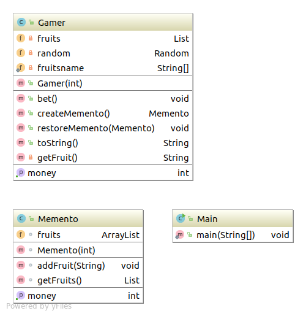

# Memento模式
**保存对象状态**
## 类表
| 名字 | 说明 |
|--------|--------|
| Memento | 表示Gamer状态的类 |
| Gamer | 表示游戏主人公的类，他会生成Memento实例 |
| Main | 进行游戏的类。他会事先保存Memento的实例，之后会根据需要回复Gamer的状态 |

## 类图


## 代码

### Memento类
``` java 

import java.util.ArrayList;
import java.util.List;

import com.sean.AbstractFactory.listfactory.ListLink;

public class Memento {
	int money;
	ArrayList fruits;
	public int getMoney(){
		return money;
	}
	Memento(int money){
		this.money=money;
		this.fruits=new ArrayList();
	}
	void addFruit(String fruit){
		fruits.add(fruit);
	}
	List getFruits(){
		return (List) fruits.clone();
	}
}

```

### Gamer类
``` java
package com.sean.Memento;

import java.util.ArrayList;
import java.util.Iterator;
import java.util.List;
import java.util.Random;


public class Gamer {
	private int money;
	private List fruits=new ArrayList();
	private Random random=new Random();
	private static String[] fruitsname={"苹果","葡萄","香蕉","橘子"};
	public Gamer(int money){
		this.money=money;
	}
	public int getMoney(){
		return money;
	}
	public void bet(){
		int dice = random.nextInt(6)+1;
		if(dice==1){
			money+=100;
			System.out.println("所持金币增加了。");
		}else if (dice==2) {
			money/=2;
			System.out.println("所持金币减半。");
		}else if (dice==6) {
			String f=getFruit();
			System.out.println("获得的水果"+f+")。");
		}else{
			System.out.println("什么都没发生。");
		}
	}
	public Memento createMemento(){
		Memento m=new Memento(money);
		Iterator it=fruits.iterator();
		while(it.hasNext()){
			String f=(String)it.next();
			if(f.startsWith("好吃的")){
				m.addFruit(f);
			}
		}
		
		return m;
	}
	public void restoreMemento(Memento memento){
		this.money=money;
		this.fruits=memento.getFruits();
	}
	public String toString(){
		return "[money= "+money+",fruits= "+fruits+"]";
	}
	private String getFruit(){ 
		String prefix="";
		if(random.nextBoolean()){
			prefix="好吃的";
		}
		return prefix+fruitsname[random.nextInt(fruitsname.length)];
	}
}

```

### Main

``` java
package com.sean.Memento;

public class Main {

	/**
	 * @param args
	 */
	public static void main(String[] args) {
		Gamer gamer=new Gamer(100);
		Memento memento=gamer.createMemento();
		for(int i=0;i<100;i++){
			System.out.println("========"+i);
			System.out.println("当前状态："+gamer);
			gamer.bet(); //进行游戏
			System.out.println("所持金钱为"+gamer.getMoney()+"元");
			if(gamer.getMoney()>memento.getMoney()){
				System.out.println("（所持金钱增加许多，因此保存游戏当前状态）");
				memento=gamer.createMemento();
			}else if (gamer.getMoney()<memento.getMoney()/2) {
				System.out.println("（所持金钱减少许多，因此要恢复至以前状态）");
				gamer.restoreMemento(memento);
			}
			try{
				Thread.sleep(100);
			}catch(InterruptedException e){
				e.printStackTrace();
			}
			System.out.println("");
		}
		
	}

}

```
## 个人理解
该模式就是实现对象状态的恢复，而设置的。

## 参照
> 《图解设计模式》


写这个只是为了加深自己对设计模式的理解，如不明白，可以看 《图解设计模式》。
程序类图使用idea 生成的
