# Myeclipse2017-ci9破解 windows版
## 安装jdk
安装jdk时注意安装jdk8及以下版本，避免破解文件无法使用
## 下载myeclipse2017ci9及破解文件
[下载地址](https://pan.baidu.com/s/17KQFLTirCf1GggMz92Qlug) 
密码: 3wsu
下载完成，进行安装步骤
## 安装myeclipse
1.点击安装文件出现下图 点击next
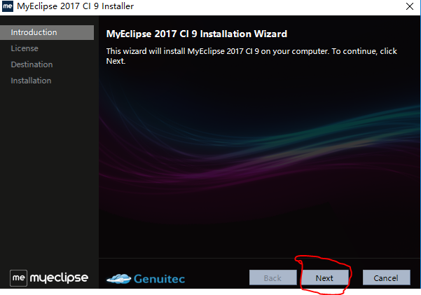
2. 接受协议 点击next
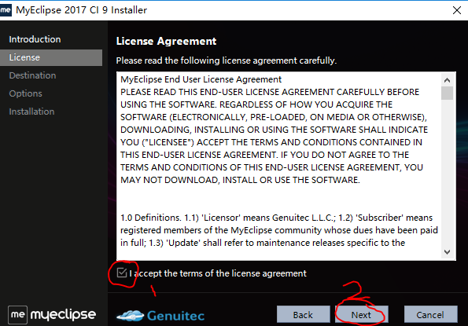
3.自己选择安装目录，一定要是空文件夹
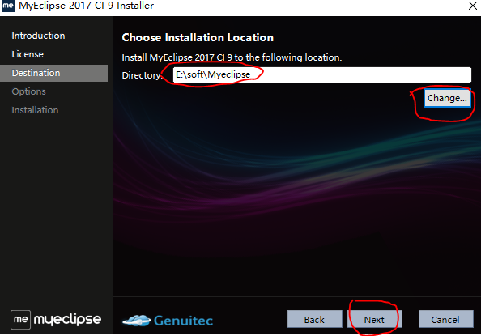
4.根据自己电脑位数选择（目前大多数电脑都是64bit）点击next
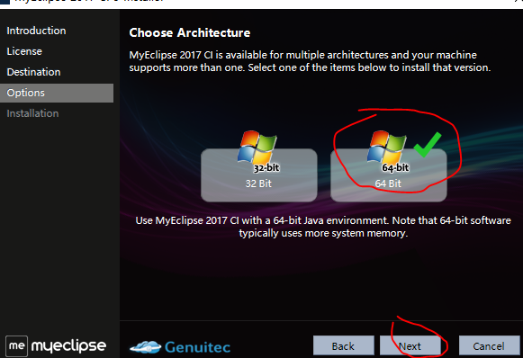
5.静静的等待安装
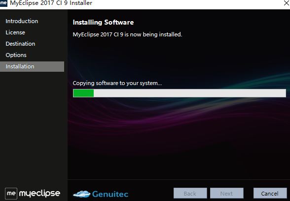
6.这一步非常重要 取消启动myeclipse 点击finish
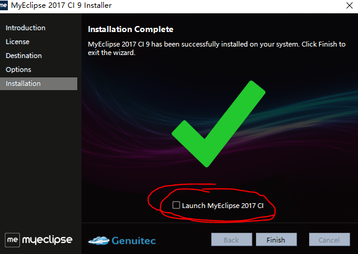
安装完成

## 破解Myeclipse
1.将破解文件patch全部内容复制到 安装目录的plugins文件夹中
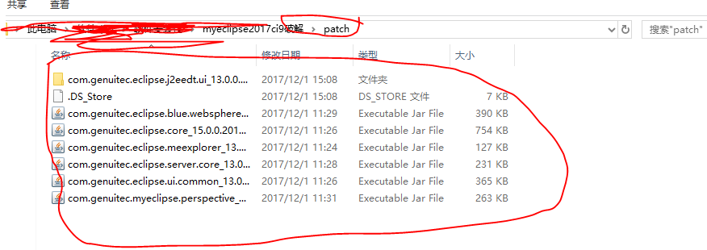
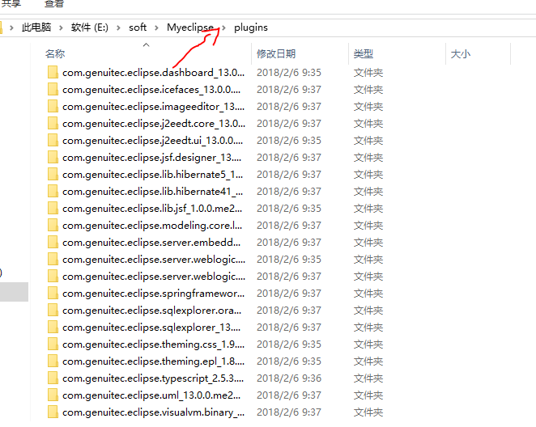
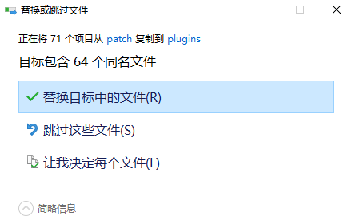

2.点击crack.bat 启动破解文件
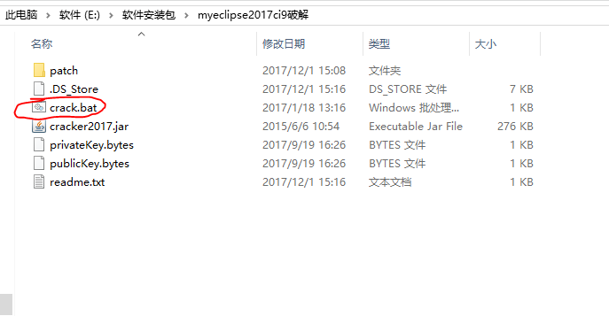

3. 在Usercode任意输入 选择blue 双击 SystemId  在点击 active
出现下面内容：
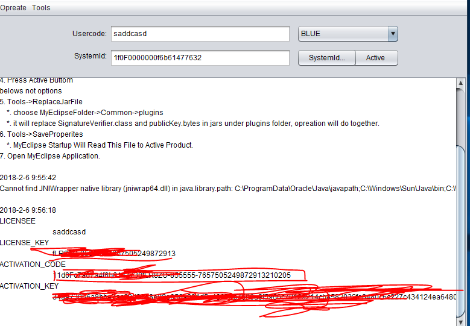

4.点击Tools  选择 saveproperties 
ok!

5.启动Myeclipse

## 查看是否激活成功
1.点击help --- SubScription information
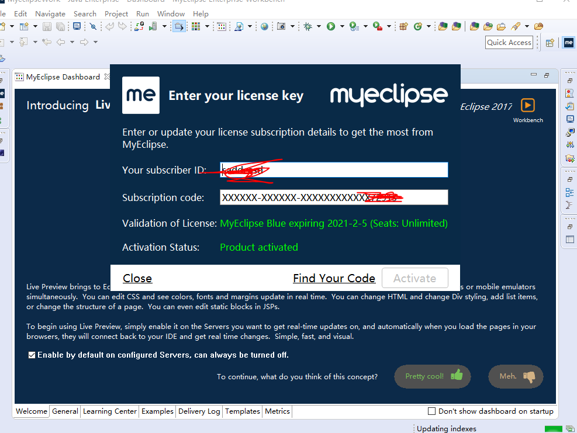

### 破解完成，请勿用于商业用途。喜欢请支持正版！！！！！
