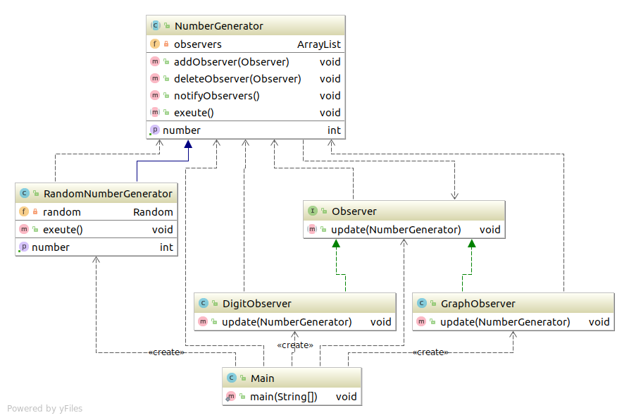

# Observe模式
在Observe模式中，当观察对象的状态发生变化，会通知给观察者。Observe模式适用于根据对象状态进行相应的处理场景。

---

## 类和接口的表
| 名字 | 说明 |
|--------|--------|
| Observer | 表示观察者接口 |
| NumberGenerator | 表示生成数值的对象的抽象类 |
| RandomNumberGenerator | 生成随机数的类 |
| DigitObserver | 表示以数字形式显示数值类 |
| GraphObserver | 表示以简单的图形显示数值类 |
| Main | 测试程序行为的类 |

## 程序类图



## 代码
### Observer接口(定义抽象方法)
``` java
package com.sean.Observer;

public interface Observer {
	public abstract void update(NumberGenerator generator);
}
```

### NumberGenerator抽象类
``` java
package com.sean.Observer;

import java.util.ArrayList;
import java.util.Iterator;

public abstract class NumberGenerator {
	private ArrayList observers = new ArrayList();
	public void addObserver(Observer observer){
		observers.add(observer);
	}
	public void deleteObserver(Observer observer){
		observers.remove(observer);
	}
	public void notifyObservers(){
		Iterator it=observers.iterator();
		while(it.hasNext()){
			Observer o=(Observer) it.next();
			o.update(this);
		}	
	}
	public abstract int getNumber();
	public abstract void exeute();
}

```

###  DigitObserver具体的观察者

``` java
package com.sean.Observer;

public class DigitObserver implements Observer {
	
	public void update(NumberGenerator generator) {
		System.out.println("DigitObserver："+generator.getNumber());
		try{
			Thread.sleep(100);
		}catch(InterruptedException e){
			e.printStackTrace();
		}
	}

}

```

### GraphObserver具体的观察者

``` java
package com.sean.Observer;

public class GraphObserver implements Observer {

	public void update(NumberGenerator generator) {
		System.out.println("GraphObserver:");
		int count = generator.getNumber();
		for(int i=0;i<count;i++){
			System.out.print("*");
		}
		System.out.println("");
		try{
			Thread.sleep(100);
		}catch(InterruptedException e){
			e.printStackTrace();
		}

	}

}

```
### RandomNumberGenerator具体的被观察对象 

``` java
package com.sean.Observer;

import java.util.Random;

public class RandomNumberGenerator extends NumberGenerator {
	private Random random= new Random();
	private int number;
	@Override
	public int getNumber() {
		
		return number;
	}

	@Override
	public void exeute() {
		for(int i=0;i<20;i++){
			number=random.nextInt(50);
			notifyObservers();
		}
	}

}

```
### 测试方法
``` java
ackage com.sean.Observer;

public class Main {

	/**
	 * @param args
	 */
	public static void main(String[] args) {
		NumberGenerator generator=new RandomNumberGenerator();
		Observer observer1=new DigitObserver();
		Observer observer2=new GraphObserver();
		generator.addObserver(observer1);
		generator.addObserver(observer2);
		generator.exeute();

	}

}

```
## 要点
Observer角色并非主动去观察，而是被动去观察，被动的接受观察对象的通知。
 

## 参照
> 《图解设计模式》


写这个只是为了加深自己对设计模式的理解，如不明白，可以看 《图解设计模式》。
程序类图使用idea 生成的
