# 接触锁相环的缘由

学电力电子，尤其是新能源光伏或风电的并网运行需要同步电网，需要锁相环来同步相位信息。对于电力驱动领域，无位置传感器电力驱动有运用锁相环的需求。我最近研究的电力驱动内容也有需求锁定一个未知信号的相位，因此需要了解并使用锁相环。大概花了一个月的时间来学习锁相环，对锁相环的基本原理有了一定的了解。尤其是自己明白原理后，看其他文献就容易理解了。不会像最开始学习锁相环阶段，看着锁相环就头大，头晕。实际锁相环的基本原理并不难，尤其是公式推导过程（公式偏多），不要抵触，多花点时间就可以掌握。接下来首先介绍锁相环的需要完成的目标。

---

# Phase Locked Loop 的目标

PLL 全称为 Phase Locked Loop，中文名把它叫做**锁相环**。PLL 的基本功能是**跟踪**、**锁定**交流信号的**相位**，且在必要时还可以提供有关信号的**频率**和**幅值**[^1]。

---

# 乘法鉴相锁相环

基于乘法鉴相器的锁相环是最基础的一种。主要参看文献**《PWM 整流器及其控制》**来学习锁相环，以此来掌握核心的概念，并加深对锁相环的理解。

## 锁相环的基本构成

基本锁相环的闭环控制回路一般含有**鉴相器**（PD）、**环路滤波器**（LF）和**压控振荡器**（VCO）这三种结构，如图1所示。乘法鉴相锁相环是指鉴相器采用**乘法器**的锁相环。 

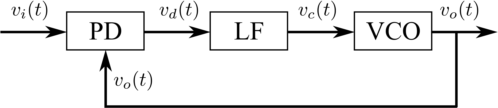

---

1. 鉴相器：比较输入信号$v_{i}(t)$和输出信号$v_{o}(t)$的相位。
2. 环路滤波器：滤除误差信号$v_{d}(t)$的二次谐波分量和噪声。
3. 压控振荡器：完成电压和频率的变换，即压控振荡器的输出信号的频率与误差信号$v_{d}(t)$的大小成正比。

---

接下来就分别分析锁相环的三个基本单元**鉴相器、环路滤波器、压控振荡器**(PD,LP,VCO)的功能和数学模型。其中，锁相环最核心的部分是**鉴相器**。

---

## 乘法鉴相器 PD

实际要分析的是为什么**乘法器**能实现相位的比较? 带着这个问题去理解**乘法鉴相器**。

定义输入信号：
$$
\begin{equation}
	v_{i}(t) = V_i \sin[\omega_i t +\theta_i(t)]
\end{equation}
$$

定义输出信号：
$$
\begin{equation}
	v_{o}(t) = V_o \cos[\omega_o t +\theta_o(t)]
\end{equation}
$$

这样一看这两个信号就含有 $\omega_i$、$\omega_o$、$\theta_{i}(t)$、
$\theta_o(t)$、$V_i$ 和 $V_o$，总共6个变量，看来需要简化简化，方便后续的分析。

注意：**输入输出信号为两正交信号**（$\sin, \cos$）

以 $\omega_o$ 为参考频率，重新定义输入信号的瞬时相位：

$$
\begin{equation}
	[\omega_i t + \theta_i(t)] = \omega_o  t + 
	[(\omega_i-\omega_o)t + \theta_i(t)]
	= \omega_o t + \theta_{1}(t)
\end{equation}
$$

其中，$\theta_{1}(t) =(\omega_i-\omega_o)t + \theta_i(t)=\Delta \omega_o t + \theta_i(t)$

输出信号的瞬时相位：

$$
\begin{equation}
	\omega_o t + \theta_o(t) = \omega_o t + \theta_2(t)
\end{equation}
$$

其中，$\theta_2(t)=\theta_o(t)$。

简化后的输入输出信号表达式：
$$
\begin{equation}
	\left\{
		\begin{aligned}
			\label{eq:input and out signal}
			v_i(t) &= V_i \sin [\omega_o t + \theta_{1}(t)]\\
			v_o(t) &= V_o \cos [\omega_o t + \theta_{2}(t)]\\
		\end{aligned}
	\right.
\end{equation}
$$

和最初定义相比，减少了一个频率变量$\omega_i$。

乘法鉴相器结构框图，如图2所示，简单的数学表达式为$v_d(t)=K_m v_i(t) v_o(t)$，其中$K_m$ 为乘法器的比列系数。

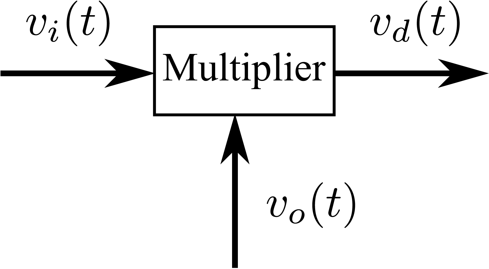

再用个积化和差公式：

$$
\begin{equation}
	\sin\alpha \cdot \cos\beta = \frac{1}{2}
	[\sin(\alpha+\beta)+\sin(\alpha-\beta) ]\\
\end{equation}
$$

在乘法鉴相器数学表达式中，应用三角函数积化和差公式化简过程：

$$
\begin{equation}
	\label{eq:complex output signal}
	\begin{aligned}
		v_d(t) & = K_m v_i(t) v_o(t)\\
		       & = K_m V_i V_o \cos [\omega_o t + \theta_{2}(t)] 
		       \sin [\omega_o t + \theta_{1}(t)]\\
		       & = \frac{1}{2} K_m V_i V_o \sin[2\omega_o t+
		       \theta_1(t)+\theta_2(t)]+\frac{1}{2} K_m V_i V_o
		       \sin[\theta_1(t)-\theta_2(t)]
	\end{aligned}
\end{equation}
$$

其中，$\frac{1}{2} K_m V_i V_o \sin[2\omega_o t+\theta_1(t)+\theta_2(t)]$ 
含有二次谐波，需要设置一个低通滤波器将其滤除。

故公式$\eqref{eq:complex output signal}$可做进一步的简化，去掉二次谐波部分。

$$
\begin{equation}
	\label{eq:simple output singal}
	v_d(t)=\frac{1}{2} K_m V_i V_o\sin[\theta_1(t)-\theta_2(t)]
\end{equation}
$$

看公式$\eqref{simple output singal}$ 中的 $\theta_1(t)-\theta_2(t)$，这不是出现了两瞬时相位之差了吗？可以解决本小节最开始提出的问题。

***"实际要分析的是为什么乘法器能实现相位的比较?"***

再进一步简化$v_d(t)$。

定义瞬时相位差：
$$
\begin{equation}
	\begin{aligned}
	\theta_e(t) &= \theta_1(t)-\theta_2(t)\\
		    &= \Delta \omega_o t + \theta_i(t) -\theta_o(t)	
	\end{aligned}
\end{equation}
$$

定义幅值：
$$
\begin{equation}
	V_d = \frac{1}{2} K_m V_i V_o
\end{equation}
$$

在进一步简化
$$
\begin{equation}
	v_d(t) = V_d \sin \theta_e(t)
\end{equation}
$$

这已经是最简化的形式了。

定义过零点的斜率为$K_d$，把 $K_d$称为鉴相器的灵敏度。

$$
\begin{equation}
	K_d = \frac{\mathrm{d}v_d}{\mathrm{d}\theta_e}\bigg|_{\theta_e=0}
	=\frac{\mathrm{d}}{\mathrm{d}\theta_e}(V_d\sin\theta_e)\bigg|_{\theta_e=0}  
	= Vd
\end{equation}
$$

故$v_d(t)$也可以写成：

$$
\begin{equation}
	v_d(t) = K_d \sin \theta_e(t)
\end{equation}
$$

这就是乘法鉴相器的数学模型，其结构图请见图3。

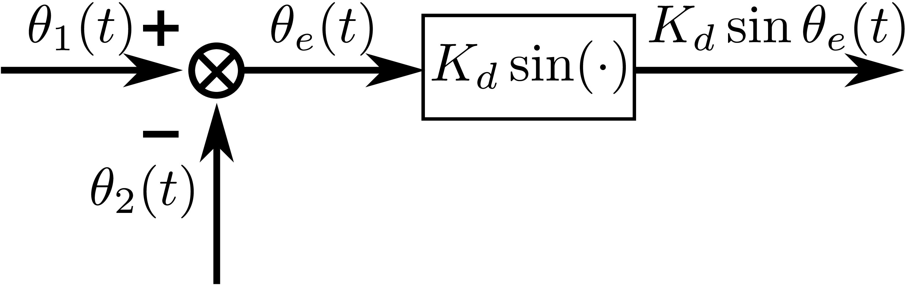

## 压控振荡器

**何为压控振荡器？**

压控振荡器的振荡频率$\omega_v(t)$随控制电压$v_c(t)$成正比（近似正比）变化。如图4所示为压控振荡器特性曲线。

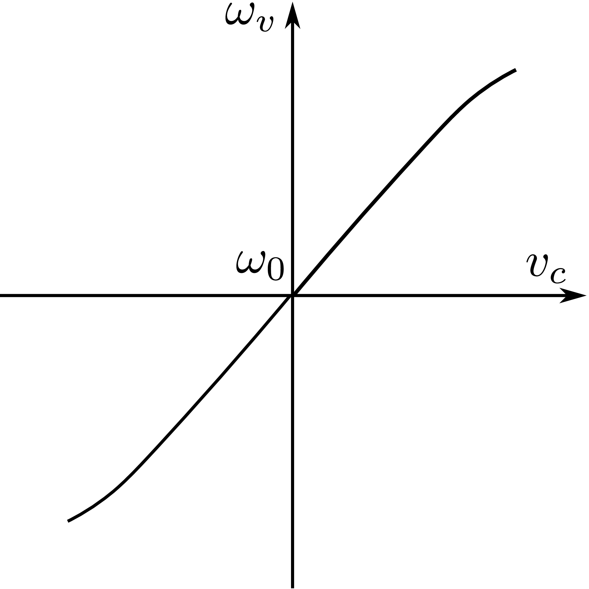

用数学表达式表示压控振荡器特性曲线：
$$
\begin{equation}
	\label{eq:VCOCharacteristic}
	\omega_v(t)=\omega_0 + K_o v_c(t)
\end{equation}
$$

注意：**$\omega_0$ 与 $\omega_o$ 区别，$\omega_0$一个是 VCO 固有振荡频率，
$\omega_o$ 是输出信号频率**。

如图3所示，对鉴相器起作用的是瞬时相位$\theta_2(t)$,不是瞬时角频率 $\omega_v (t)$。
$$
\begin{equation}
 	\omega_o t + \theta_2(t)=\int_{0}^{t} \omega_v(t) d(t)= \omega_0 t 
	+ K_0 \int_{0}^{t} v_{c}(t) dt
\end{equation}
$$

$$
\begin{equation}
	\theta_2(t) = K_0 \int_{0}^{t} v_{c}(t) dt
\end{equation}
$$

这就是压控振荡器的数学模型，显然是一个积分器。定义微分算子 $p=d/dt$。
$$
\begin{equation}
	\theta_2(t) = K_0 \frac{v_{c}(t)}{p}
\end{equation}
$$

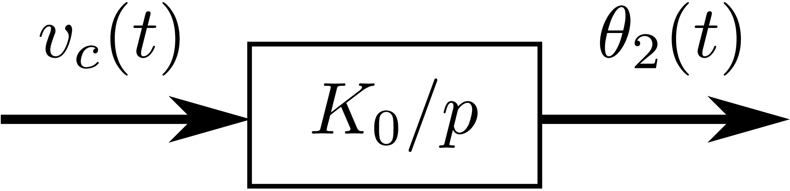

## 环路滤波器

环路滤波器的作用主要是用来滤除鉴相器输出信号的**二次谐波分量和噪声**。

环路滤波器的$s$域数学模型:
$$
\begin{equation}
	V_c(s) = F(s) V_d(s)
\end{equation}
$$

换成微分算子的形式：

$$
\begin{equation}
	v_c(t)=F(p)v_d(t)
\end{equation}
$$

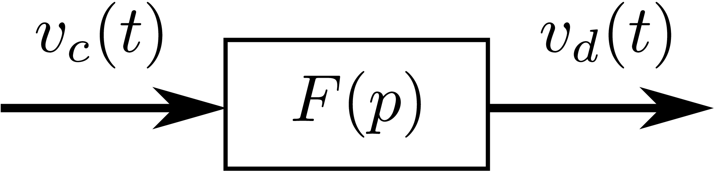

## 乘法鉴相器锁相环基本相位方程

根据前面三个基本单元的分析，可以综合成一个模型图，如图7所示。

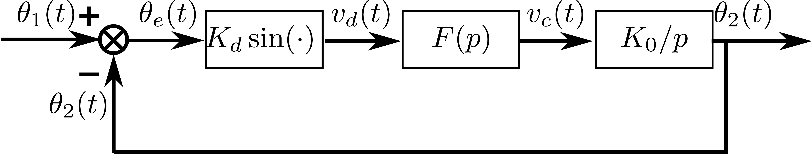

$$
\begin{equation}
	\theta_e(t)=\theta_1(t) - \theta_2(t)=\theta_1(t) - K_0F(p) \frac{v_d(t)}{p}
	=\theta_1(t) - K_0 K_d F(p) \frac{1}{p} \sin \theta_e(t)
\end{equation}
$$

两端微分：

$$
\begin{equation}
	\frac{\mathrm{d}\theta_e(t)}{\mathrm{d}t}+K_0 K_d F(p) \sin \theta_e(t)
	= \frac{\mathrm{d}\theta_1(t)}{\mathrm{d}t}
\end{equation}
$$

## 锁相环锁定问题

当锁相环输入一个频率和相位不随时间变化的信号，即$v_i(t)=V_i\sin(\omega_i t+\theta_i)$。$\omega_i$与$\theta_i$ 不随时间变化。

$$
\begin{equation}
	\frac{\mathrm{d}\theta_1(t)}{\mathrm{d}t}
	= \omega_i - \omega_o = \Delta \omega_o
\end{equation}
$$

简化基本相位方程：

$$
\begin{equation}
	\underbrace{\frac{\mathrm{d}\theta_e(t)}{\mathrm{d}t}}_{\omega_e}
	+\underbrace{K_0 K_d F(p) \sin \theta_e(t)}_{\omega_v-\omega_0}
	= \Delta \omega_o
\end{equation}
$$

参考锁相环的相位反馈图7和VCO特性方程$\eqref{eq:VCOCharacteristic}$，可得

$$
\begin{equation}
	\label{eq:control frequencyi difference}
	\begin{aligned}
		K_0 K_d F(p) \sin \theta_e(t) & = K_0 F(p)  [K_d\sin\theta_e(t)]\\
					      &= K_0 F(p) v_d(t)\\
					      &= K_0 v_c(t)\\
					      &= \omega_v - \omega_0
	\end{aligned}
\end{equation}
$$

$\omega_v - \omega_0$称为控制频差，是压控振荡器受控制电压$v_c(t)$作用而产生的。

注意：**$\omega_0$ 与 $\omega_o$ 区别，$\omega_0$一个是 VCO 固有振荡频率，$\omega_o$ 是输出信号频率**。

$\frac{\mathrm{d}\theta_e(t)}{\mathrm{d}t}$ 可以用 $\omega_e$ 代替，被称为瞬时频差。

$$
\begin{equation}
	\begin{aligned}
	\frac{\mathrm{d}\theta_e(t)}{\mathrm{d}t} = 
	\frac{\mathrm{d}\theta_1(t)-\theta_2(t)}{\mathrm{d}t}
	\end{aligned}
\end{equation}
$$

书上的解释不清楚，下面是我按照自己理解，来解释整个锁相环的工作情况。

**现在分析锁相环是如何实现频率的锁定和相位的锁定？**

根据图7来分析锁定问题。假设存在某一时刻$\theta_1(t)>\theta_2(t)$，$0 <\theta_e(t)<\frac{\pi}{2}$，$\theta_1(t)$ 与 $\theta_2(t)$ 的差值在扩大，也就是说$\theta_1(t)$对应的角频率大于$\theta_2(t)$ 的角频率。$\theta_e(t)=\theta_1(t)-\theta_2(t)>0$ $\uparrow$，那么 $v_d(t)$  $\uparrow$ ，那么 $v_c(t)$ $\uparrow$，那么对应 VCO 的输出信号频率增加$\omega_v$，那么$\theta_2(t)$的频率在增加，以此来追上$\theta_2(t)$的频率，当 $\theta_1(t)$的频率和 $\theta_2(t)$的频率相等时，$\theta_e(t)$就是一个恒定值，整个闭环系统进入稳态。

**现在的稳定状态是有输入输出信号是有相位差。为了实现相位偏差为零，可以在环路滤波器之后加一个PI，便可实现相位的零稳态误差。**

---

# 经典的三相锁相环 
 
经典的三相系统的锁相环主要参考文献 [Operation of a phase locked loop system under distorted utility conditions](https://ieeexplore.ieee.org/document/567077)[^2]。

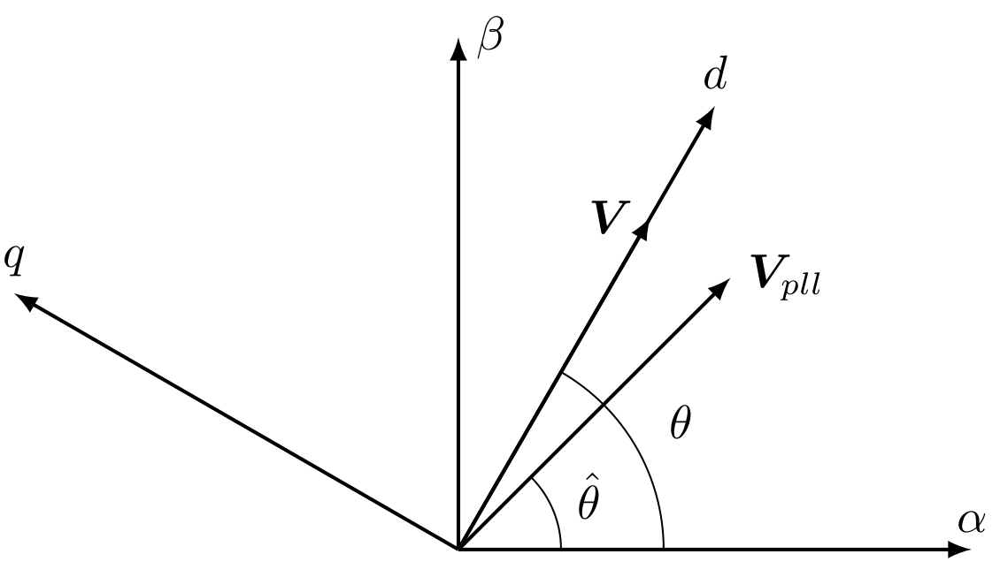

SSRF-SPLL矢量图8各变量定义：

---

- $\mathbf{V}$ 实际电压矢量
- $\mathbf{V}_{pll}$ 锁相环的输出电压矢量
- $\theta$ 实际电压矢量的矢量角度
- $\hat{\theta}$ 锁相环输出的电压矢量角度

---

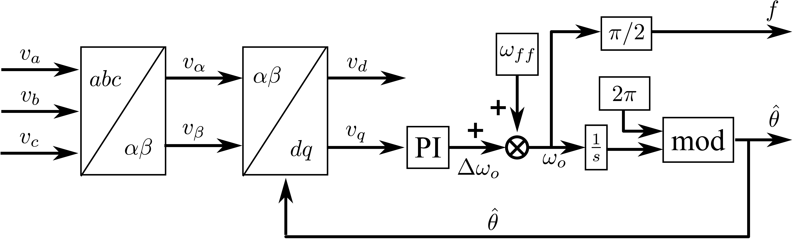

$\omega_{ff}$ 是检测电压的额定频率，那这个物理量的作用是什么？主要是设置一个检测信号的额定频率，实际信号的频率是在这个频率$\omega_{ff}$上下波动，主要降低PI控制器输出的压力，这样PI输出就没必要和额定频率一样大，只需一个较小的量$\Delta \omega_o$即可。同时，$\omega_{ff}$给系统的频率一个初始值，有维持系统稳定的作用（不必要从0直接突变到$\omega_{ff}$附近，而是直接在$\omega_{ff}$附近变换）。

上面的锁相环控制框图有点复杂，可以简化简化。

简化版的三相锁相环控制框图，如图10所示。

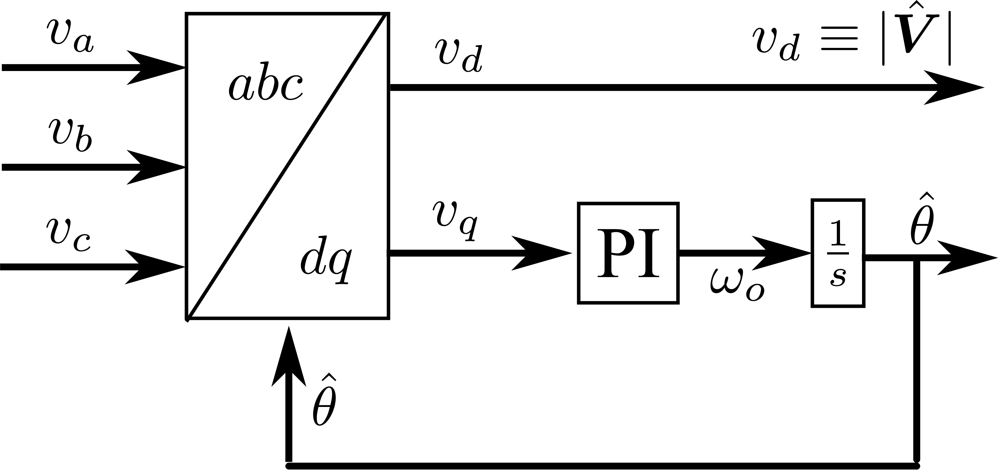

平衡的三相电网电压：
$$
\begin{equation}
	\label{eq:BalancedThreePhaseVoltage}
	\begin{aligned}
		v_a &=\mathbf{V} \cos(\omega_1 t)\\
		v_b &=\mathbf{V} \cos(\omega_1 t - 2\pi/3)\\
		v_a &=\mathbf{V} \cos(\omega_1 t - 4\pi/3)
	\end{aligned}
\end{equation}
$$

$$
\begin{equation}
	\label{eq:AlphaBetaVoltage}
	\begin{aligned}
	\begin{bmatrix}
		v_{\alpha}\\
		v_{\beta}
	\end{bmatrix}
	=\frac{2}{3}
	\begin{bmatrix}
		1 & -\frac{1}{2} & -\frac{1}{2}\\
		0 & \frac{\sqrt{3}}{2} & -\frac{\sqrt{3}}{2}\\
	\end{bmatrix}
	\begin{bmatrix}
		v_a\\
		v_b\\
		v_c
	\end{bmatrix}
	=\mathbf{V}
	\begin{bmatrix}
		\cos (\omega_1 t)\\
		\sin (\omega_1 t)
	\end{bmatrix}
	=\mathbf{V}
	\begin{bmatrix}
		\cos \theta\\
		\sin \theta
	\end{bmatrix}
	\end{aligned}
\end{equation}
$$

如果三相平衡电压以 $\sin$ 表示， $abc\rightarrow \alpha\beta$ 的变换方程：
$$
\begin{equation}
	\begin{aligned}
		\label{eq:AlphaBetaVoltage2}
	\begin{bmatrix}
		v_{\alpha}\\
		v_{\beta}
	\end{bmatrix}
	=\frac{2}{3}
	\begin{bmatrix}
		1 & -\frac{1}{2} & -\frac{1}{2}\\
		0 & \frac{\sqrt{3}}{2} & -\frac{\sqrt{3}}{2}\\
	\end{bmatrix}
	\begin{bmatrix}
		v_a\\
		v_b\\
		v_c
	\end{bmatrix}
	=\mathbf{V}
	\begin{bmatrix}
		\sin (\omega_1 t)\\
		-\cos (\omega_1 t)
	\end{bmatrix}
	=\mathbf{V}
	\begin{bmatrix}
		\sin \theta\\
		-\cos \theta
	\end{bmatrix}
	\end{aligned}
\end{equation}
$$

$$
\begin{equation}
	\begin{bmatrix}
		v_d\\
		v_q
	\end{bmatrix}
	=
	\begin{bmatrix}
		\cos(\hat{\theta}) & \sin(\hat{\theta})\\
		-\sin(\hat{\theta}) & \cos(\hat{\theta})
	\end{bmatrix}
	\begin{bmatrix}
		v_\alpha\\
		v_\beta
	\end{bmatrix}
\end{equation}
$$

$\hat{\theta}=\omega_o t+\varphi_o$

各物理量意义：

---

- $\mathbf{V}$ 实际电压矢量
- $\omega_1$ 电网电压角频率
- $\theta$ 实际电压矢量的矢量角度
- $\hat{\theta}$ 锁相环估计的电压矢量角度
- $\omega_o$ 锁相环估计角频率

---

进一步简化计算：
$$
\begin{equation}
	\label{eq:SimpleAlphaBetaToDQ}
	\begin{bmatrix}
		v_d\\
		v_q
	\end{bmatrix}
	=\mathbf{V}
	\begin{bmatrix}
		\cos (\theta - \hat{\theta})\\
		\sin (\theta - \hat{\theta})
	\end{bmatrix}
	=\mathbf{V}
	\begin{bmatrix}
		\cos [(\omega_1 - \omega_o)t+\varphi_{error}]\\
		\sin [(\omega_1 - \omega_o)t+\varphi_{error}]
	\end{bmatrix}
\end{equation}
$$

进行了一堆的数学推到过程，开始通过最后的数学表达式$\eqref{eq:SimpleAlphaBetaToDQ}$和图9开始分析三相锁相环原理。

**三相锁相环原理分析**

---

输入信号和锁相环输出信号的可能性主要为**频率**和**初相位**的比较。频率不同$\omega_1 \neq \omega_o$， $v_q$ 是一个交流量。当频率锁定 $\omega_1 = \omega_o$， $v_q$ 是一个直流量。当频率和相位完全锁定， $\omega_1=\omega_o,\varphi_{error}=0$，$v_q=0$。 而图9原理框图，因PI环节，正好能实现 $v_q=0$ 要求。那么按照图9的原理便可实现锁相环的功能。

*前面分析的三相锁相环的实现需要一个三相电网电压平衡的条件，对于不平衡的电网，无法适用。*

**不平衡电网电压用正、负和零序电压表示**：

$$
\begin{equation}
	\label{eq:UnbalanceThreePhaseVoltage}
	\begin{aligned}
		v_a &=\mathbf{V}^+ \cos(\omega_1 t) +
		\mathbf{V}^- \cos(-\omega_1 t+\varphi^-) +
		\mathbf{V}^0 \cos(\omega_1 t + \varphi^0)\\
		v_b &=\mathbf{V}^+ \cos(\omega_1 t - 2\pi/3) +
		\mathbf{V}^- \cos(-\omega_1 t - 2\pi/3+\varphi^-) +
		\mathbf{V}^0 \cos(\omega_1 t - 2\pi/3+\varphi^0)\\
		v_a &=\mathbf{V}^+ \cos(\omega_1 t - 4\pi/3)+
		\mathbf{V}^- \cos(-\omega_1 t - 4\pi/3+\varphi^-)+
		\mathbf{V}^0 \cos(\omega_1 t - 4\pi/3+\varphi^0)
	\end{aligned}
\end{equation}
$$

$0,+,-$ 分别代表零序，正序，负序。

$$
\begin{equation}
	\label{eq:PositiveAndNegativeComponentAlphaBeta}
	\mathbf{v}_{\alpha\beta}=
	\begin{bmatrix}
		v_{\alpha}\\
		v_{\beta}
	\end{bmatrix}
	= \mathbf{V}^+ + \mathbf{V}^-
	=\mathbf{V}^+
	\begin{bmatrix}
		\cos (\omega_1 t)\\
		\sin (\omega_1 t)
	\end{bmatrix}
	+\mathbf{V}^-
	\begin{bmatrix}
		\cos (-\omega_1 t + \varphi^-)\\
		\sin (-\omega_1 t + \varphi^-)
	\end{bmatrix}
\end{equation}
$$

通过公式$~\eqref{eq:PositiveAndNegativeComponentAlphaBeta}$，可以得
到电网电压矢量的幅值和相位。

$$
\begin{equation}
	\label{eq:AmplitudeAndPhaseForUnbalance}
	\begin{aligned}
	|\mathbf{V}|=\sqrt{(\mathbf{V}^+)^2 + (\mathbf{V}^-)^2 + 2 \mathbf{V}^+ 
	\mathbf{V}^- \cos(-2\omega t + \varphi^-)}\\
	\theta = \omega t + \arctan(\frac{\mathbf{V}^- \sin 
	(-2 \omega t + \varphi^-)}
	{\mathbf{V}^+ + \mathbf{V}^- \cos (-2\omega t + \varphi^{-1})})
	\end{aligned}
\end{equation}
$$

由公式$\eqref{eq:AmplitudeAndPhaseForUnbalance}$可以知道，不平衡的电网电压会出现波动的幅值和频率。

**对应该公式，可以提出使用低通滤波器滤波，来抑制谐波分量。但是引入滤波器会降低响应速度。**

***Se Kyo Chung 的三相锁相环闭环传递函数推导以及相角不平衡，谐波和直流偏置对三相锁相环误差理论分析写的不错[^3]，值得一提的是该文献的实验结果图简单明了，值得一读。***

为了用于不平衡的三相电网，也可以采取提取不平衡电网中正序电压电压。那么需要了解**对称分量法**的原理，以此来提取正序电压。

---

# 对称分量法

$ABC\longrightarrow NP0$ 对于三相非平衡ABC（可以是电压，也可以是电流，甚至其他信号）可以分解成 $N$(negative sequence)，$P$(positive sequence)，$0$(zero sequence)，这个方式被称为**对称分量法**。

$$
\begin{equation}
	\begin{bmatrix}
		P\\
		N\\
		0
	\end{bmatrix}
	=
	\frac{1}{3}
	\begin{bmatrix}
		1 & \alpha & \alpha^2\\
		1 & \alpha^2 & \alpha\\
		1 & 1 & 1\\
	\end{bmatrix}
	\begin{bmatrix}
		A\\
		B\\
		C\\
	\end{bmatrix}
\end{equation}
$$

$$\alpha = e^{j\frac{2\pi}{3}}$$

$NP0 \longrightarrow ABC$

至于理论推到，用 $NP0 \longrightarrow ABC$ 更易于理解。

$$
\begin{equation}
	\begin{bmatrix}
		A\\
		B\\
		C\\
	\end{bmatrix}
	=
	\begin{bmatrix}
		1 & 1 & 1\\
		\alpha^2 & \alpha & 1\\
		\alpha & \alpha^2 & 1\\
	\end{bmatrix}
	\begin{bmatrix}
		P\\
		N\\
		0
	\end{bmatrix}
\end{equation}
$$

**提取的正序分量直接用于平衡三相锁相环的原理**,便可解决三相锁相不平衡问题。但是该方法对变换频率的三相电网适应性差。提取正序分量用于锁相环的方法可参考文献[^4]。

# 双同步坐标系解耦锁相环

针对三相电网不平衡的锁相问题，Rodriguez 等人提出了双同步坐标系解耦锁相环[^5]，具有较高的响应速度、较高的鲁棒性和较精确的性能这一节的内容主要是理解**双同步坐标系解耦锁相环原理**。这一小节稍微有点复杂，不想看可以跳过，感兴趣或者闲来没事倒是可以看看。

**双同步坐标系**故名思意该锁相环方法含有两个同步坐标系。

**因此定义两个同步坐标系**：

---

- $dq^{+}$坐标系，angular frequency: $\hat{\omega}$，angluar position: $\hat{\theta}$
- $dq^{-}$坐标系，angular frequency: $-\hat{\omega}$，angluar position: $-\hat{\theta}$

---

**备注**： 对于不平衡的三相电网电压系统，合成的电压矢量 $\mathbf{V}$ 虽然频率是固定的，但是幅值是不断变化的。而当把三相不平衡电压使用对称分量法，可以分解成**正序**、**负序**和**零序**。因为中性点连接的系统，不存在零序分量。故只剩下**正序和负序**。同时单个负序或正序的电压矢量的幅值是恒定的。正、负序分别对应$dq^+$、$dq^-$同步坐标系。用$dq^+$ 来锁相正序， $dq^-$ 来锁相负序是没有问题。

定义的双坐标系和电压矢量如图11所示。

---

## 双同步坐标系的一些数学公式

conventional $ \alpha \beta \longrightarrow dq$ transformation matrix

$$
\begin{equation}
	\label{eq:AlphaBetaToDQ}
	\mathbf{T}_{dq}=
	\begin{bmatrix}
		\cos(\theta) & \sin(\theta)\\
		-\sin(\theta) & \cos(\theta)
	\end{bmatrix}
\end{equation}
$$

从图11可以发现，$dq^+$ 坐标系和我们传统的$dq$坐标系是一样的。故

$$
\begin{equation}
	\label{eq:AlphaBetaToDQPositive}
	\mathbf{T}_{dq^+}=
	\begin{bmatrix}
		\cos(\hat{\theta}) & \sin(\hat{\theta})\\
		-\sin(\hat{\theta}) & \cos(\hat{\theta})
	\end{bmatrix}
\end{equation}
$$

而$dq^-$坐标系的位置角为 $-\hat{\theta}$, 故

$$
\begin{equation}
	\label{eq:AlphaBetaToDQNegative}
	[\mathbf{T}_{dq^-}]=
	\begin{bmatrix}
		\cos(-\hat{\theta}) & \sin(-\hat{\theta})\\
		-\sin(-\hat{\theta}) & \cos(-\hat{\theta})
	\end{bmatrix}
	=
	\begin{bmatrix}
		\cos(\hat{\theta}) & -\sin(\hat{\theta})\\
		\sin(\hat{\theta}) & \cos(\hat{\theta})
	\end{bmatrix}
	=[\mathbf{T}_{dq^+}]^T
\end{equation}
$$

根据公式 $\eqref{eq:PositiveAndNegativeComponentAlphaBeta}$，再结合 $\mathbf{T}_{dq^+}$ 和 $\mathbf{T}_{dq^-}$，可以获得 $\mathbf{v}_{dq^+}$ 和 $\mathbf{v}_{dq^+}$:

$$
\begin{equation}
	\label{eq:DoubelSychrounousDQ}
	\begin{aligned}
		\mathbf{v}_{dq^+}=
		\begin{bmatrix}
			v_{d^+}\\
			v_{q^+}
		\end{bmatrix}
		=[\mathbf{T}_{dq^+}] \mathbf{v}_{\alpha\beta} 
		=\mathbf{V}^+
		\begin{bmatrix}
			\cos (\omega t -\hat{\theta})\\
			\sin (\omega t -\hat{\theta})
		\end{bmatrix}
		+\mathbf{V}^-
		\begin{bmatrix}
			\cos (-\omega t + \varphi^- - \hat{\theta})\\
			\sin (-\omega t + \varphi^- - \hat{\theta})
		\end{bmatrix}\\
		\mathbf{v}_{dq^-}=
		\begin{bmatrix}
			v_{d^-}\\
			v_{q^-}
		\end{bmatrix}
		=[\mathbf{T}_{dq^-}] \mathbf{v}_{\alpha\beta} 
		=\mathbf{V}^+
		\begin{bmatrix}
			\cos (\omega t +\hat{\theta})\\
			\sin (\omega t +\hat{\theta})
		\end{bmatrix}
		+\mathbf{V}^-
		\begin{bmatrix}
			\cos (-\omega t + \varphi^- + \hat{\theta})\\
			\sin (-\omega t + \varphi^- + \hat{\theta})
		\end{bmatrix}
	\end{aligned}
\end{equation}
$$

前面我们已经知道，使用单同步坐标系的锁相环控制结构是可以实现 $\hat{\theta} \approx \omega t$，那么对于双同步坐标系，各自独立闭环运行，依旧可以实现 $\hat{\theta} \approx \omega t$。那么 $\hat{\theta} - \omega t$ 为一个很小的值，可以采用小信号分析方法。有如下的近似等式：

$$
\begin{equation}
	\label{eq:sincosapprox}
	\begin{aligned}
	\sin(\omega t - \hat{\theta}) & \approx \omega t 
	- \hat{\theta}\\
	\cos(\omega t - \hat{\theta}) & \approx 1 - ((\omega t - 
	\hat{\theta})^2/2)\\
	-\omega t - \hat{\theta} & \approx -2 \omega t
	\end{aligned}
\end{equation}
$$

根据公式$\eqref{eq:sincosapprox}$，可以化简公式$\eqref{eq:DoubelSychrounousDQ}$,得到一个简化版结果。

$$
\begin{equation}
	\label{eq:SimpleDoubelSychrounousDQ}
	\begin{aligned}
		\mathbf{v}_{dq^+}
		&=\mathbf{V}^+
		\begin{bmatrix}
			1 - (\omega t -\hat{\theta})^2/2\\
			\omega t -\hat{\theta}
		\end{bmatrix}
		+\mathbf{V}^-
		\begin{bmatrix}
			\cos (-2\omega t + \varphi^-)\\
			\sin (-2\omega t + \varphi^-)
		\end{bmatrix}\\
		\mathbf{v}_{dq^-}
		&=\mathbf{V}^+
		\begin{bmatrix}
			\cos (2\omega t)\\
			\sin (2\omega t)
		\end{bmatrix}
		+\mathbf{V}^-
		\begin{bmatrix}
			\cos (\varphi^-)\\
			\sin (\varphi^-)
		\end{bmatrix}
	\end{aligned}
\end{equation}
$$

至于得到简化的公式有何意义？$dq^+$ 和 $dq^-$ 坐标系的直流分量与电网电压的正序和负序分量的幅值有关，而2次谐波分量是分解两同步旋转坐标系而造成的耦合分量。接下来主要目标就是**解耦耦合分量**，或者说消除耦合分量。

---

## 解耦网络

为进行一般化分析，假设任意电压矢量包括正、负序分量两部分，分别以角速度 $n\omega$ 和 $m\omega$ 旋转，其中 $n$ 、$m$ 分别表示正、负序。电网角频率$\omega$。通过公式$\eqref{eq:PositiveAndNegativeComponentAlphaBeta}$，可以得电压矢量的正、负序分量表示为：

$$
\begin{equation}
	\label{eq:GeneralPositiveAndNegativeComponentAlphaBeta}
	\mathbf{v}_{\alpha\beta}=
	\begin{bmatrix}
		v_{\alpha}\\
		v_{\beta}
	\end{bmatrix}
	= \mathbf{V}_{\alpha\beta}^n + \mathbf{V}_{\alpha\beta}^m
	=\mathbf{V}^{n}
	\begin{bmatrix}
		\cos (n \omega t + \varphi^n)\\
		\sin (n \omega t + \varphi^n) 
	\end{bmatrix}
	+\mathbf{V}^{m}
	\begin{bmatrix}
		\cos (m \omega t + \varphi^m)\\
		\sin (m \omega t + \varphi^m)
	\end{bmatrix}
\end{equation}
$$

$\varphi^n$ 和 $\varphi^m$ 正序和负序电压矢量的初始相位角。

现在正序、负序两个旋转坐标系分别用 $dq^n$ 和 $dq^m$ 来表示。$n \hat{\theta}$ 和$m \hat{\theta}$ 则表示正、负序的两个旋转坐标系的相位角度。$\hat{\theta}$ 为锁相环输出角度。

**先假设锁相环能完全锁相，即有 $\hat{\theta}=\omega t$。**(至于为什么要这样假设？在理想的锁相的条件下，找出影响波动的原因,并把波动量消除，便可得到正确的锁相。同时，在常规的三相锁相环结构，就可以达到$\hat{\theta} \approx \omega t$的效果，因此做这样的假设是合理的操作)。那么，公式$\eqref{eq:GeneralPositiveAndNegativeComponentAlphaBeta}$ 在 $dq^n$ 和 $dq^m$ 坐标系下表达式为：

$$
\begin{equation}
	\label{eq:MNDoubelSychrounousDQ}
	\begin{aligned}
		\mathbf{v}_{dq^n} &=
		\begin{bmatrix}
			v_{d^n}\\
			v_{q^n}
		\end{bmatrix}
		=[\mathbf{T}_{dq^n}] \mathbf{v}_{\alpha\beta}=
		\begin{bmatrix}
			\cos(n\hat{\theta}) & \sin(n\hat{\theta})\\
			-\sin(n\hat{\theta}) & \cos(n\hat{\theta})
		\end{bmatrix}
		\begin{bmatrix}
			v_{\alpha}\\
			v_{\beta}
		\end{bmatrix}
		\\
			      &= \mathbf{V}^n
		\begin{bmatrix}
			\cos (\varphi^n)\\
			\sin (\varphi^n)
		\end{bmatrix}
		+\mathbf{V}^m\cos(\varphi^m)
		\begin{bmatrix}
			\cos ((n-m)\omega t)\\
			-\sin( (n-m)\omega t)
		\end{bmatrix}
		+\mathbf{V}^m\sin(\varphi^m)
		\begin{bmatrix}
			\sin ((n-m)\omega t)\\
			\cos ((n-m)\omega t)
		\end{bmatrix}\\
		\mathbf{v}_{dq^m} &=
		\begin{bmatrix}
			v_{d^m}\\
			v_{q^m}
		\end{bmatrix}
		=[\mathbf{T}_{dq^m}] \mathbf{v}_{\alpha\beta}=
		\begin{bmatrix}
			\cos(m\hat{\theta}) & \sin(m\hat{\theta})\\
			-\sin(m\hat{\theta}) & \cos(m\hat{\theta})
		\end{bmatrix}
		\begin{bmatrix}
			v_{\alpha}\\
			v_{\beta}
		\end{bmatrix}
		\\
			      &=\mathbf{V}^m
		\begin{bmatrix}
			\cos \varphi^m\\
			\sin \varphi^m
		\end{bmatrix}
		+\mathbf{V}^n\cos(\varphi^n)
		\begin{bmatrix}
			\cos ((n-m)\omega t)\\
			\sin ((n-m)\omega t)
		\end{bmatrix}
		+\mathbf{V}^n\sin(\varphi^n)
		\begin{bmatrix}
			-\sin ((n-m)\omega t)\\
			\cos ((n-m)\omega t)
		\end{bmatrix}\\
	\end{aligned}
\end{equation}
$$

从公式$\eqref{eq:MNDoubelSychrounousDQ}$，我们得到了在**锁相状态($\omega t = \hat{\theta}$)**下的 $\mathbf{v}_{dq^n}$和$\mathbf{v}_{dq^n}$的表达式。通过表达式可以知道，$dq^n$坐标系下的交流量(振荡量)的幅值由 $dq^m$ 坐标系下的平均值所决定。与之对应的， $dq^m$ 坐标系下的**交流量**的幅值由$dq^n$坐标系下的平均值决定。**解耦的目标就是消除振荡量(交流量)。**既然实际的$\mathbf{v}_{dq^n}$ 和 $\mathbf{v}_{dq^m}$ 中含有交流量部分，为了消除交流量，可以\textbf{构造一个等量的交流量来与之做差}，便可消除交流部分。
以消除交流分量为目标，如图12所示，为$dq^n$ 坐标系下的解耦网络。

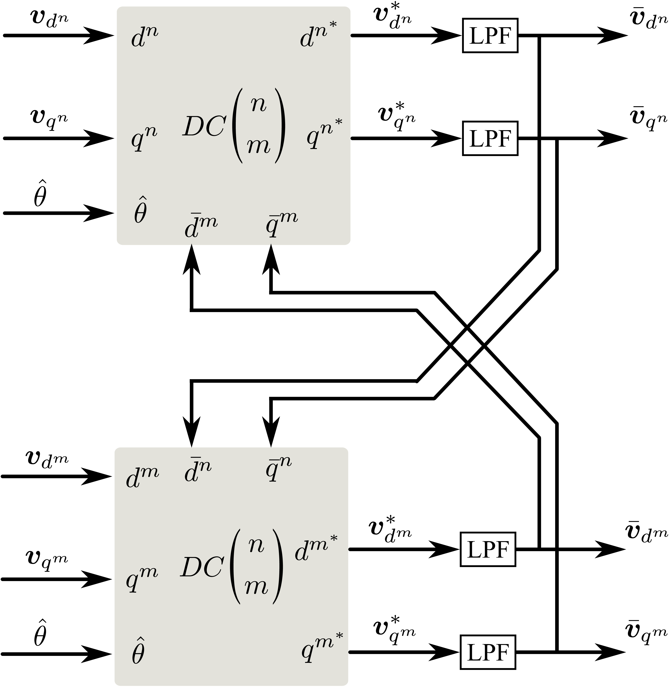

针对$dq^m$坐标系，可以根据公式$\eqref{eq:MNDoubelSychrounousDQ}$，构造对应的解耦网络。

那么$dq^n$和$dq^m$双同步坐标系的解耦网络如图13所示。其中LPF是一个一阶低通滤波器，其传递函数可表示为：

$$
\begin{equation}
	LPF(s)=\frac{\omega_f}{s+\omega_f}
\end{equation}
$$

文献[5]中，在这个解耦网络的基础上，进一步用状态空间方程来表示该解耦网络。个人认为，对于理解双坐标系的锁相环原理到此，就可以完全理解其核心理念了。文献[5]用状态空间模型的目的大概在于表达形式更统一，简便吧！

通过对解耦网络图13和传统的三相锁相环结构图10整合，可以得到双同步坐标系下锁相环整个原理框图，如图14所示。 **$n$ 或 $m$ 分别代表正负序的意义。**

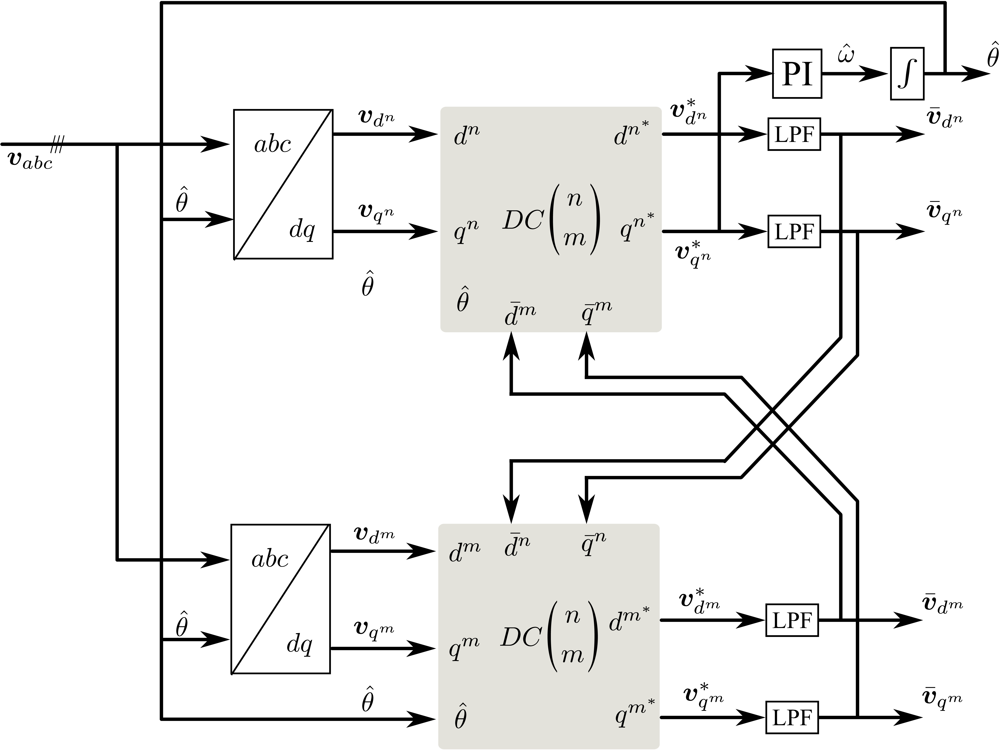

该方法解决了前面提取正序方案无法应对变换频率的问题。对频率具有良好的适应性。尽管该接偶环节加了一个一阶低通滤波器降低了响应速度，但是该锁相环的效果还是不错的。三相锁相环的研究就告一段落。接下来开始研究单相锁相环。

---

# 虚拟平均无功鉴相单相锁相环

该方法取了一个高大上的名字**虚拟平均无功鉴相单相锁相环**，实际从本质上来看就是最开始分析的**乘法鉴相锁相环**。如果再本质一点就是**乘法器**。

输入信号：

$$
\begin{equation}
	e_i=V\cos \theta
\end{equation}
$$

锁相环输出相角：$\hat{\theta}$

定义一个虚拟的电流$i_s$（简单的说就是一个假想的物理量，在真实的物理世界不存在的物理量)重要的是它的数学表达式：

$$
\begin{equation}
	i_s=\sin \hat{\theta}
\end{equation}
$$

上面$e_i$和 $i_s$ 经过乘法器得到的结果，定义为虚拟无功功率$p$:

$$
\begin{equation}
	p=V\cos\theta \sin \hat{\theta}
\end{equation}
$$

三角函数积化和差公式用于 $p$:

$$
\begin{equation}
	p=\frac{V}{2}\sin (\hat{\theta} - \theta)
	+\frac{V}{2} \sin (\hat{\theta} + \theta)
\end{equation}
$$

和乘法器鉴相锁相环相似的处理逻辑，低通滤波器滤除$\frac{V}{2} \sin (\hat{\theta} + \theta)$ 交流分量，得到无功功率平均值$\bar{p}$。

$$
\begin{equation}
	\bar{p}=\frac{V}{2}\sin (\hat{\theta} - \theta)
\end{equation}
$$

假设该系统成功锁相，那么有 $\theta \approx \hat{\theta}$, 小信号处理，可以得到

$$
\begin{equation}
	\bar{p} = \frac{V}{2}(\hat{\theta} - \theta)
\end{equation}
$$

那么只要控制$\bar{p}$为0，便可以实现锁相。这也是 $\bar{p}^{ * }=0$ 的原因。

虚拟平均无功鉴相单相锁相环的整个原理，控制结构图15充分展现其原理。

该方法简单，但该方法的动态性能比较弱(添加了低通滤波器LPF)。它对电网谐波不敏感，算一个优点吧。无法获得电网的幅值信息，算一个缺点吧。

---

# 增强型单相锁相环EPLL

为了解决**虚拟平均无功鉴相单相锁相环**动态响应速度慢的问题，采用基于自适应滤波理论的来重构输入信号的基波分量，同时可以实现对输入信号幅值、相位角与频率的估算。把这种基于自适应滤波理论的锁相环称为**增强型单相锁相环**[^6]. 

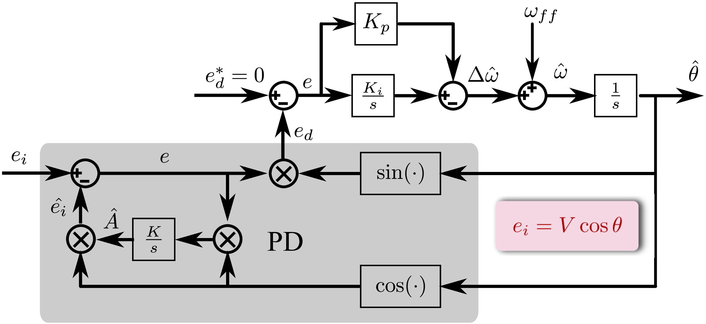

该控制结构多了一个比较陌生的变量$\hat{A}$，他是用来估算输入锁相信号的幅值。

根据图16的控制结构，可以写出$e_d$

$$
\begin{equation}
	\label{eq:SingleEpllPDSignal}
	\begin{aligned}
		e_d &= e \times \sin \hat{\theta}\\
		    &= (e_i-\hat{e_i}) \sin \hat{\theta}\\
		    &= (\hat{A} \cos \hat{\theta}-V\cos \theta) 
		    \sin \hat{\theta}\\
		    &= \frac{V}{2} \sin (\hat{\theta} -\theta)+
		    \frac{V}{2} \sin (\theta + \hat{\theta}) -
		    \frac{\hat{A}}{2} \sin 2 \hat{\theta}
	\end{aligned}
\end{equation}
$$

仔细端详该控制结构框图，会发现在**稳态**时，有$\hat{A} \approx V$, $\hat{\theta} \approx \theta$，在使用小信号模型分析方法，可以简化公式$\eqref{eq:SingleEpllPDSignal}$，得到一个有关相位差的公式。

$$
\begin{equation}
	e_d = \frac{V}{2} (\hat{\theta}-\theta)
\end{equation}
$$

值得注意的是控制框图中的PD环节中有一个积分系数 $K$, $K$的大小决定的是线电压幅值估算值 $\hat{A}$ 的收敛速度。**$\hat{A}$的收敛目标就是线电压幅值**。

该锁相环的近似闭环传递函数：

$$
\begin{equation}
	H(s)=K_v \frac{s K_p + K_i}{s^2+s K_v K_p + K_v K_i}
\end{equation}
$$

$K_v$ 为鉴相器的稳态增益， $K_v=\frac{V}{2}$。但是该闭环传递函数如何得来的，目前还不是特别清楚？

该方案替换了低通滤波器，通过使$\frac{V}{2} \sin (\theta + \hat{\theta})$、$\frac{\hat{A}}{2} \sin 2 \hat{\theta}$ 两者抵消的方案实现交流量的滤除。尽管提高了锁相环的响应速度，具有较好的动态性能。但是该锁相环方案对谐波比较敏感。不适合含有大量谐波的场合，需要先进行谐波滤除，才能应用该方案。

图16的控制结构和图17只是$\sin$和$\cos$互换，依然能实现锁相环的功能。

---

# 基于延迟法的虚拟两相的单相锁相环

前面针对单相锁相环的处理都是集中在单个输入信号。当然，可以采取前面的三相锁相环的思路，来构造一个虚拟的正交信号，来模仿三相锁相环的原理。输入信号定义为$v_{\beta}$，经过$90^{\circ}$的延时来虚拟一个$v_{\alpha}$。而通过公式$\eqref{eq:AlphaBetaVoltage}$可以知道，$v_{\alpha}$ 的相角和三相的$v_a$相角对应(这句话实际没啥意义，可以忽略！)。有了$v_{\alpha}$和 $v_{\beta}$，那么就可以使用三相锁相环的处理方案。

如图18所示，为基于延迟法的虚拟两相的单相锁相环的控制结构。和经典的三相锁相环结构对比对比就可以理解啦！延迟$90^{\circ}$的方法，影响响应速度。

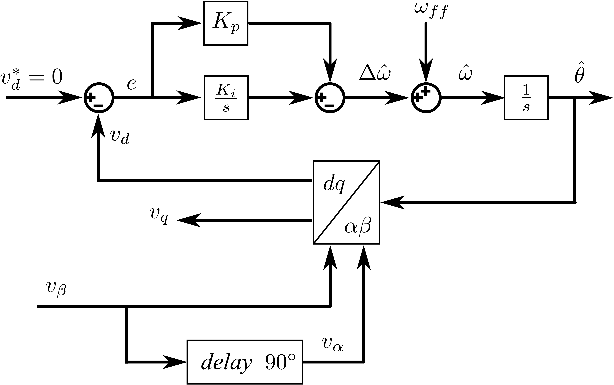

---

# 基于微分法的虚拟两相的单相锁相环

知道$v_{\beta}$ 获得 $v_{\alpha}$ 的方式，除了使用延迟方式，还可以使用微分的方式。但是有个一个前提， **输入信号$v_{\beta}$为理想的正弦信号**。对于非理想电网就会出现问题。尽管速度提高了，但微分环节的引入，抗噪声能力严重下降。

如果想把非理想正弦的信号变换为正弦的理想信号，又需要加入滤波器，这又引入了延迟。哈哈！进入无限死循环。该微分法的原理框图不在列出，本质上和基于延迟法的单相锁相环没有差别。

---

# 基于Park反变换虚拟两相的单相锁相环

基于Park反变换的方法有点意思，所以把控制结构图列出来，如图19所示。尽管文献[^7]有其他分析思路，但是我更倾向于更简单有效的理解方式。把这个反Park变换作为估计$v_{\beta}$的一种观测器来理解。同样和前面的基于虚拟两相的方法具有一曲同功之妙。已知输入信号$v_{\alpha}$，通过坐标变换获得$v_{\beta}$，然后使 $v_d=0$,即可实现锁相环功能。

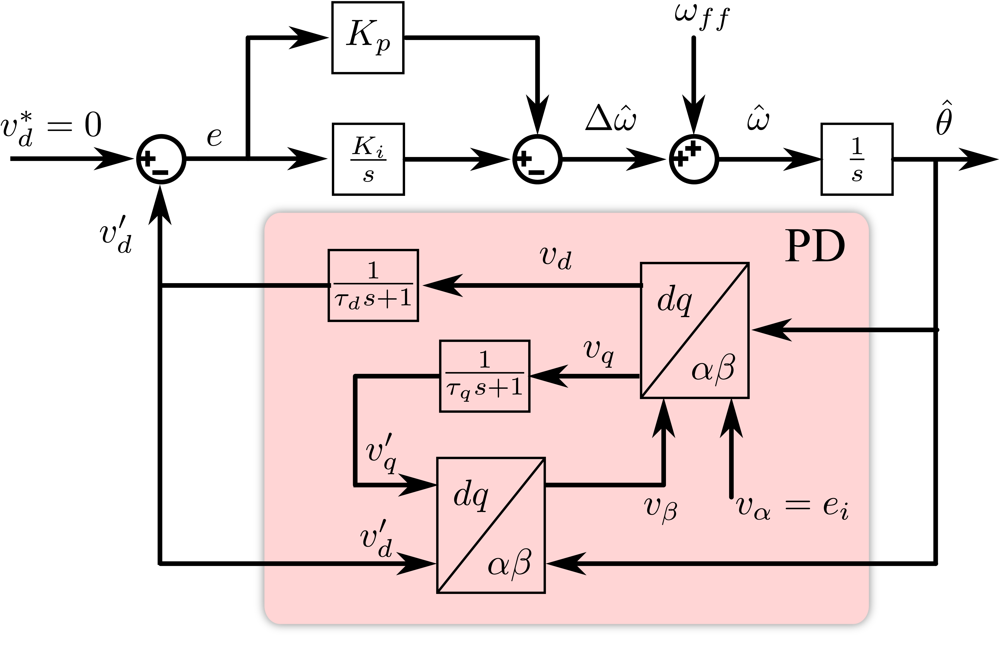

列写几个变换方程（通过上面结构框图可以得到），意思意思一下。

$$
\begin{equation}
	\begin{bmatrix}
		v_d\\
		v_q
	\end{bmatrix}
	=
	\begin{bmatrix}
		\cos(\hat{\theta}) & \sin(\hat{\theta})\\
		-\sin(\hat{\theta}) & \cos(\hat{\theta})
	\end{bmatrix}
	\begin{bmatrix}
		v_{\alpha}\\
		v_{\beta}
	\end{bmatrix}
\end{equation}
$$

$$
\begin{equation}
	\begin{bmatrix}
		v_{\alpha}'\\
		v_{\beta}'
	\end{bmatrix}
	=
	\begin{bmatrix}
		\cos(\hat{\theta}) & -\sin(\hat{\theta})\\
		\sin(\hat{\theta}) & \cos(\hat{\theta})
	\end{bmatrix}
	\begin{bmatrix}
		v_d'\\
		v_q'
	\end{bmatrix}
\end{equation}
$$

$$v_{\beta}=v_{\beta}'$$

$$
\begin{equation}
	v_{d}'(s)=\frac{v_d(s)}{\tau_d s + 1}
\end{equation}
$$

$$
\begin{equation}
	v_{q}'(s)=\frac{v_q(s)}{\tau_d s + 1}
\end{equation}
$$

---

# 基于SOGI的单相锁相环

SOGI全称为 **Second-Order Generalized Integrator**，翻译成中文为**二阶广义积分器**。基于SOGI的单相锁相环的核心就是**SOGI**，如果明白SOGI，剩下的问题就迎刃而解啦！

简单的说一下SOGI的功能：**SOGI的两个输出信号严格的满足$90^{\circ}$的相位偏差(两输出信号严格的正交)，同时其中一个输出能精确的跟踪输入基频信号。**

如果能得到两个严格正交的信号，可以分别定义为$v_{\alpha}$、$v_{\beta}$，那么再利用前面经典的三相锁相环原理，便可实现锁相环功能。

如图20所示，为SOGI-QSG(Second-Order Generalized Integrator Quadrature Signals Generation)的原理框图。

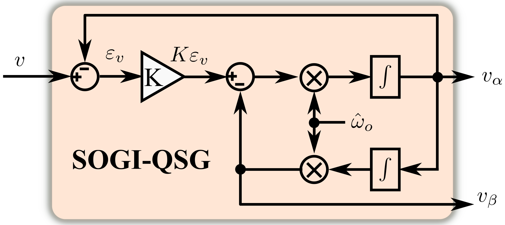

## 为什么SOGI能精确跟踪为正弦的输入信号?

根据图20，可以得到SOGI的开环传递函数：

$$
\begin{equation}
	\label{eq:SOGIOpenLoopTransferFunction}
	\begin{aligned}
	\frac{v_{\alpha}(s)}{K\varepsilon_v(s)}
	&=\frac{s \hat{\omega_o}}{s^2+\hat{\omega_o}^2}\\
	\frac{v_{\beta}(s)}{K\varepsilon_v(s)}
	&=\frac{\hat{\omega_o}^2}{s^2+\hat{\omega_o}^2}
	\end{aligned}
\end{equation}
$$

正弦信号的 laplace 变换

$$
\begin{equation}
	\label{eq:SinusoidalLaplaceTransfer}
	\begin{aligned}
		\mathcal{L}\{\sin(\omega t)\}&=\frac{\omega}{s^2+\omega^2}\\
		\mathcal{L}\{\cos(\omega t)\}&=\frac{s}{s^2+\omega^2}
	\end{aligned}
\end{equation}
$$

根据**内膜原理**[^8]，可以用一句简单的话来说，**整个控制系统要使输入信号与输出信号无静差，完全精准跟踪输入信号，那么只要满足控制系统的开环传递函数中含有输入信号的s域模型的条件，便可实现精准无静差跟踪。**

比较好的 [The Internal Model Principle](https://engineering.purdue.edu/~zak/ECE_382-Fall_2018/hand_3.pdf) 教程是 Purdue 大学 Zak 教授的这一篇内膜原理笔记。有兴趣，可以读一读。

观察公式 $\eqref{eq:SOGIOpenLoopTransferFunction}$和公式$\eqref{eq:SinusoidalLaplaceTransfer}$你会发现恰巧SOGI的开环传递函数含有正弦信号的s域模型。那么就解决了为什么SOGI可以精确跟踪正弦信号。

## 为什么SOGI两输出信号严格正交？

SOGI的闭环传递函数：
$$
\begin{equation}
	\label{eq:SOGIClosedLoopTransferFunction}
	\begin{aligned}
	 G_{\alpha} &=\frac{v_{\alpha}(s)}{v(s)}
	 =\frac{ks}{s^2+ks+\hat{\omega_o}^2}\\
	 G_{\beta} &=\frac{v_{\beta}(s)}{v(s)}
	 =\frac{k\hat{\omega_o}}{s^2+ks+\hat{\omega_o}^2}
	\end{aligned}
\end{equation}
$$

可以直接看两闭环传递函数$\eqref{eq:SOGIClosedLoopTransferFunction}$互差$90^{\circ}$。

$$
\begin{equation}
	\angle G_{\alpha} - \angle G_{\beta}=\frac{\pi}{2}
\end{equation}
$$

因此SOGI的两输出信号严格正交。

从闭环传递函数 Bode 图中也可以验证SOGI输出信号严格正交，
$G_{\alpha}$、 $G_{\beta}$ 相角严格互差$\frac{\pi}{2}$。

从图21可以发现，$G_{\alpha}$可以看作一个带通滤波器，在频率 $\hat{\omega_o}$ 处无衰减，但在其它频率就有衰减作用，越偏离 $\hat{\omega_o}$，衰减越厉害。这也是锁相环所期望的，锁定频率基本不衰减，其他次谐波都衰减，过滤。因此基于SOGI的单相锁相环性能不错，能抵抗谐波干扰。

写了这么多理论，放一个基于 SOGI 的 simulink 的仿真波形吧！如图22所示。

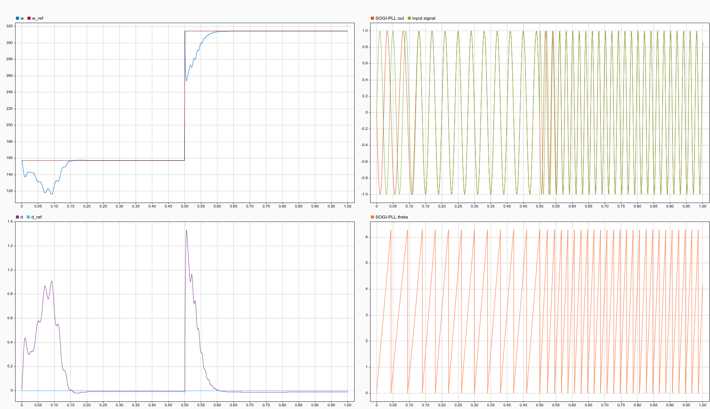

对SOGI单相锁相环有兴趣，可以参考文献[^9]，该文献对SOGI单相锁相环写的清晰明了，图文并茂。

---

# 锁相环的性能指标

---

- 稳态相角误差 state phase-angle error
- 相角响应速度 speed of response to angle
- 频率响应速度 speed of response to frequency
- 变频的适应能力 variable frequency rejection
- 谐波适应能力 harmonic rejection
- 非平衡电网适应能力 line unbalance rejection

---

# 推荐阅读有关PLL文献

[A method for synchronization of power electronic converters in polluted and variable-frequency environments](https://ieeexplore.ieee.org/document/1318659)

[Performance evaluation of PLL algorithms for single-phase grid-connected systems](https://ieeexplore.ieee.org/document/1348790)

[Decoupled Double Synchronous Reference Frame PLL for Power Converters Control](https://ieeexplore.ieee.org/document/4118328)

[Comparison of Three Single-Phase PLL Algorithms for UPS Applications](https://ieeexplore.ieee.org/document/4497881)

[PLL structures for utility connected systems](https://ieeexplore.ieee.org/document/955993)

[A phase tracking system for three phase utility interface inverters](https://ieeexplore.ieee.org/document/844502)

[Operation of a phase locked loop system under distorted utility conditions](https://ieeexplore.ieee.org/document/567077)

[A new single-phase PLL structure based on second order generalized integrator](https://ieeexplore.ieee.org/document/1711988)

[A new phase-locked loop (PLL) system]({https://ieeexplore.ieee.org/document/986202)

---

# 备注

I would greatly appreciate hearing about any error in this article, even minor ones.
I welcome your suggestions for improvements, even tiny one. Please contact me by email 😏! Have fun!

---

# 参考文献

[^1]: 张崇巍, 张兴. PWM 整流器及其控制 [M]. 北京: 机械工业出版社, 2012.

[^2]: KAURA V, BLASKO V. Operation of a phase locked loop system under distorted utility conditions[J]. IEEE Transactions on Industry applications, 1997, 33(1): 58-63.

[^3]: CHUNG S K. A phase tracking system for three phase utility interface inverters[J/OL]. IEEE Transactions on Power electronics, 2000, 15(3): 431-438. DOI: 10.1109/63.844502.

[^4]: LEE S J, KANG J K, SUL S K. A new phase detecting method for power conversion systems considering distorted conditions in power system[C/OL]//Conference Record of the 1999 IEEE Industry Applications Conference. Thirty-Forth IAS Annual Meeting (Cat. No.99CH36370):volume 4. 1999: 2167-2172 vol.4. DOI: 10.1109/IAS.1999.798754.

[^5]: RODRIGUEZ P, POU J, BERGAS J, et al. Decoupled double synchronous reference frame pll for power converters control[J/OL]. IEEE Transactions on Power Electronics, 2007, 22(2):584-592. DOI: 10.1109/TPEL.2006.890000.

[^6]: KARIMI-GHARTEMANI M, IRAVANI M R. A method for synchronization of power electronic converters in polluted and variable-frequency environments[J]. IEEE Transactions on Power Systems, 2004, 19(3): 1263-1270.

[^7]: SILVA S M, LOPES B M, CAMPANA R P, et al. Performance evaluation of pll algorithms for single-phase grid-connected systems[C]//Conference Record of the 2004 IEEE Industry Applications Conference, 2004. 39th IAS Annual Meeting.: volume 4. IEEE, 2004: 2259-2263.

[^8]: FRANCIS B A, WONHAM W M. The internal model principle for linear multivariable regulators[J]. Applied mathematics and optimization, 1975, 2(2): 170-194.

[^9]: CIOBOTARU M, TEODORESCU R, BLAABJERG F. A new single-phase pll structure based on second order generalized integrator[C/OL]//2006 37th IEEE Power Electronics Specialists Conference. 2006: 1-6. DOI: 10.1109/pesc.2006.1711988. 
