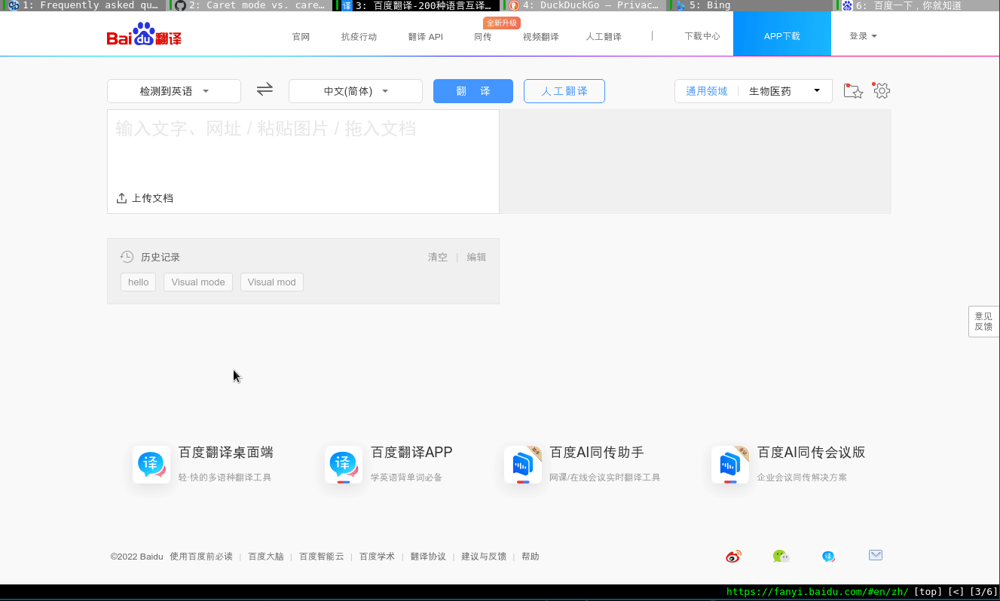
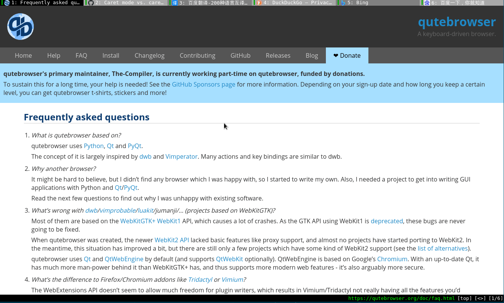
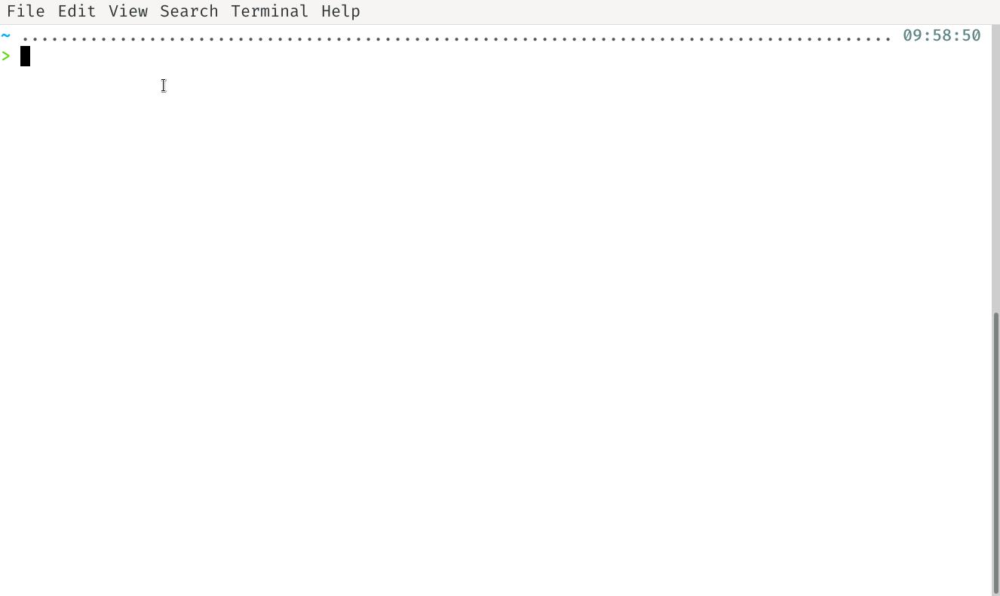
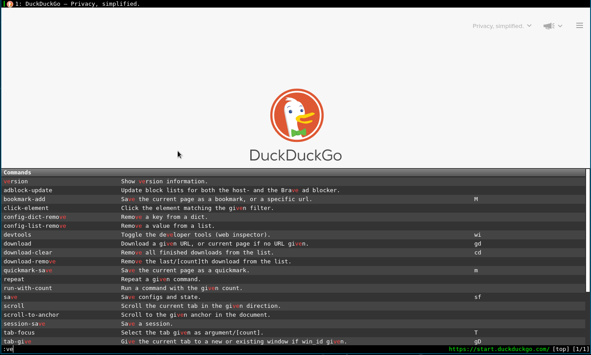
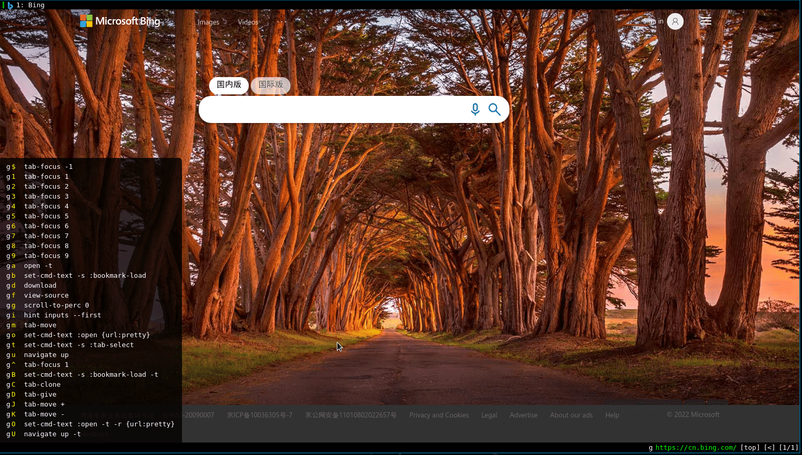
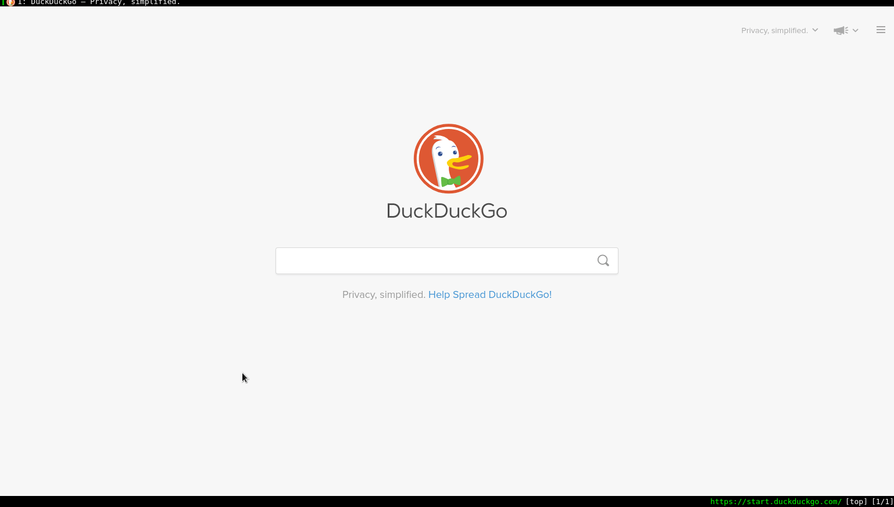
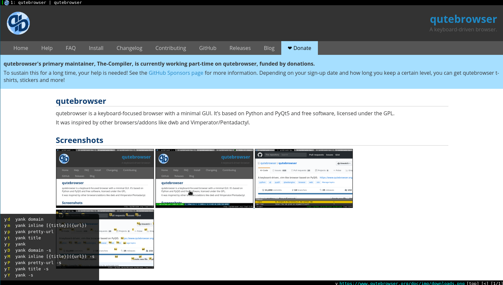
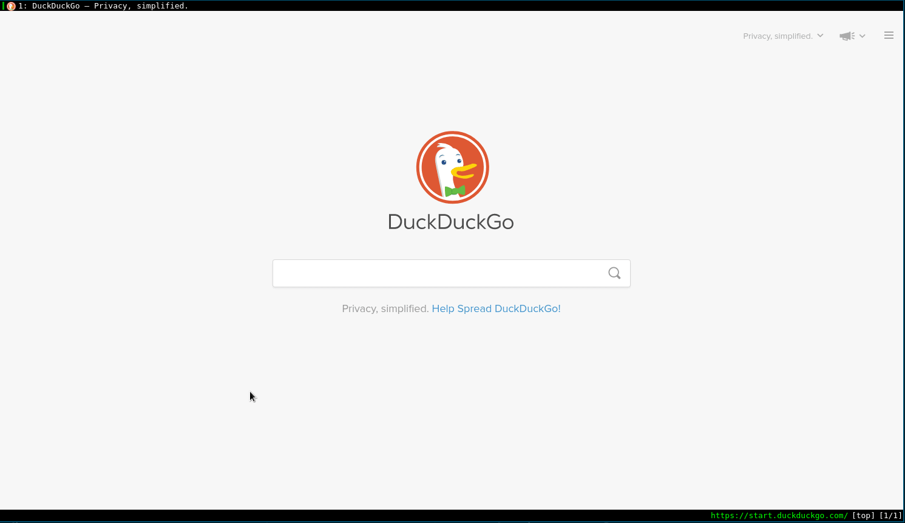
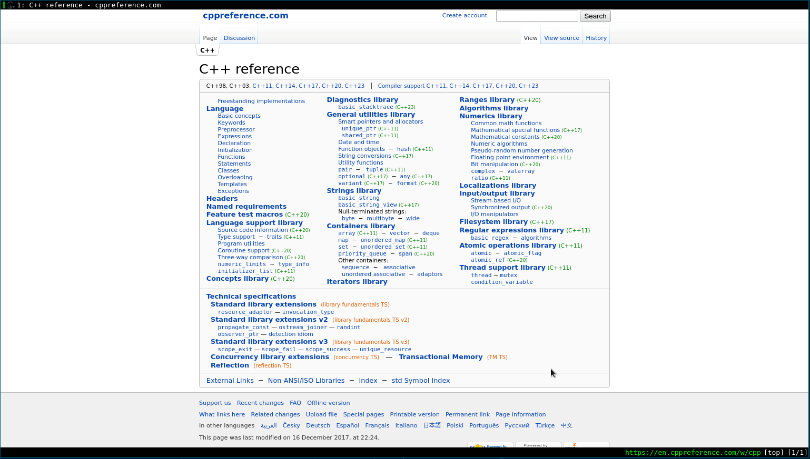
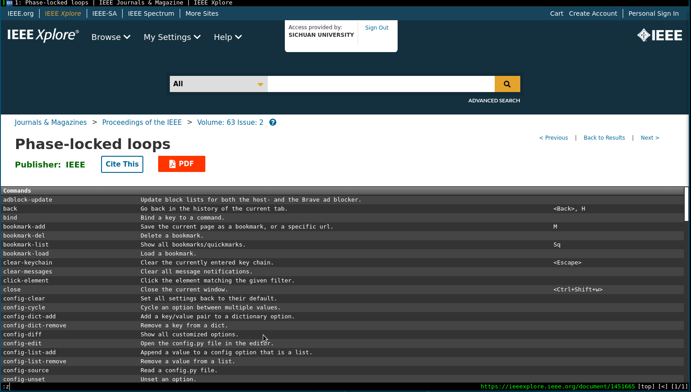

---


# 怎么接触到 qutebrowser

写 qutebrowser 正文前先来聊聊题外话题。我为什么会发现 qutebrowser 这款小众化的浏览器。最初的动机是自己电脑太古老了，跑一些现在的应用程序太卡顿了，为了提升PC的使用体验，需要采用最小化的应用程序来武装自己的电脑，对于不必要的系统组件尽量不要。毕竟我这台电脑已经不足以带动这么多现代化的大型应用程序。自己的电脑桌面环境从 [Gnome](https://www.gnome.org/) 换成一个激进的 Dynamic Windows Manager [dwm](https://suckless.org/)。用了一周左右，感觉使用比 Gnome 的操作逻辑舒服，体验效果也不错。毕竟 dwm 程序用纯C写的，代码行数不到2000行（实际我查看最新的 dwm 6.3 源代码加上注释应该有3000行左右，即使这样也体现 dwm 的精简特点）。十分精简，所有配置都是直接修改源代码，刚开始使用比较难受，随后感觉越来越顺手。suckless 的四件套: [**dwm**](https://dwm.suckless.org/)，[**st**](https://st.suckless.org/)，[**dmenu**](https://tools.suckless.org/dmenu/)，[**slstatus**](https://tools.suckless.org/slstatus/)，[**slock**](https://tools.suckless.org/slock/)。以前一直使用 Firefox，最近大量查阅IEEE论文，同时开多个IEEE论文网页，系统硬件资源就比较吃紧。开其他网页没这么大影响，推测可能是IEEE这个网站对硬件消耗比较大，需要加载的资源比较多。然后第一反应是使用 suckless 的 [surf](https://surf.suckless.org/) 浏览器。毕竟 dwm 在我电脑上运行的还不错。然后花了时间编译运行 surf 浏览器。实际体验效果不是特别好，硬件消耗还是特别严重。查阅网上资料解释说不是 surf 的问题，而是 surf 使用的 **WebKit2/GTK+** 导致硬件消耗比较严重。简单的说就是 surf 不背这锅。 但是由于使用了几天的 surf，被它的快捷键操作逻辑吸引了，可以大部分时间放下鼠标，直接用键盘驱动浏览器，可以带来快速沉浸式浏览网页的体验。然后查询了和 surf 类似的浏览器一个是 **qutebrowser**，另一个是 [**vimb**](https://fanglingsu.github.io/vimb/)，而自己使用的 Debian 的最新稳定版本的软件仓库里没有vimb，所以就选择 qutebrowser 了。

然后就踏上了qutebrowser折腾之路。

---

# qutebrowser introduction


先去 [qutebrowser](https://qutebrowser.org/index.html) 官方网站浏览浏览，下面是这样介绍 qutebrowser。翻译过来就是 qutebrowser 是一个键盘驱动的浏览器。

> qutebrowser is a *keyboard-focused* browser with a minimal GUI. 
> It’s based on *Python* and *PyQt5* and free software, licensed under the GPL.
> It was inspired by other browsers/addons like *dwb* and *VTridactylimperator/Pentadactyl*.

而且 qutebrowser 的键盘配置符合 vim 快捷键，加上自己已习惯 vim 快捷键操作逻辑。因此 qutebrowser 正符合我的口味。值得一提的是 qutebrowser 的作者 Github 名: [**The-Compiler**](https://github.com/The-Compiler)，个人网站 [Florian Bruhin Blog](https://bruhin.software/)。 单独一个人就开发一个浏览器GUI，真厉害！不过由于是单个人开发的浏览器程序，所以没有 Firefox 和 Chrome 功能强大。但是还是值得推荐使用的。值得遗憾的一点就是 qutebrowser 没有 Firefox 和 Chrome 的插件功能。算一个缺点吧！但是 qutebrowser 支持 greasemonkey 油猴脚本和 [userscripts](https://www.qutebrowser.org/doc/userscripts.html) (用户自定义脚本)，算弥补了这一缺陷吧。qutebrowser 支持 Windows，macOS 和 Linux平台。PC三巨头都支持哈！

$$
e^{i\theta}=\cos(\theta)+i \sin(\theta)
$$

---
操作环境：

- OS: Debian GNU/Linux 11 (bullseye) x86\_64
- Kernel: 5.10.0-11-amd64
- DE: dwm
- WM: LG3D
- qutebrowser: v2.0.2
---

qutebrowser version `:version`

```
Version info
         ______     ,,
    ,.-"`      | ,-` |
  .^           ||    |
 /    ,-*^|    ||    |
;    /    |    ||    ;-*```^*.
;   ;     |    |;,-*`         \
|   |     |  ,-*`    ,-"""\    \
|    \   ,-"`    ,-^`|     \    |
 \    `^^    ,-;|    |     ;    |
  *;     ,-*`  ||    |     /   ;;
    `^^`` |    ||    |   ,^    /
          |    ||    `^^`    ,^
          |  _,"|        _,-"
          -*`   ****"""``

qutebrowser v2.0.2
Git commit: 
Backend: QtWebEngine (Chromium 83.0.4103.122)
Qt: 5.15.2

CPython: 3.9.2
PyQt: 5.15.2

sip: 5.4.0
colorama: no
jinja2: 2.11.3
pygments: 2.7.1
yaml: 5.3.1
adblock: 0.5.1
PyQt5.QtWebEngineWidgets: yes
PyQt5.QtWebEngine: 5.15.2
PyQt5.QtWebKitWidgets: no
pdf.js: 2.6.0 (/usr/share/javascript/pdf/build/pdf.js)
sqlite: 3.34.1
QtNetwork SSL: OpenSSL 1.1.1k  25 Mar 2021

Style: QFusionStyle
Platform plugin: xcb
OpenGL: Intel Open Source Technology Center, 3.0 Mesa 20.3.5
Platform: Linux-5.10.0-11-amd64-x86_64-with-glibc2.31, 64bit
Linux distribution: Debian GNU/Linux 11 (bullseye) (debian)
Frozen: False
Imported from /usr/lib/python3/dist-packages/qutebrowser
Using Python from /usr/bin/python3
Qt library executable path: /usr/lib/x86_64-linux-gnu/qt5/libexec, data path: /usr/share/qt5

Paths:
cache: /home/sean/.cache/qutebrowser
config: /home/sean/.config/qutebrowser
data: /home/sean/.local/share/qutebrowser
runtime: /run/user/1000/qutebrowser
system data: /usr/share/qutebrowser

Autoconfig loaded: yes
Config.py: no config.py was loaded
Uptime: 0:47:58
```


在 dwm 中使用 qutebrowser，体验效果不错。在 Gnome 中使用 qutebrowser 有空白的区域，感觉没最大化利用屏幕空间，个人感觉有点别扭，有点罪过，所以觉得体验效果没有 dwm 舒服。实际在 dwm 和 Gnome 中，不存在使用差别，只是在 dwm 中 qutebrowser 更简洁。

Debian系列安装

```bash
sudo apt install qutebrowser
```
至于其他平台安装教程请参考官方 [qutebrowser Install](https://qutebrowser.org/doc/install.html)

---

# qutebrowser 操作模式

学过 vim 的同学都知道，vim 的操作有模式区分。一般常用 vim 操作模式：*普通模式（Normal Mode）， 插入模式（Insert Mode），可视模式（Visual Mode）*。qutebrowser 也有操作模式，大致和 vim 操作模式类似。qutebrowser 中的模式直接用英文替代，就不翻译成中文了，避免出错。

qutebrowser modes:

* Normal Mode：你大部分时间浏览网页都处在 Normal Mode，和 vim 的 Normal Mode 相同。

* Insert Mode：现在你有个需要向网页中的搜索框输入。例如使用百度翻译或搜素引擎的搜索框。你需要先进入 Insert Mode 才能输入内容。Insert Mode 快捷键 `i`。退出模式到 Normal Mode 快捷键 `Esc`。对于有些网页搜索框，进入 Insert Mode 还是无法输入搜素内容，可以试试 `gi`，或者像平常使用浏览器一样，鼠标点击搜索框，出现闪烁光标，代表可以输入文字。



* Caret Mode：会在当前网页产生一个光标，然后你会觉得就像该网页像文本编辑器的操作一样。其中一个使用就是选择网页文本并复制选择文本。稍后会有演示。Caret Mode 快捷键 `v`。退出模式到 Normal Mode 快捷键 `Esc`。



* PassThrough Mode：qutebrowser 官方解释是 PassThrough Mode 和 Insert Mode 类似。那为什么需要该模式呢？个人理解是 PassThrough Mode 下基本没有快捷键绑定，一个快捷键可能在 Normal Mode 中被占用，但你又想使用该快捷键，你可以绑定快捷键到 PassThrough Mode。这样就实现同一快捷键不同功能的目的。PassThrough Mode 快捷键 `Ctrl+v`。这不是 windows 常用的复制粘贴键吗？在 Insert Mode 下使用是复制粘贴的意思，在 Normal Mode 下是进入 PassThrough Mode 的意思。退出模式到 Normal Mode 快捷键 `Shift+Esc`。

---


# qutebrowser basic use

## qutebrowser 整体界面简单介绍


qutebrowser 界面具体解释：

1. 黑色背景为当前所打开的网页标签，以及打开网页的名字

2. 和vim类似，为输入命令的区域，我们把它成为 qutebrowser 命令行。除了快捷键操作，大部分都在这里输入命令

3. 当前打开网页的URL

4. qutebrowser 打开的标签总数目以及当前所处的标签位置

注意：接下来对 qutebrowser 的命令操作的输入法都是*英文半角模式*。简单的说就是要把输入法调节到英文输入。

> qutebrowser 的操作主要分为两类：一类是使用快捷键，另一类是在命令行输入命令 `:command`。


## 打开帮助文档

因为 qutebrowser 的操作逻辑和 vim 编辑器类似。因此在 qutebrowser 中打开本地帮助文档，直接使用输入 `:help`。


除了打开本地的帮助文档，当然可以使用 [qutebrowser 官方帮助文档](https://qutebrowser.org/doc/help/)。

打开帮助文档后，点击 **quick start guide**链接，并阅读就可以快速上手 qutebrowser。

当然你可以通过在终端输入 `man qutebrowser` 了解一些 qutebrowser 的基本信息，文档有用且不长，但没有 `:help` 文档全面。



## 查看 qutebrowser 版本

命令：`:version`



## 打开一个网页

按快捷键 `o` 然后输入网络需要打开网页的url即可。然后敲击回车键 `Enter`。


使用快捷键 `O` 然后输入URL，会在新标签 `tab` 打开一个网页。动画演示如下：


使用快捷键 `go` 编辑当前网页url。

`ga` 快速在新标签打开默认首页，就是你首次打开 qutebrowser 显示的浏览器界面。

例如我的首页设置如下 
```bash
:set url.start_pages https://start.duckduckgo.com
```



## 快速点击当前网页链接

先按快捷建 `f`，然后网页中的每个链接旁都出现一个字母，输入你想访问链接的字母即可。


按键 `f` 是在当前网页打开点击的链接，而 `F` 是在新的标签打开链接。在回忆一下 `o` 和 `O`，似乎你可以发现一些规律。*小写的按键是在当前标签操作内容，大写字母的按键是在新标签操作内容*。

## 命令撤销
当输入一个命令，发现好像输出错误或者不想运行该命令，请按 `Esc` 键退出命令。这个 `Esc` 和 vim 的 `Esc` 类似。当你是 vim 玩家，你会很快上手 qutebrowser 。


## 当前网页浏览

`jkhl` 分别对应vim的上下左右移动。

`gg` 快速移动到第一行。

`GG` 快速移动到最后一行。

## 缩放网页

有时网页的字体太小或太大，你可能有缩放网页的需求。当然可以用传统浏览器Firefox的方式，使用键盘和鼠标 `Ctrl+MouseWheel`。即按住 `Ctrl`键盘不放，然后滚动鼠标滑轮。另一种方式是使用快捷键 `+` 放大网页，`-` 缩小网页，`=` 恢复默认大小。



## 复制网页超链接

可能你需要复制当前网页的超链接到剪贴板，请使用 `yy` 即可。如果需要复制当前网页中的其中一个超链接，可以使用 `;y`，然后选择你想复制的超链接。如果你再使用 `pp` ，可以在当前标签快速打开当前剪贴板的链接。



## 标签切换

`shift+j` `shift+k` 分别是向前向后切换标签

和 `shift+j` 的功能相同的快捷键是 `shift+t`。两者在使用上我目前还没发现差别。不过 `shift+t` 可以理解成 `shift tab`, 翻译成中文就是*切换标签*，似乎更容易记住这个快捷键。


## 前进或后退

`shift+h` 当前标签后退一步网页

`shift+k` 当前标签前进一步网页


## 删除当前标签

`d` (delete)删除(关闭)当前标签

## 撤销刚删除标签

`u` (undo) 撤销刚删除标签，可以连续使用，多恢复几个标签。


## 网页搜索

`/` 和 vim 操作相同，用于在当前页面搜索内容。

qutebrowser 命令行输入 `/keyword`。网页就会高亮和你输入匹配的 `keyword`，然后按 `n`，跳转到下一个高亮结果。如果你会 vim 你就会联想到按  `shift+n` 是跳转下一个高亮结果方向和 `n` 相反。 进一步思考，vim 不是有 `？keyword` 搜索命令吗？你可以在自己 qutebrowser 上试试，看看会出现什么效果。


## 查看历史记录

`:history` 或者 `Sh`(**S**how **h**istory)


## 退出 qutebrowser

`:wq` `:q` 都是关闭 qutebrowser，但是他们又有区别。

`:wq` 和 `:q` 区别：

- `:q` 只是关闭当前 qutebrowser, 不保存当前浏览网页界面。

- `:wq` 保存当前网页浏览界面并退出。下次 qutebrowser 自动打开上次浏览界面。


---


# config qutebrowser

用户配置文件目录`~/.config/qutebrowser`下面的文件有: 

---
* autoconfig.yml  
* **bookmarks**   
* **greasemonkey**  
* qsettings  
* quickmarks  
* **userscripts**
---

没有的文件或目录可以自己创建。

## autoconfig.yml
`autoconfig.yml` 文件是在 qutebrowser 命令行用 `:set xxxx` 设置然后自动生成到 `autoconfig.yml`。

个人配置文件如下：

```python autoconfig.yml
# If a config.py file exists, this file is ignored unless it's explicitly loaded
# via config.load_autoconfig(). For more information, see:
# https://github.com/qutebrowser/qutebrowser/blob/master/doc/help/configuring.asciidoc#loading-autoconfigyml
# DO NOT edit this file by hand, qutebrowser will overwrite it.
# Instead, create a config.py - see :help for details.

config_version: 2
settings:
  aliases:
    global:
      q: close
      qa: quit
      w: session-save
      wq: quit --save
      wqa: quit --save
      zotero: spawn --userscript zotero
  bindings.commands:
    global:
      normal:
        <Alt+1>: null
        g0: null
        g1: tab-focus 1
        g2: tab-focus 2
        g3: tab-focus 3
        g4: tab-focus 4
        g5: tab-focus 5
        g6: tab-focus 6
        g7: tab-focus 7
        g8: tab-focus 8
        g9: tab-focus 9
        xb: config-cycle statusbar.show always never
        xt: config-cycle tabs.show always never
        xx: config-cycle statusbar.show always never;;config-cycle tabs.show always
          never
  colors.tabs.bar.bg:
    global: '#555555'
  colors.tabs.even.bg:
    global: darkgrey
  colors.tabs.selected.even.bg:
    global: black
  colors.tabs.selected.even.fg:
    global: white
  content.blocking.adblock.lists:
    global:
    - https://easylist.to/easylist/easylist.txt
    - https://easylist.to/easylist/easyprivacy.txt
    - https://easylist-downloads.adblockplus.org/easylistdutch.txt
    - https://easylist-downloads.adblockplus.org/abp-filters-anti-cv.txt
    - https://secure.fanboy.co.nz/fanboy-cookiemonster.txt
  content.blocking.method:
    global: both
  content.headers.user_agent:
    https://accounts.google.com/*: Mozilla/5.0 ({os_info}; rv:90.0) Gecko/20100101
      Firefox/90.0
  content.pdfjs:
    global: true
  content.webgl:
    global: true
  downloads.location.directory:
    global: null
  statusbar.show:
    global: always
  tabs.show:
    global: always
  url.searchengines:
    global:
      DEFAULT: https://cn.bing.com/search?q={}
      aw: https://wiki.archlinux.org/?search={}
      b: https://bing.com/search?q={}
      d: https://duckduckgo.com/?q={}
      du: https://www.baidu.com/s?ie=utf-8&f=8&rsv_bp=1&rsv_idx=1&tn=baidu&wd={}
      g: https://www.google.com/search?hl=en&q={}
      re: https://www.reddit.com/r/{}
      w: http://en.wikipedia.org/w/index.php?search={}
      yt: https://www.youtube.com/results?search_query={}
  url.start_pages:
    global: https://start.duckduckgo.com
```

`Alt+num` 在 qutebrowser 的含义是快速跳转到 num 标签，但是与我使用 dwm 的快捷建冲突，故自己定义了快速跳转标签的快捷键为 `g+num`，上面配置文件有。

尽管 `autoconfig.yml` 是自动生成的，但是你也可以直接复制上面配置内容到你的 `autoconfig.yml` 文件，这样就不需要自己单独设置了。

个人配置文件可以使用 `config.py`。如果配置文件夹存在 `config.py`， 那么 `autoconfig.yml` 会被覆盖。个人习惯使用 `autoconfig.yml`，感觉更方便。但是官方建议是使用 `config.py` 自定义自己的配置文件，因为 `autoconfig.yml` 会被 qutebrowser 中运行 `:set xxx` 命令覆盖。

如果你想使用 `config.py`，可以运行 `:config-write-py` 命令，根据 `autoconfig.yml` 生成对应的 `config.py`。


## 网络代理配置

qutebrowser 设置网络代理命令 
```bash
:set content.proxy socks://127.0.0.1:1080
```


运行网络代理配置命令后，在 `autoconfig.yml` 文件中会发现自动添加如下内容。

```python autoconfig.yml
content.proxy:
  global: socks://127.0.0.1:1080
```

## 搜索引擎
根据前面的 `autoconfig.yml` 文件配置，可快速使用指定引擎搜索。使用命令 `:open b keyword`，其中`b`是我设置的Bing搜索引擎的缩写单词。详细设置参考上述 `autoconfig.yml` 的 **url.searchengines** 部分内容。`DEFAULT` 是在不加指定搜索引擎时，默认使用的搜索引擎。例如：`:open keyword` 就直接使用 `DEFAULT` 设置的默认搜索引擎搜索内容。


在来一个应用场景，演示一下如何快速搜索内容。由于经常使用 IEEE 搜索论文，一般操作流程是先打开 IEEE 官网，然后输入关键字，在点击搜索图标，等待网页显示搜索结果。那么用快速搜索引擎的方案，你会发现好像要快一点点。

首先在 qutebrowser 搜索引擎设置添加如下内容：

```python
:set url.searchengines '{"ee": "https://ieeexplore.ieee.org/search/searchresult.jsp?newsearch=true&queryText={}"}'
```



其他常用网站搜索也可以自己添加，提高你浏览网页速度。


## pdf.js
pdf.js 是 Mozilla 开发的一款网络标准的 pdf 阅读器。Firefox 内置的 pdf 阅读器就是使用的 pdf.js。qutebrowser 也是使用 pdf.js 来渲染 pdf 文件。

qutebrowser 使用 pdf.js 需要进行如下设置：

1. 安装 pdf.js 

```bash
sudo apt install pdfjs
```

2. qutebrowser 打开 pdf.js

```bash
:set content.pdfjs true
```

qutebrowser 阅读 pdf 没有显示操作按钮问题，请参考 [pdf.js not show button](https://github.com/qutebrowser/qutebrowser/issues/4289)。

解决方法：去 [Github pdf.js](https://github.com/mozilla/pdf.js/tree/master/web/images) 找到对应的操作图标复制到 `/usr/share/pdf.js/web/images` 中。

qutebrowser 阅读 pdf 中文乱码问题

解决方案：把 [bcmaps](https://github.com/mozilla/pdf.js/tree/master/external/bcmaps) 中内容复制到 `/usr/share/pdf.js/web/cmaps` 中。


## quickmarks

quickmarks 和 bookmarks 没啥区别，但是在 qutebrowser 中建议使用 quickmarks，毕竟 quickmarks 中含有 *quick*（代表快速的含义）。你可以把 quickmarks 理解成 Firefox 等浏览器中的书签。

添加当前网页地址到 quickmarks 按键：`m`。




对于导入其他浏览器书签到 qutebrowser 请参考 arch wiki qutebrowser 中的 [Importing quickmarks bookmarks](https://wiki.archlinux.org/title/Qutebrowser#Importing_quickmarks/bookmarks) 小节内容。

下面以 Firefox 为例，首先从 Firefox 导出书签 bookmarks.html，然后运行如下命令：

``` bash
python /usr/share/qutebrowser/scripts/importer.py bookmarks.html >> ~/.config/qutebrowser/quickmarks
```


## greasemonkey

直接在文件夹 greasemonkey 中添加 `xxx.js` 脚本文件即可。脚本寻找网站：[Greasemonkey](https://greasyfork.org/zh-CN/scripts)。

移除Youtube广告脚本，直接添加到 greasemonkey 配置文件夹中。

```javascript
// ==UserScript==
// @name         Auto Skip YouTube Ads
// @version      1.0.0
// @description  Speed up and skip YouTube ads automatically
// @author       jso8910
// @match        *://*.youtube.com/*
// @exclude      *://*.youtube.com/subscribe_embed?*
// ==/UserScript==
setInterval(() => {
    const btn = document.querySelector('.videoAdUiSkipButton,.ytp-ad-skip-button')
    if (btn) {
        btn.click()
    }
    const ad = [...document.querySelectorAll('.ad-showing')][0];
    if (ad) {
        document.querySelector('video').playbackRate = 10;
    }
}, 50)
```

## 广告 block

先安装 Python adblock library，因为里面含有 [Brave's Rust adblock library](https://github.com/brave/adblock-rust)
可以改善广告 block. 

```bash
pip install adblock
```

qutebrowser 设置 host block list

```bash
:set content.blocking.adblock.lists '["https://easylist.to/easylist/easylist.txt", "https://easylist.to/easylist/easyprivacy.txt", "https://easylist-downloads.adblockplus.org/easylistdutch.txt", "https://easylist-downloads.adblockplus.org/abp-filters-anti-cv.txt", "https://halflife.coding.net/p/list/d/list/git/raw/master/ad-pc.txt"]'
```

推荐一些的广告 filter list。下面的 halflife 是支持国内网站 adblock 的。

```json 
https://easylist.to/easylist/easylist.txt
https://easylist.to/easylist/easyprivacy.txt
https://easylist.to/easylist/fanboy-social.txt
https://halflife.coding.net/p/list/d/list/git/raw/master/ad-pc.txt
```
Easylist list 获得 可以参考 [easylist web site](https://easylist.to/)。

阻止国内网站广告也可以参考这篇 blog [Adguad 过滤规则分享](https://wsgzao.github.io/post/adguard/)。

前面讲述的都是使用大佬们定义好的广告过滤规则，能解决大部分问题，但是不能解决所有问题。有可能你有自定义广告过滤规则的需求，可以参看
[How to write filters](https://help.eyeo.com/en/adblockplus/how-to-write-filters)。等我那天闲的无聊，再学学如何写广告过滤规则。

注意：qutebrowser adblock 功能没有 [uBlock Origin](https://seanchristspc.github.io/2021/04/20/uBlock-Orgin-Tutor/)功能强大。
qutebrowser adblock 实现核心仅仅是阻止网络请求，不会更细致的 block 网页界面的某一个元素。 至于为什么不实现这个功能，请看 [more sophisticated adblocking](https://github.com/qutebrowser/qutebrowser/issues/29) 中 The-Compiler 的解释。

设置 qutebrowser 使用 Brave's adblock 和自己设置的 host block list.

```bash
:set content.blocking.method both
```

更新 adblock `:adblock-update`


## zotero

主要自己长期使用 zotero 管理自己的文献，但是 qutebrowser 没有 zotero 插件，但是又想使用 qutebrowser 浏览器和 zotero 交互，在 github 上找到解决方案使用 qutebrowser 的 **userscripts** 功能，可以解决 zotero 交互问题。具体参考 [zotero userscript](https://github.com/parchd-1/qutebrowser-zotero) 把上面脚本添加到 `~/.config/qutebrowser/userscripts` 中，并命名为zotero，同时添加执行权限。

```bash
chmod +x zotero
```

就在IEEE上下载一篇论文到 zotero 演示吧！



---


# do not copy to clipboard

qutebrowser 对于有些网站的 copy 按钮无法使用，这个功能严重影响我工作。今天2022-03-29觉得该解决这个问题，所以去搜索引擎搜索了一下这个问题，直接就找到答案了 参考 [qutebrowser github issue 6719](https://github.com/qutebrowser/qutebrowser/issues/6719)。

```bash
:set content.javascript.can_access_clipboard true
```


--- 

# 快捷键图表


没事多看看这个快捷键图表，提高你使用 qutebrowser 效率。

---

# Firefox Addon: Tridactyl 实现 vim keyboard-driven

浏览器插件 Vimperator 和 Pentadactyl 已经退出历史舞台。但是对于对于有强力需求使用 Firefox 浏览器的用户，可以使用 Firefox addon [**Tridactyl**](https://github.com/tridactyl/tridactyl) 来实现 vim 键盘驱动。在 Firefox [ADD-ONS](https://addons.mozilla.org/en-US/) 搜索 **Tridactyl** ，并安装插件即可。就可直接键盘驱动 Firefox 啦！使用方式和 qutebrowser 差不多。推荐运行命令 `:tutor` 来查看使用教程。虽然没有 qutebrowser 支持 vim 快捷键全面，还是可以尝试一下的，至少比用鼠标快多了。值得一提的是，*使用 `o` 命令快捷打开历史记录和浏览器书签，不是使用方向键选择需要打开的历史记录或浏览器书签，而是使用 `tab` 或 `shift+tab` 移动选择需要打开的历史记录或书签。*

当然还有其他浏览器插件可以实现 vim 键盘驱动功能，如果好奇，可以自己尝试其他 vim 插件。对于 Chrome 系列的 vim 插件，可以尝试 [Vimium](https://vimium.github.io/)。因为自己不用 Chrome, 所以 Vimium 的体验效果如何不知道哈！

Firefox Tridactyl 使用演示 gif 动图。


# 备注

I would greatly appreciate hearing about any error in this article, even minor ones. I welcome your suggestions for improvements, even tiny one. Please contact me by email 😏! Have fun!

---

# 参考


[qutebrowser quick start guide](https://www.qutebrowser.org/doc/quickstart.html)

[qutebrowser userscripts](https://www.qutebrowser.org/doc/userscripts.html)

[qutebrowser help](https://www.qutebrowser.org/doc/help/)

[qutebrowser faq](https://www.qutebrowser.org/doc/faq.html)

[arch linux qutebrowser wiki](https://wiki.archlinux.org/title/Qutebrowser)

