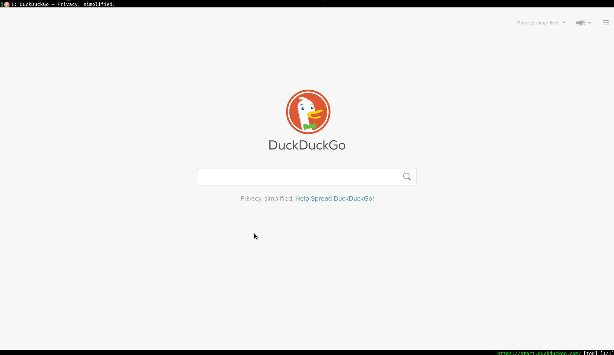

---


# qutebrowser tutorial


## 怎么接触到 qutebrowser

写 qutebrowser 正文前先来聊聊题外话题。我为什么会发现 qutebrowser 这款小众化的浏览器。最初的动机是自己电脑太古老了，跑一些现在的应用程序太卡顿了，为了提升PC的使用体验, 需要采用最小化的应用程序来武装自己的电脑，对于不必要的系统组件尽量不要。毕竟我这台电脑已经不足以带动这么多现代化的大型应用程序。自己的电脑桌面环境从 [Gnome](https://www.gnome.org/) 换成一个激进的 Dynamic Windows Manager [dwm](https://suckless.org/)。用了一周左右，感觉使用比 Gnome 的操作逻辑舒服，体验效果也不错。毕竟 dwm 程序使用纯C写的，代码行数不到2000行。十分精简，所有配置都是直接修改源代码，刚开始使用比较难受, 随后感觉越来越顺手。suckless 的四件套: **dwm, st, dmenu, slock**。以前一直使用 Firefox，最近大量查阅IEEE论文，同时开多个IEEE论文网页, 系统硬件资源就比较吃紧。开其他网页没这么大影响，推测可能是IEEE这个网站对硬件消耗比较大，需要加载的资源比较多。然后第一反应是使用 suckless 的 [surf](https://surf.suckless.org/) 浏览器。毕竟 dwm 在我电脑上运行的还不错。然后花了时间编译运行 surf 浏览器。实际体验效果不是特别好，硬件消耗还是特别严重。查阅网上资料解释说不是 surf 的问题，而是 surf 使用的 **WebKit2/GTK+** 导致硬件消耗比较严重。简单的说就是 surf 不背这锅。 但是由于使用了几天的 surf, 被它的快捷键操作逻辑吸引了，可以大部分时间放下鼠标，直接用键盘驱动浏览器，可以带来快速沉浸式浏览网页的体验。然后查询了和 surf 类似的浏览器一个是 **qutebrowser**, 另一个是 [**vimb**](https://fanglingsu.github.io/vimb/), 而自己使用的 Debian 的最新稳定版本的软件仓库里没有vimb, 所以就选择 qutebrowser 了。

然后就踏上了qutebrowser折腾之路。

---

## qutebrowser introduction


先去 [qutebrowser](https://qutebrowser.org/index.html) 官方网站浏览浏览，下面是这样介绍 qutebrowser。翻译过来就是 qutebrowser 是一个键盘驱动的浏览器。

> qutebrowser is a keyboard-focused browser with a minimal GUI. 
> It’s based on Python and PyQt5 and free software, licensed under the GPL.
> It was inspired by other browsers/addons like dwb and Vimperator/Pentadactyl.

而且 qutebrowser 的键盘配置符合 vim 快捷键，加上自己已习惯 vim 快捷键操作逻辑。正符合我的口味。值得一提的是 qutebrowser 的作者 Github 名: **The-Compiler**, 个人网站 [Florian Bruhin Blog](https://bruhin.software/). 单独一个人就开发一个浏览器GUI, 真厉害！不过由于是单个人开发的浏览器程序，所以没有 Firefox 和 Chrome 功能强大。但是还是值得推荐使用的。值得遗憾的一点就是 qutebrowser 没有 Firefox 和 Chrome 的插件功能。算一个缺点吧！但是 qutebrowser 支持 greasemonkey 油猴脚本和 [userscripts](https://www.qutebrowser.org/doc/userscripts.html)(用户自定义脚本)，算弥补了这一缺陷吧。qutebrowser 支持 Windows, macOS 和 Linux平台。PC三巨头都支持哈！

---
操作环境：

- OS: Debian GNU/Linux 11 (bullseye) x86\_64
- Kernel: 5.10.0-11-amd64
- DE: dwm
- WM: LG3D

---


在 dwm 中使用 qutebrowser，体验效果不错。在 Gnome 中使用 qutebrowser 有空白的区域，感觉没最大化利用屏幕空间，个人感觉有点别扭，有点罪过，所以不会觉得体验效果没有 dwm 舒服。实际在 dwm 或 Gnome 中使用不存在功能差别。


Debian系列安装

```bash
sudo apt install qutebrowser
```
至于其他平台安装教程请参考官方 [qutebrowser Install](https://qutebrowser.org/doc/install.html)

## qutebrowser basic use

### qutebrowser 整体界面简单介绍


界面具体解释：

1. 黑色背景为当前所打开的网页标签，以及打开网页的名字

2. 和vim类似，为输入命令的区域。除了快捷键操作，大部分都在这里输入命令

3. 当前打开网页的URL

4. qutebrowser 打开的标签总数目以及当前所处的标签位置


### 打开帮助文档

因为 qutebrowser 的操作逻辑和 vim 编辑器类似。因此在 qutebrowser 中打开本地帮助文档，直接使用输入 `:help`。



除了打开本地的帮助文档，当然可以使用 [qutebrowser 官方帮助文档](https://qutebrowser.org/doc/help/)。

打开帮助文档后，点击 **quick start guide**链接，并阅读就可以快速上手 qutebrowser。

### 打开一个网页

按快捷键 `o` 然后输入网络需要打开网页的url即可。然后回车。


使用快捷键 `O` 然后输入URL，会新打开一个网页标签。动画演示如下：


使用快捷键 `go` 编辑当前网页url。

### 快速点击当前网页链接

先按快捷建 `f`, 然后网页中的每个链接旁都出现一个字母，输入你想访问链接的字母即可。


### 当前网页浏览

`jkhl` 分别对应vim的上下左右移动。

`gg` 到第一行。

`GG` 到最后一行。


### 标签切换

`shift+j` `shift+k` 分别是向前向后切换标签

`shift+t` 和 `shift+j` 的功能相同


### 前进或后退

`shift+h` 当前标签后退一步网页

`shift+k` 当前标签前进一步网页


### 删除当前标签

`d` (delete)删除(关闭)当前标签

### 撤销刚删除标签

`u` (undo) 撤销刚删除标签，可以连续使用，
多回复几个标签。


### 网页搜索

`/` 和vim操作相同

### 查看历史记录

`:history` 或者 `Sh`(**S**how **h**istory)


### 退出qutebrowser

`:wq` `:q` 关闭 qutebrowser

`:q` 只是关闭当前 qutebrowser, 不保存当前浏览网页界面

`：wq` 保存当前网页浏览界面并退出。下次 qutebrowser 自动打开上次浏览界面。


---


## config qutebrowser

用户配置文件目录`~/.config/qutebrowser`下面的文件有: autoconfig.yml  **bookmarks**   **greasemonkey**  qsettings  quickmarks  **userscripts**。没有的文件或目录可以自己创建。

### autoconfig.yml
`autoconfig.yml` 文件是在 qutebrowser 命令行用 `:set xxxx` 设置然后自动生成到 `autoconfig.yml`。

个人配置文件如下：

```bash
# If a config.py file exists, this file is ignored unless it's explicitly loaded
# via config.load_autoconfig(). For more information, see:
# https://github.com/qutebrowser/qutebrowser/blob/master/doc/help/configuring.asciidoc#loading-autoconfigyml
# DO NOT edit this file by hand, qutebrowser will overwrite it.
# Instead, create a config.py - see :help for details.

config_version: 2
settings:
  aliases:
    global:
      q: close
      qa: quit
      w: session-save
      wq: quit --save
      wqa: quit --save
      zotero: spawn --userscript zotero
  bindings.commands:
    global:
      normal:
        <Alt+1>: null
        g0: null
        g1: tab-focus 1
        g2: tab-focus 2
        g3: tab-focus 3
        g4: tab-focus 4
        g5: tab-focus 5
        g6: tab-focus 6
        g7: tab-focus 7
        g8: tab-focus 8
        g9: tab-focus 9
        xb: config-cycle statusbar.show always never
        xt: config-cycle tabs.show always never
        xx: config-cycle statusbar.show always never;;config-cycle tabs.show always
          never
  colors.tabs.bar.bg:
    global: '#555555'
  colors.tabs.even.bg:
    global: darkgrey
  colors.tabs.selected.even.bg:
    global: black
  colors.tabs.selected.even.fg:
    global: white
  content.blocking.adblock.lists:
    global:
    - https://easylist.to/easylist/easylist.txt
    - https://easylist.to/easylist/easyprivacy.txt
    - https://easylist-downloads.adblockplus.org/easylistdutch.txt
    - https://easylist-downloads.adblockplus.org/abp-filters-anti-cv.txt
    - https://secure.fanboy.co.nz/fanboy-cookiemonster.txt
  content.blocking.method:
    global: both
  content.headers.user_agent:
    https://accounts.google.com/*: Mozilla/5.0 ({os_info}; rv:90.0) Gecko/20100101
      Firefox/90.0
  content.pdfjs:
    global: true
  content.webgl:
    global: true
  downloads.location.directory:
    global: null
  statusbar.show:
    global: always
  tabs.show:
    global: always
  url.searchengines:
    global:
      DEFAULT: https://cn.bing.com/search?q={}
      aw: https://wiki.archlinux.org/?search={}
      b: https://bing.com/search?q={}
      d: https://duckduckgo.com/?q={}
      du: https://www.baidu.com/s?ie=utf-8&f=8&rsv_bp=1&rsv_idx=1&tn=baidu&wd={}
      g: https://www.google.com/search?hl=en&q={}
      re: https://www.reddit.com/r/{}
      w: http://en.wikipedia.org/w/index.php?search={}
      yt: https://www.youtube.com/results?search_query={}
  url.start_pages:
    global: https://start.duckduckgo.com
```

`Alt+num` 在 qutebrowser 的含义是快速跳转到 num 标签，但是与我使用 dwm 的快捷建冲突，故自己定义了快速跳转标签的快捷键为 `g+num`, 上面配置文件有。

尽管 `autoconfig.yml` 是自动生成的，但是你也可以直接复制上面配置内容到你的 `autoconfig.yml` 文件，这样就不需要自己单独设置了。

个人配置文件可以使用 `config.py`. 如果配置文件夹存在 `config.py`, 那么 `autoconfig.yml` 会被覆盖。个人习惯使用 `autoconfig.yml`, 感觉更方便。

### 网络代理配置

qutebrowser 设置网络代理命令 `:set content.proxy socks://127.0.0.1:1080`


你在 `autoconfig.yml` 文件中会发现添加如下内容。

```bash
content.proxy:
  global: socks://127.0.0.1:1080
```

### 引擎搜索
根据前面的 `autoconfig.yml` 文件配置，可快速使用指定引擎搜索。使用命令 `:open b keyword`，其中`b`是我设置的Bing搜索引擎的缩写单词。详细设置参考上述 `autoconfig.yml` 的 **url.searchengines** 部分内容。`DEFAULT` 是在不加指定搜索引擎时，默认使用的收缩引擎。例如：`:open keyword` 就直接使用 `DEFAULT` 设置的默认搜索引擎搜索内容。


### pdf.js
pdf.js 是 Mozilla 开发的一款网络标准的 pdf 阅读器。Firefox 内置的 pdf 阅读器就是使用的 pdf.js。qutebrowser 也是使用 pdf.js 来渲染 pdf 文件。

qutebrowser 使用 pdf.js 需要进行如下设置：

1. 安装 pdf.js 

```bash
sudo apt install pdfjs
```

2. qutebrowser 打开 pdf.js

```bash
:set content.pdfjs true
```

qutebrowser 阅读 pdf 没有显示操作按钮问题，请参考 [pdf.js not show button](https://github.com/qutebrowser/qutebrowser/issues/4289)。

解决方法：去 [Github pdf.js](https://github.com/mozilla/pdf.js/tree/master/web/images) 找到对应的操作图标复制到 `/usr/share/pdf.js/web/images` 中。

qutebrowser 阅读 pdf 中文乱码问题

解决方案：把 [bcmaps](https://github.com/mozilla/pdf.js/tree/master/external/bcmaps) 中内容复制到 `/usr/share/pdf.js/web/cmaps` 中。


### quickmarks

quickmarks 和 bookmarks 没啥区别，但是在 qutebrowser 中建议使用 quickmarks, 你可以理解成其他浏览器中的书签。


对于导入其他浏览器书签到 qutebrowser 请参考 Arch wiki qutebrowser 中的 [Importing quickmarks bookmarks](https://wiki.archlinux.org/title/Qutebrowser#Importing_quickmarks/bookmarks) 小节内容。

下面以 Firefox 为例, 首先从 Firefox 导出书签 bookmarks.html，然后运行如下命令：

``` bash
python /usr/share/qutebrowser/scripts/importer.py bookmarks.html >> ~/.config/qutebrowser/quickmarks
```


### greasemonkey

直接在文件夹 greasemonkey 中添加 `xxx.js` 脚本文件即可。脚本寻找网站：[Greasemonkey](https://greasyfork.org/zh-CN/scripts)。

移除Youtube广告脚本，直接添加到 greasemonkey 配置文件夹中。

```javascript
// ==UserScript==
// @name         Auto Skip YouTube Ads
// @version      1.0.0
// @description  Speed up and skip YouTube ads automatically
// @author       jso8910
// @match        *://*.youtube.com/*
// @exclude      *://*.youtube.com/subscribe_embed?*
// ==/UserScript==
setInterval(() => {
    const btn = document.querySelector('.videoAdUiSkipButton,.ytp-ad-skip-button')
    if (btn) {
        btn.click()
    }
    const ad = [...document.querySelectorAll('.ad-showing')][0];
    if (ad) {
        document.querySelector('video').playbackRate = 10;
    }
}, 50)


```

### zotero

主要自己长期使用 zotero 管理自己的文献，但是 qutebrowser 没有 zotero 插件,但是又想使用 qutebrowser 浏览器和 zotero 交互，在 github 上找到解决方案使用 qutebrowser 的 **userscripts** 功能，可以解决 zotero 交互问题。具体参考 [zotero userscript](https://github.com/parchd-1/qutebrowser-zotero) 把上面脚本添加到 `~/.config/qutebrowser/userscripts` 中，并命名为zotero, 同时添加执行权限。

```bash
chmod +x zotero
```

---

## 快捷键图表


没事多看看这个快捷键图表，提高你使用 qutebrowser 效率。

---

## 备注

I would greatly appreciate hearing about any error in this article, even minor ones.
I welcome your suggestions for improvements, even tiny one. You can give advice on
the following comment area and email to me!. Have fun!

---

## 参考连接


[qutebrowser quick start guide](https://www.qutebrowser.org/doc/quickstart.html)
[qutebrowser userscripts](https://www.qutebrowser.org/doc/userscripts.html)
[qutebrowser help](https://www.qutebrowser.org/doc/help/)


