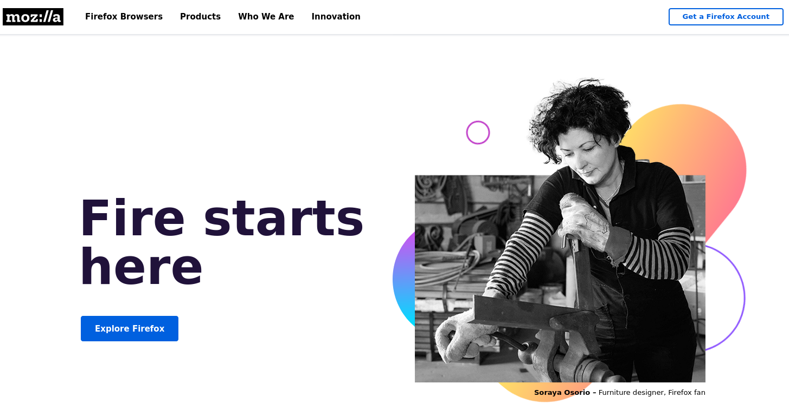

# Recommend Software
为什么要写这篇博文？今天比较闲，闲来没事干，突发奇想，使用电脑也有一段时间了，要不写个blog记录一下自己喜欢使用的软件。文章会持续更新。

计算机行业经过这几十年的发展，已产出成千上万的软件，其中不乏一些优秀实用的软件。当前，软件还是要区分平台的，有些软件依托于windows，有些软件依托于linux，有些软件依托于macOS。我会以平台来分类推荐不同的软件。由于，从未使用过mac，故主要分为windows和linux两大板块来推荐软件，都是自己使用过的，感觉比较nice的。对于自己从未使用的，但是比较优秀的软件并没有加入推荐列表。收录主要标准，其一自己使用过，其二优秀的软件。实际这两个标准是比较主观的。

$$
f(x)=e^{x}
$$

--- 


# Linux 平台

linux平台是开源平台，基本上linux上的软件都是金钱免费的，但是时间不免费，学习成本比较大，有些bug不能及时修复，毕竟开发者纯粹靠热爱自愿投入到软件项目中，基本不靠软件赚钱，有热爱的积极性，但没有金钱强制的积极性。bug修复不即时，但最终会修复。近几年开源界优秀的软件成出不穷，但依旧无法与windows平台软件相比较。就目前而言，windows的生态还是好于linux，可以发现越来越多的大厂，例如 **Microsoft，IBM，Google，Tencent，Huawei，AWS** 等开始拥抱开源，开源界开始朝着越来越好的方向发展。说了这么多题外话，该进入正式话题啦，linux上的优秀软件。

---

## 视频播放软件

[VLC](https://www.videolan.org/vlc/): VLC还是一个不错的视频播放器，基本市面上的视频格式都支持，同时还可以视频格式转换，更强大的是VLC还支持剪切视频。哈哈哈！完全不专注自己的播放器主业，搞一些视频处理的副业务。该视频播放器完全没有广告或弹窗。如下图所示，为VLC网站的官网截图，也说了自己的优点。全平台视频播放器，无论是linux，windows，mac 还是ios，andriod他都有客户端。良心的视频播放软件。有个缺点就是Windows和Linux平台界面有点平淡古老，但是andriod的VLC界面还是挺现代化的。


至于下载开源软件，国内的同学可以去[清华镜像](https://mirrors.tuna.tsinghua.edu.cn/)下载，速度还是比较快的。


linux平台上的视频播放软件太多了，也有比较纯粹简洁的视频播放软件。例如Gnome桌面的**totem**视频播放器。[**mpv**](https://mpv.io/)播放器也是挺nice的，简洁的。

---


## Pdf软件

[Evince](https://wiki.gnome.org/Apps/Evince): Evince是Gnome桌面环境自动安装的pdf阅读器，也是相当的简洁，有简单的批注功能。如果你喜欢像手机一样具有黑夜模式，Evince依旧可以满足你。


[zathura](https://pwmt.org/projects/zathura/): zathura是比Evince更简洁的软件，但是没有批注功能，纯粹的pdf阅读器，高效、轻量。如下图所示，一个菜单选项都没有。当然有快捷建调出它的其他功能。试试按 `Tab`键，看看会发生什么？当然这个也支持黑夜模式，快捷键`Ctrl+R`。


[okluar](https://okular.kde.org/): okluar比前两者都要复杂，功能也更多。对于需要注解，各种标注的同学，可以使用okluar。Okluar也有黑夜模式，自己在设置里面找找会了。


[WPS](https://www.wps.cn/): 如果你想使用像word一样的排版文档处理软件，金山的WPS是一款不错的文档处理套件。今天终于解决Linux下WPS账户登录问题。该问题困扰了接近大概半年了吧！终于找到解决方法了。解决方法很简单，就是我下载WPS的网址有问题。如果使用 **https://www.wps.cn** 下载的WPS deb安装包，是包含登录功能的，但是使用**https://www.wps.com**下载的Linux安装包是没有登录功能。前者安装包大小在300M以上，后者200M以上。有了WPS登录功能，就具有WPS云盘功能，自动备份文档，并且可以在手机和电脑无缝切换，当然多个电脑之间也可以无缝切换。这样一说还是挺方便的(前提是你有一个WPS会员)。值得提醒的linux版WPS是没有广告的。

你可能会好奇，为啥不推荐Adobe Acrobat DC。哈哈Adobe Acrobat DC 确实不错，功能很强大，不过我很少使用它。我会在后续的Windows推荐，在Linux平台尽量推荐一些Linux的特色软件吧！当然，Adobe Acrobat DC 还是有许多优秀的功能的，比如文件的合并，pdf文件OCR，缩小pdf文件大小等。依稀记得，有一次想看一本电子书，电子书内容在各个pdf软件上都乱码，唯独Adobe Acrobat DC 不乱码。顿时对Adobe Acrobat DC产生好感。后来明白出现乱码的原因是自己系统中缺少电子书使用的字体，在无法查到指定的字体时，会使用默认的字体，字体的不匹配，出现了乱码。最后，把字体嵌入pdf文件后，所有pdf软件打开都不会乱码了。哈哈哈！嘴上说不要不要，实际特别想要。你看，我自己都说了这么多Adobe Acrobat DC的优点，还嘴硬，还说不喜欢用Adobe Acrobat DC。我在处理pdf没有办法的时候，才会使用Adobe Acrobat。


---

## 浏览器软件

[Firefox](https://www.mozilla.org/en-US/): linux平台基本都默认安装了**Firefox**，linux浏览器界的王者。尽管Firefox或多或少有些缺点，但是不阻碍我使用它。Firefox的插件，值得推荐。最近Firefox的Andriod平台的浏览器，感觉使用不错，进化啦！至于Firefox 拦截广告的插件使用，可以参考 [ublock origin 教程](https://seanchristspc.github.io/2021/04/20/uBlock-Orgin-Tutor/)。




对于有些网站必须使用Chromium内核，可以使用 [Brave](https://brave.com/)，简单一个字就是"快"。可能你无法访问brave官方网站，那么你需要VPN啦！

推荐一款比较小众的浏览器是 [qutebrowser](https://qutebrowser.org/)，基本可以实现全程快捷键操作。教程请参考自己写的 [qutebrowser blog](https://seanchristspc.github.io/2022/02/20/Qutebrowser/)。是基于 QtWebEngine，而 QtWebEngine 是基于 Chromium的，所以 qutebrowser 支持 Chromium 内核。 另外一款和 qutebrowser 类似的是 [vimb](https://fanglingsu.github.io/vimb/)。


---

## 截图软件

[Flameshot](https://flameshot.org/): 除了系统自带的截图快捷键，最值得推荐的linux截图软件就是**Flameshot**。看了一下官网，现在已经支持windows，Linux，MacOS啦！


---

## 画图软件
[Inkscape](http://https://inkscape.org): 当前**Inkscape**已经更新到1.1版本。有许多新的特点。同样支持 Linux，Windows，macOS。
我主要用 **Inkscape** 来画论文中的图，对于论文中标注的公式或符号可以使用inkscape的 **Latex**功能，可以很方便的输入公式。
特色功能丰富，自己探索吧！


---

## 修图软件
[Gimp](http://https://www.gimp.org): 修图可以用PS（Photoshop），当然可以用GIMP，今天访问 **GIMP** 官网，发现GIMP已经历了25年啦！同样支持 Linux，Windows，macOS。只要你用的熟练，依旧可以与PS相媲美。


---

## 视频处理软件
[Handshake](https://handbrake.fr/): 主要用于视频的格式转换，视频的压缩，由于是图形界面，使用还是挺简单的。依旧是全平台软件。


[ffmpeg](http://https://ffmpeg.org): 无论是视频转换格式，还是剪切视频，还是合并视频，提取声音，合并声音和视频，基本上所有的关于
视频处理都可以使用 **ffmpeg**。其他的一些视频处理软件，基本都使用了ffmpeg。使用命令行的ffmpeg，有点麻烦。不过ffmpeg依旧优秀。
当然你也可以用他截图或录屏。功能十分强大。你也可以使用它的配套命令`ffplay`，播放视频;查看视频文件信息，也可以使用`ffprobe`命令。


---


## 相册管理软件

[darktable](http://https://www.darktable.org):darktable是一个不错的图片管理软件。该图片管理软件主要针对你用相机拍摄图片的管理，可以简单的修改，加滤镜，修改元信息等。界面也较为美观。该软件也是全平台软件（Linux，Windows，macOS）。


---


## 录屏软件

[SSR](https://www.maartenbaert.be/simplescreenrecorder/): simplescreenrecorder看着参数特别多，但是使用还是特别方便的。


[OBS](https://obsproject.com/): 当然录屏软件，怎么能少了 **OBS Studio** 呢？可以录屏，也可以用于直播，不错的软件。


---

## 文献管理软件

[Zotero](http://https://www.zotero.org): Zotero文献管理软件依旧强大。没使用过其他的参考文献管理软件，不做评论。我可以说的是Zotero配合浏览器Zotero插件，可以快捷方便的下载文献，自己导入到Zotero中。 可以配合MS word 的zotero的插件，相当方便的插入**参考文献**，参考文献的索引号会自动更新，解放你参考文献的烦恼。简单方便，同时可以安装Zotero插件，来增强Zotero功能。例如安装[zotero-citationcounts](https://github.com/eschnett/zotero-citationcounts)，可以快速更新文献的被引用数。


---


[Docear](https://www.docear.org): **Docear**(The Academic Literature Suite)，也是文献管理软件，同时也可以做思维导图。不仅可以插入图片，还可以插入 **latex 公式**，简直太舒服了。还可以设置文件超链接。简直就是文献管理全家桶。不过该项目已经太久没更新，维护了。且该软件依托于 **jdk8**，其他更高版本的jdk无法使用。对于要写文献综述，该文献管理软件可以提升你的效率。有个缺点，界面有点复古，不够现代化！哈哈哈！


上述两款文献管理软件可以结合使用，都是全平台软件。

---


## 文本编辑软件

[Vim](http://https://www.vim.org): Vim文本编辑器，依旧强大。有学习门槛和学习成本。现在我使用文本编辑大部分时间被vim占有，我姑且称为超级记事本。学习教程可以参考[Linux简单教程](https://seanchristspc.github.io/2018/03/19/Linux_Introduction/)中的 **vim**部分。Vim中尤其爱使用**snippet**功能，可以试试。


[Sublime](https://www.sublimetext.com/): Sublime Text 也是不错的超级记事本。这个和Vim相比，学习成本较低，基本开箱即用。依旧是优秀的文本编辑器。写一些脚本，或一些简单的程序，依旧可以使用它。这个是需要付费的，如果不购买，偶尔会提醒你需要订阅该软件，提醒频率不高，有闲钱就买一个，没闲钱，提醒时，把提醒框关掉就行了。


**两款文本编辑软件也是全平台软件。** 至于VSCode，目前没使用过，不做评论。

---


## 磁盘分析软件

[Disk Usage Analyzer](https://help.gnome.org/users/baobab/3.24/): 该磁盘分析软件是相当不错的。对于我这种希望手动删除不需要的文件，手动分析各文件在磁盘的占有率，使用该软件清理磁盘空间是一个不错的选择。该软件还有一个名字： [**baobab**](https://gitlab.gnome.org/GNOME/baobab). 命令行使用`baobab`运行该软件。


---


## 下载文件软件

[FreeDownLoad](https://www.freedownloadmanager.org): 该软件作为自己的默认下载器，可以开启多线程下载，提升自己的下载速度。全平台软件。


---

## 字典软件

[Goldendict](http://goldendict.org/): 字典查询软件。需要自己添加符合格式的字典库文件。该字典查询软件既可以使用自己的字典库查询，也可以使用在线查询，需要添加在线查询网址，想当与浏览器查询字典。该字典查询软件有个快捷使用方式。你先用鼠标选中你需要查询的单词，然后连续两次`Ctrl+C`，可以弹出一个查询结果对话框。快捷查询单词，但是无法翻译文章，仅仅用于作为字典，还是相当有用的。


离线的字典在无网络的时候是挺有用的。但是有时我们需要知道一些单词的具体用法，或者例句。离线的 Goldendict 可能不够使用，这里推荐一些在线的字典网站。当然[百度翻译](https://fanyi.baidu.com/)和[微软字典](https://cn.bing.com/dict?FORM=HDRSC6).


---

- [cambridge dictionary](https://dictionary.cambridge.org/dictionary/english-chinese-simplified/)

- [macmillan dictionary](https://www.macmillandictionary.com/)

- [merriam webster](https://www.merriam-webster.com/)

- [linguee dictionary](https://www.linguee.com/chinese-english)

- [collins dictionary](https://www.collinsdictionary.com/dictionary/english-chinese)

- [the free dictionary](https://www.thefreedictionary.com/)

- [dictionary](https://www.dictionary.com/)

- [urban dictionary](https://www.urbandictionary.com/)

- [visual dictionary](http://www.visualdictionaryonline.com/)

- [vidtionary](http://www.vidtionary.com/)


---


## 终端扩展软件

[Zsh](https://www.zsh.org/): zsh是一个shell。Linux常规默认的shell是Bash。为了更高效的使用的Terminal，可以使用zsh，可以提高输入命令的速度。对于一个已经使用Linux多年的菜鸟，最近发现自己使用 **Terminal**的频率比较频繁。闲下来想想，是时候提升自己使用Terminal的效率了。回想起以前听过的`zsh`，就试试它吧！至于安装 `sudo apt install zsh`，还是挺方便的。如果不配置，直接这样使用zsh，是感觉不出差别的。和zsh配套的配置框架有许多。我使用了网上介绍最多的 [Oh My zsh](https://ohmyz.sh/)，这个折腾比较简单，方便。安装zsh并配置后，使用终端的效率大幅提升。

但是，对于Oh My zsh配置框架，当使用的插件较多时，速度就会变慢许多，使用越多的zsh插件，速度越慢。为了解决插件多，zsh速度变慢的问题，可以使用原生的zsh和 [zinit](https://github.com/zdharma/zinit)。zinit相当与zsh的插件管理软件。这样速度提升了。使用大量zsh插件，也不会卡顿。

**zsh**也是最近才发现的，感觉相见恨晚。这么优秀的shell，真该早点使用。不过，在你使用一段时间的bash后，再使用zsh，确实感觉舒服多了，好像任督二脉被打通了一样。


---


## 排版软件

[TexLive](http://tug.org/texlive/): 排版软件是相当不错的，很好的支持数学公式。和word相比，word是所见即所得的排版软件，但是Tex不是，需要先编写代码，再编译，然后生成Pdf文件。这样说起来，比Word复杂多了。你的直觉是对的。但是随着你文档的内容的不断增加，使用word修改文章是很消耗时间，word排版的时间和你的内容量基本成超线性关系，但是使用Tex排版，内容量和排版时间基本线性关系。如果你是一篇小文档，用word或WPS都挺OK的，但是如果文档内容过多，推荐使用Tex。对于交叉引用特别多的文档，使用Tex不失为一种较好的选择。你可以去[清华镜像源](https://mirrors.tuna.tsinghua.edu.cn/)下载 **TexLive**安装文件。


---


## 终端互连软件

[KDE Connect](https://kdeconnect.kde.org/): 各个终端(手机，电脑)互联的软件，对于文件的分享，剪贴板的共享是相当不错的。而且也支持电脑与电脑之间的互联，手机与手机之间的互联。KDE 桌面的用户直接使用 **KDE Connect**即可，对于Gnome桌面的用户，可以使用Gnome的扩展[GSConnect](https://extensions.gnome.org/extension/1319/gsconnect/)，**GSConnect**完全实现了 **KDE Connect**的功能，在Gnome桌面运行良好。macOS也有对应的应用程序[macOS Download](https://binary-factory.kde.org/view/MacOS/job/kdeconnect-kde_Nightly_macos/)，对于iOS目前还在测试阶段，不是特别稳定，可以参考[iOS KDE Connect](https://kdeconnect.kde.org/download.html)。Windows平台可以通过**Microsoft Store** 安装，对于Win7用户没有 **Microsoft Store**，可以通过[离线安装](https://download.kde.org/unstable/kdeconnect/win64-pre-20.08/).Andriod在国内的主流应用商店都没有对应的软件，可以访问 [F-driod](https://f-droid.org/packages/org.kde.kdeconnect_tp/)，直接下载对应的kde apk文件。

用于多设备之间的文件分享还是挺不错的，文件传输速度取决于路由器和两个互联设备的网络性能，10M/s是可以达到的。该软件的使用有一个前提，就是所有设备处在同一个局域网下才能相互连接。简单的来说，需要你的设备连接同一个WIFI，或路由器。官方的对该软件的解释如下：

> Enabling communication between all your devices. Made for people like you. 


我在使用GSConnect的时候，由于防火墙端口没有开放，导致无法发现其他设备。
[参考教程](https://userbase.kde.org/KDEConnect#I_have_two_devices_running_KDE_Connect_on_the_same_network.2C_but_they_can.27t_see_each_other)

```bash
sudo firewall-cmd --zone=public --permanent --add-port=1714-1764/tcp
sudo firewall-cmd --zone=public --permanent --add-port=1714-1764/udp
sudo systemctl restart firewalld.service
```

[KDE 帮助文档](https://userbase.kde.org/KDEConnect)


---


## 按键显示软件

最近看别人写的 blog 的 gif 动画演示，都会显示自己的按键操作，而自己的动画演示没有显示按键操作，感觉演示动图没有显示按键，不是特别清晰表达自己操作流程。因此，需要解决按键显示问题。网上查阅了一下资料，最终决定使用 [screenkey](https://www.thregr.org/~wavexx/software/screenkey/)按键显示软件。然后再配合其他录屏软件就可以实现显示按键操作的 gif 动图制作啦！至于 Mac 推荐使用 [keycastr](https://github.com/keycastr/keycastr)。


接下来演示一些 **screenkey** 常用的一些命令：

```bash
screenkey --show-settings
screenkey -g $(slop -n -f '%g')
screenkey -p fixed -g $(slop -n -f '%g')
```
`screenkey --show-settings` 的作用是调出 screenkey 设置窗口，进行一些精细化的设置。

`screenkey -g $(slop -n -f '%g')` 设置你显示 screenkey 的区域，` screenkey -p fixed -g $(slop -n -f '%g')` 命令类似前者。但是在使用该命令需要安装 `slop` [(select operation) 软件](https://github.com/naelstrof/slop)。

---


# Windows 平台

Windows平台，目前PC生态系统最完善的平台，能使用的软件也颇多。基本软件厂商都会适配Windows系统，毕竟Windows在这个地球村上，使用的人数的目前排第一(PC领域)。软件厂商不可能抛弃这么大的用户群体。由于我在windows上使用时间不多，所以没有Linux推荐的软件那么多，基本会和Linux推荐的软件一样。

---

## 视频播放软件

我依旧推荐 **VLC**播放器。当然也可以使用 [**potplayer**](https://potplayer.daum.net/)。

---


## pdf软件

首推 **Adobe Acrobat Pro DC**，无论是阅读还是修改pdf文件，该款Adobe的Pdf处理软件都能从容应对。

也推荐 [**PDF—XChange Views**](https://www.tracker-software.com/)也是一款不错的pdf软件。可以自己定义自己界面的配色，同时标注类型特别丰富。使用顺滑，使用配合自定义快捷键，可以快速的使用该PDF阅读器。


[Sumatra PDF](https://www.sumatrapdfreader.org/free-pdf-reader):如果你追求像Linux pdf的的zathura一样简洁，windows平台的**Sumatra**可能是你喜欢的菜。


---


## 浏览器软件

浏览器软件和Linux推荐的浏览器软件相同 **Firefox或Brave**，请参考前面Linux浏览器软件部分。但对于 qutebrowser 可以在 windows 上使用，但是好像安装要复杂一点。 简单一点的操作可以在 Firefox 中安装 vim 插件。


---

## 截图软件 

除了Linux推荐的 **Flameshot**，也可以使用 **Snipaste**。可以去微软应用商店搜索 **snipaste**，并安装截图软件。


---

## 画图软件

画图软件依旧推荐**Inkscape**，当然你也可以使用微软的**Visio**。不过个人更喜欢使用 **Inkscape**。当然，配合Word使用，还是Visio更方便。


---

## 修图软件

修图软件依旧和Linux推荐的应用程序一样，25岁的 **GIMP**。


---

## 视频处理软件

依旧推荐 **Handshake**和 **ffmpeg**。


---

## 相册管理软件

相册管理软件依旧 **darktable**。


---


## 录屏软件

windows录屏软件就使用 **OBS Studio**吧！


---

## 文献管理软件

既然Zotero和Docear是全平台软件，那么和Linux一样。 **Zotero和Docear** Yes!

---


## 文本编辑软件

Windows平台就使用 **Sublime Text**软件。


---


## 磁盘分析软件

[SpaceSniffer](http://www.uderzo.it/main_products/space_sniffer/): 磁盘分析软件是一款轻量小巧的软件。大概只有3M大小。


---


## 下载文件软件

windows下载软件依旧推荐 **FreeDownloadManager**。


---


## 排版软件

**Word 、TexLive、WPS**。


---

## 终端互连软件

[KDE Connect](https://kdeconnect.kde.org/)


---

## 按键显示软件

[Carnac](http://code52.org/carnac/)

---


# 备注

I would greatly appreciate hearing about any error in this article, even minor ones. I welcome your suggestions for improvements, even tiny one. Please email to me!😜 
