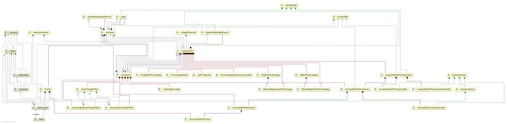

# State模式
用类表示状态

***
## 类图
有点复杂！但只有部分是自己写的，其他是java类库内的类。



粗略简单一点的类图


## 代码
###  State
``` java
package com.sean.State;

public interface State {
	
	public abstract void doClock(Context context,int hour);
	public abstract void doUse(Context context);
	public abstract void doAlarm(Context context);
	public abstract void doPhone(Context context);
}
```

### NightState(具体的状态)

``` java
package com.sean.State;

public class NightState implements State {

	private static NightState singleton = new NightState();
	private NightState(){
		
	}
	public static State getInstance(){
		return singleton;
	}
	public void doClock(Context context, int hour) {
		if(9<=hour || hour<17){
			context.changeState(DayState.getInstance());
		}

	}

	public void doUse(Context context) {
		
		context.callSecurityCenter("紧急！晚上使用金库！");
	}

	public void doAlarm(Context context) {
		context.callSecurityCenter("按下警铃（晚上）");

	}

	public void doPhone(Context context) {
		context.callSecurityCenter("晚上通话录音");
	}
	public String toString(){
		return "[晚上]";
	}

}

```

### DayState(具体的状态)
``` java
package com.sean.State;

public class DayState implements State {

	private static DayState singleton = new DayState();
	private DayState(){
		
	}
	public static State getInstance(){
		return singleton;
	}
	public void doClock(Context context, int hour) {
		if(hour<9 || 17<=hour){
			context.changeState(NightState.getInstance());
		}
	}

	public void doUse(Context context) {
		context.recordLog("使用金库（白天）");

	}

	public void doAlarm(Context context) {
		context.callSecurityCenter("按下警铃（白天）");

	}

	public void doPhone(Context context) {
		context.callSecurityCenter("正常通话（白天）");

	}
	
	public String toString(){
		return "[白天]";
	}
}

```
### Context
``` java
package com.sean.State;

public interface Context {
	public abstract void setClock(int hour);
	public abstract State changeState(State state);
	public abstract void callSecurityCenter(String msg);
	public abstract void recordLog(String msg);
}

```

### SafeFrame
``` java
package com.sean.State;

import java.awt.BorderLayout;
import java.awt.Button;
import java.awt.Color;
import java.awt.Frame;
import java.awt.Panel;
import java.awt.TextArea;
import java.awt.TextField;
import java.awt.event.ActionEvent;
import java.awt.event.ActionListener;

public class SafeFrame extends Frame implements ActionListener, Context {
	
	private TextField textClock = new TextField(60);
	private TextArea textScreen=new TextArea(10,60);
	private Button buttonUse=new Button("使用金库");
	private Button buttonAlarm=new Button("按下警铃");
	private Button buttonPhone=new Button("正常通话");
	private Button buttonExit=new Button("结束");
	private State state=DayState.getInstance();
	//构造函数
	public SafeFrame(String title){
		super(title);
		setBackground(Color.lightGray);
		setLayout(new BorderLayout());
		//配置textClock
		add(textClock,BorderLayout.NORTH);
		textClock.setEditable(false);
		//配置textScreen
		add(textScreen,BorderLayout.CENTER);
		textScreen.setEditable(false);
		//为界面添加按钮
		Panel panel=new Panel();
		panel.add(buttonUse);
		panel.add(buttonAlarm);
		panel.add(buttonPhone);
		panel.add(buttonExit);
		//配置界面
		add(panel,BorderLayout.SOUTH);
		//显示
		pack();
		show();
		//设置监听器
		buttonUse.addActionListener(this);
		buttonAlarm.addActionListener(this);
		buttonPhone.addActionListener(this);
		buttonExit.addActionListener(this);
	}
	public void setClock(int hour) {
		String clockstring="现在时间是:";
		if(hour<10){
			clockstring+="0"+hour+":00";
		}else {
			clockstring+=hour+":00";
		}
		System.out.println(clockstring);
		textClock.setText(clockstring);
		state.doClock(this, hour);
	}

	public State changeState(State state) {
        System.out.println("从"+this.state+"状态变为了"+state+"状态");
		this.state=state;	
		return state;
	}

	public void callSecurityCenter(String msg) {
		textScreen.append("Call!"+msg+"\n");

	}

	public void recordLog(String msg) {
		textScreen.append("record ... "+msg+"\n");

	}

	public void actionPerformed(ActionEvent e) {
		System.out.println(e.toString());
		if(e.getSource()==buttonUse){
			state.doUse(this);
		}else if (e.getSource()==buttonAlarm) {
			state.doAlarm(this);
		}else if (e.getSource()==buttonPhone) {
			state.doPhone(this);
		}else if (e.getSource()== buttonExit) {
			System.exit(0);
		}else {
			System.out.println("?");
		}

	}

}

```

### Main

``` java
package com.sean.State;

public class Main {

	/**
	 * @param args
	 */
	public static void main(String[] args) {
		SafeFrame frame=new SafeFrame("state module");
		while(true){
			for(int hour=0;hour<24;hour++){
				frame.setClock(hour);	//设置时间
				try{
					Thread.sleep(1000);
				}catch(InterruptedException e){
					e.printStackTrace();
				}
			}
		}

	}

}
```
## 要点
采用分而治之方针。
**定义接口，声明抽象方法**
**定义多个类，实现具体的方法**

## 参照
> 《图解设计模式》


写这个只是为了加深自己对设计模式的理解，如不明白，可以看 《图解设计模式》。
程序类图使用idea 生成的
