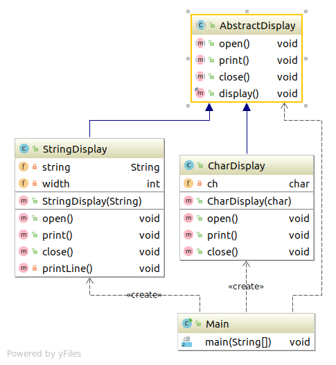

# TemplateMethod模式
将具体处理交给子类
带有模板功能的模式。
在父类中定义处理流程的框架，在子类中实现具体处理的模式就称为TemplateMethod模式。
在抽象类阶段确定处理的流程非常重要。

---

## 类图



## 代码

### AbstractDisplay

``` java
package com.sean.TemplateMethod;
/**
 * 抽象类中可有具体的方法实现
 * 但是如果用接口是不行的（原因：接口不能有具体的方法实现）
 * @author sean
 *
 */
public abstract class AbstractDisplay {
	//修改修饰符可以改变抽象类方法的访问权限问题
	public abstract void open();
	public abstract void print();
	public abstract void close();
	public final void display(){
		open();
		for(int i=0;i<5;i++){
			print();
		}
		close();
	}
}

```

### CharDisplay
``` java
package com.sean.TemplateMethod;

public class CharDisplay extends AbstractDisplay {
	private char ch;
	public CharDisplay(char ch){
		this.ch=ch;
	}
	@Override
	public void open() {
		System.out.print("<<");

	}

	@Override
	public void print() {
		System.out.print(ch);

	}

	@Override
	public void close() {
		System.out.println(">>");

	}

}

```

### StringDisplay
``` java
package com.sean.TemplateMethod;

public class StringDisplay extends AbstractDisplay {
	private String string;
	private int width;
	public StringDisplay(String string){
		this.string=string;
		this.width=string.getBytes().length;
	}
	@Override
	public void open() {
		printLine();
	}

	@Override
	public void print() {
		System.out.println("|"+string+"|");
	}

	@Override
	public void close() {
		printLine();

	}
	
	private void printLine(){
		System.out.print("+");
		for(int i=0;i<width;i++){
			System.out.print("-");
		}
		System.out.println("+");
	}

}

```

### Main
``` java
package com.sean.TemplateMethod;

public class Main {
	public static void main(String[] args) {
		AbstractDisplay d1=new CharDisplay('H');
		AbstractDisplay d2=new StringDisplay("Hello,world");
		d1.display();
		d2.display();

	}

}

```

## 要点

Template Method模式中，父类与子类是紧密联系，共同工作的。在子类中实现父类的抽象方法。

## 参照
> 《图解设计模式》


写这个只是为了加深自己对设计模式的理解，如不明白，可以看 《图解设计模式》。
程序类图使用idea 生成的
