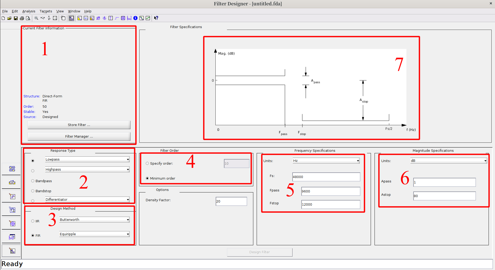
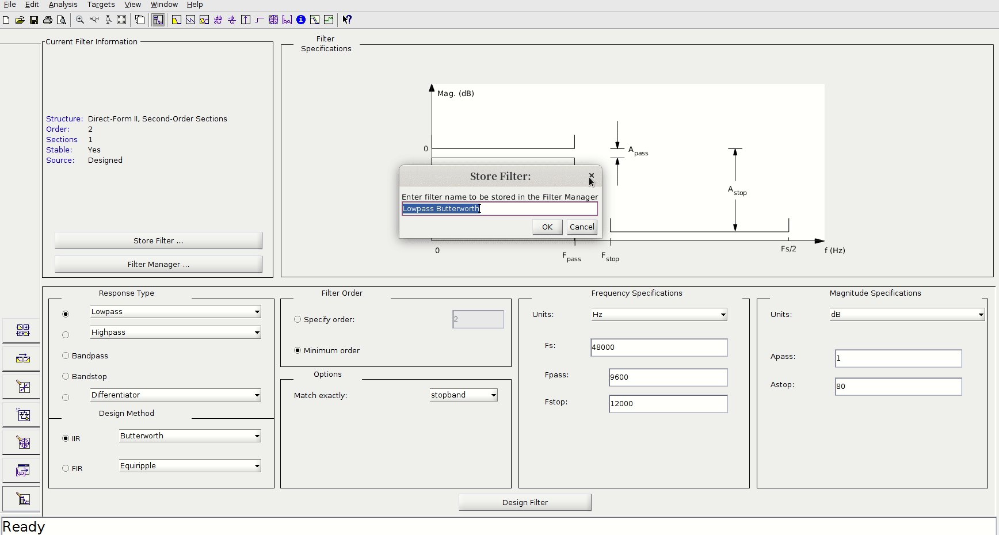
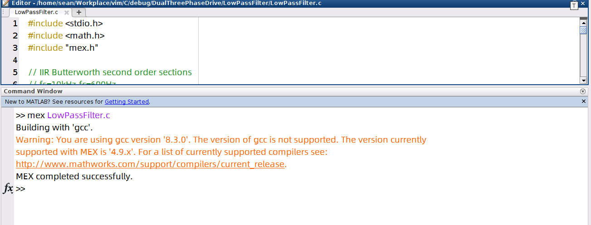
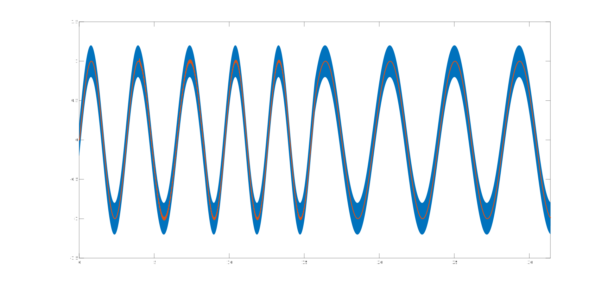
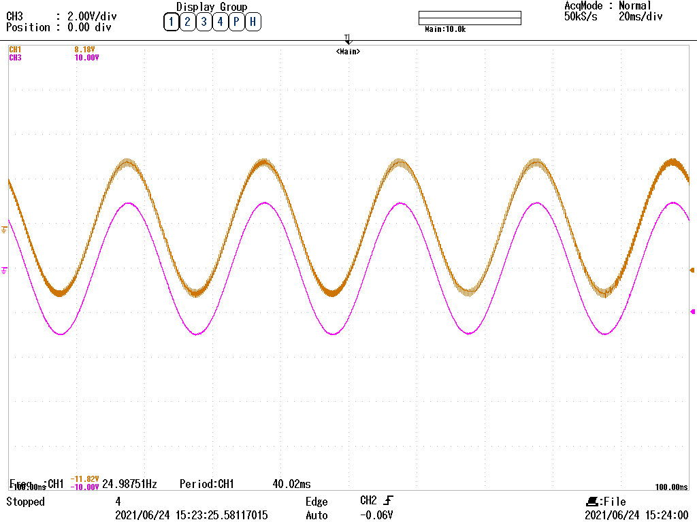

# 为什么要使用 matlab mex

我来聊聊怎么和 **matlab mex** 相遇的吧！哈哈哈！也可以说是我有求于 **matlab mex**，需要它的帮助！

*Matlab Mex brother! help me! help me!* 

自己在用 C 语言写低通滤波器，但是在实际的硬件调试电路中，发现滤波器输出的结果 **inf** (无穷大)，到底是怎么一回事？我应该去哪里 debug 呢？


放下硬件调试电路，去周围溜达溜达，出去透透气，呼吸呼吸人间烟火。休息回来后，思考思考，滤波器为什么不正常工作？ 难道我滤波器参数设置不对吗？还是 C 语言代码出了问题？还是其他原因？为了 debug，还是把这部分滤波器代码分离出来，看看是否正确？ 

在得到输入的信号数据和输出信号数据，需要对他们进行分析。由于有成千上万个数据点，不可能自己手输入到 matlab 数组里面。那么目前有两种方案，解决数据分析问题，第一种还是用C语言分析数据和画图（ C 语言代码偏向底层，不适合分析数据，python 倒是可以，但是我的 DSP 中的程序是C语言，为了保持 DSP 中的代码和我测试代码一致性，python 不适合当前操作。去github上找C语言的图形库函数或数据分析包，这是一个不错的解决方案，但我主观上不像学习其他库函数，学习成本比较大），第二种使用 matlab 和 C 语言的函数接口，即今天的主要内容 matlab mex， 实现C语言数据和matlab数据之间的沟通。

---

# 操作环境

- OS：Linux
- matlab version: matlab 2017b
- gcc verison: 8.3.0 (5.3官方推荐)

---

# 低通滤波器离散设计

使用 matlab 的 filterDesiner 工具来设计低通滤波器，该工具主要用于滤波器的设计，可以设计多种滤波器。

## fiterDesiner quick Overview

在matlab command 窗口输入 `filterDesigner` ，启动滤波器设计工具。如下图所示，为 filterDesigner 启动后的界面。

**各个功能块做如下说明**：

1. 显示当前的设计滤波器的信息，其中 **Order** 指的是滤波器的阶数。
2. 设计滤波器的的类型，是低通滤波器还是高通滤波器还是带通滤波器或是其他的。
3. 滤波器的设计方法，首先分为两大类(针对离散化滤波器设计)，IIR 和 FIR， 然后其中可以选择 butterworth 或 chebyshev I 或 chebyshev II 滤波方法
4. 指定是滤波器的阶数，可以设置指定的阶数，也可以使用自动优化后的最小阶数，一般来说，最小阶数的方法优化的滤波器结果更好，但是阶数一般都大于2阶以上，对于需要二阶或以下的滤波器，需要具体指定阶数。
5. 频率参数的设计，首先是 **Unit** 指定单位，然后 **Fs** 为采样频率， 至于 **Fpass** **Fstop** 可以查看7中的参数，可以明确知道， **Fpass** 为截至频率， **Fstop** 和 **Astop** 配合， **Astop** 指定具体的衰减分贝，对应的频率为 **Fstop**。
6. 幅度参数设置，和频率参数的设计结合使用， **Apass** 就是我们所说的通带衰减分贝和截至频率 **Fpass** 相对应，一般来说 **Apass=3dB**， **Astop** 和 **Fstop** 对应，一般是每20dB对应衰减幅度$\frac{1}{10}$. 分贝公式如下: $$ dB = -20 \lg A $$ A 为增益倍数。

7. 参数设计的参考图


针对**5，6**的设置多看看 **7**就明白了。


# filterDesigner Example

设计二阶低通滤波器，采用 IIR butterworth 滤波器，截至频率 $fc=600Hz$，采样频率$fs=10000Hz$，具体操作，请看如下动图。



设计后的具体参数如下：
```
--------------------------                
Section #1                                
--------------------------                
Numerator:                                
1                                         
2                                         
1                                         
Denominator:                              
 1                                        
-1.475480443592646073724949928873684257269
 0.586919508061190309256005548377288505435
Gain:                                     
0.027859766117136031127188289246987551451 
--------------------------                
Output Gain:                              
1        

```

该参数是z变换下的常数，参数对应的公式如下：

$$H(z)=0.027856\frac{1+2z^{-1}+z^{-2}}{1-1.17548z^{-1}+0.58692z^{-2}}$$

转换成离散表达式：

$$Y(n)=0.027856[X(n)+2X(n-1)+X(n-2)]+1.47548Y(n-1)-0.58693Y(n-2)$$

输入为X，输出为Y。通过上述离散表达式书写C语言数字滤波器。

# 低通滤波器C语言代码

## 二阶数字滤波器宏定义

```C

// IIR Butterworth second order sections
// fs=10kHz,fc=600Hz
#define LPF2_k1      0.02786		//gain
#define LPF2_a11     -1.47548		//denominator
#define LPF2_a12     0.58692
#define LPF2_b10     1*LPF2_k1		//numerator
#define LPF2_b11     2*LPF2_k1
#define LPF2_b12     1*LPF2_k1

#define PI 3.14159

struct filterValues {
	float x[3];	/* input values: x(n):x[0], x(n-1):x[1], x(n-2)=x[2]  */
	float y[3];	/* output values: y(n):y[0], y(n-1):y[1], y(n-2)=y[2]  */
};

```

## 二阶滤波函数

```C
/*! \brief low pass filter
 *
 * second order low pass filter:
 * 	fs=10khz(sample frequency), fc=600hz(cutoff frequency)
 * 	z transfer function:
 * 			   		1+2z^(-1)+z^(-2)
 * 		h(z)=0.02786  ---------------------------------
 *				1-1.47548z^(-1)+0.58692z^(-2)
 *
 * \param inputvalue: current input value
 * \param values: pointer to filtervalues
 *
 * \return no return
 */
void lowpassfilter(float inputvalue, struct filtervalues *values)
{
	values->x[0]=inputvalue;
	values->y[0] =LPF2_b10*(values->x[0])+LPF2_b11*(values->x[1])+LPF2_b12*(values->x[2])-LPF2_a11*(values->y[1])-LPF2_a12*(values->y[2]);

	values->x[2]=values->x[1];                                                  //x存储值更新
    	values->x[1]=values->x[0];

    	values->y[2]=values->y[1];                                                //y存储值更新
    	values->y[1]=values->y[0];                                                //y[0]为最终滤波输出
}


```

## 需要导入的头文件

```C
#include <stdio.h>
#include <math.h>
#include "mex.h"
```

**math.h** 文件主要用于计算 sin 的值，用于产生正弦信号。 **mex.h** 主要用于 C 语言和 matlab 数据交互。

---

# matlab mex

## matlab mex install
matlab mex 的安装比较简单，参考[MinGW-w64 C/C++ Compiler](https://ww2.mathworks.cn/matlabcentral/fileexchange/52848-matlab-support-for-mingw-w64-c-c-compiler?s_tid=mwa_osa_a)，登录 matlab 帐号，下载安装文件即可。用于 Window 平台，GCC 编译器的安装，基本上是点点点就行了。但是需要外网，网络不好，只有手动安装 GCC 编译器。安装 matlab 版本相对应的 GCC 版本，对于 R2017b and R2018a GCC 5.3。最好安装和 matlab 版本一致的版本。 对于linux系统，就无需使用该方法安装 GCC 编译器。linux一般情况下是自带 gcc 编译器，如果没有，安装也比 Windows 方便。当前我的 gcc 版本和官方推荐的版本不一致，比 matlab 推荐的 GCC 版本高，在使用 mex 会有警告，提示版本不一致，可以忽略。至少在我当前使用中是没有问题的。



## matlab mexFunction
C 语言的滤波函数和 matlab mex 已经配置完成。剩下的便是完成 C 语言和 matlab 之间的编程接口。顺便提一下，matlab 的 mex 支持 C 语言和 Fortran 语言。在低通滤波操作使用的是 C 语言。通过 mex 编译 C 语言的源文件，可以得到 matlab 可运行的 mex 文件。从而实现 C 和 matlab 之间的数据交互操作，需要在 C 源代码文件中添加 **mexFunction** 函数，可以理解在C语言中的主函数，用于调用自己写的其他 C 函数，实现具体的功能。

```C
#include "mex.h"				//引入mex头文件
void mexFunction(int nlhs, mxArray *plhs[], 	//输出结果
int nrhs, const mxArray *prhs[])		//输入参数
```

**mexFunction参数**: 

1. **nlhs**: Number of expected output mxArrays  输出结果的数量
2. **plhs**: Array of pointers to the expected output mxArrays  输出结果的指针数组
3. **nrhs**: Number of input mxArrays	输入参数的数量
4. **prhs**: Array of pointers to the input mxArrays. Do not modify any prhs values in your MEX file. 
Changing the data in these read-only mxArrays can produce undesired side effects. 输入参数的指针数组。

一句话总结一下 mexFunction，输出参数的和返回结果的数量和指针数组(存储输入和输出的具体结果)。

## mexFunction中常用函数
对 mexFunction 中需要使用的一些常用函数做简要说明。

`mwPointer mxCreateDoubleMatrix(m, n, ComplexFlag)`
该函数用于创建一个矩阵，m 为行，n 为列， `ComplexFlag` 用于指定矩阵中元素的数据类型，对于实数：`mxREAL`，返回的是该矩阵的指针(地址)。一般是把返回值赋给数组 `plhs[]` 中的一个指针。实际使用该函数，主要用于在内存中为矩阵分配空间。

`double *mxGetPr(const mxArray *pm)` 该函数用于获取数组的首地址，即第一个元素的地址指针。

`int mexPrintf(const char *message, ...)` 和 C 语言中的 `printf()` 函数的用法一样。


## mexFunction 具体C代码
mexFunction 二阶低通滤波器的 C 源代码。在正弦基波分量的基础上，添加了高频率的毛刺(也是正弦分量，只是频率比基波高很多)。如下为二阶低通滤波和 matlab 数据交换的具体代码：


```C
/*
 * nlhs 输出结果 数量
 * plhs 输出结果 指针
 *
 * nrhs 输入参数 数量
 * prhs 输入参数 指针
 *
 */

void mexFunction(int nlhs, mxArray *plhs[],
        int nrhs, const mxArray *prhs[])
{
	int N=400;
	int n=10;	//显示周期数
	int f=3000;	//相对频率
	int i,m;
	float delta=2*PI/N/f;
	float point=0;
    	double *input,*result;
	struct filterValues fvalues={{0,0,0},{0,0,0}};

	plhs[0]= mxCreateDoubleMatrix(1, N*n*f, mxREAL);
	plhs[1] = mxCreateDoubleMatrix(1, n*N, mxREAL);

	input  = mxGetPr(plhs[0]);
    	result = mxGetPr(plhs[1]);
	m=0;
	for (i = 0; i < N*n*f; ++i) {
		input[i]=sin(point)+0.2*sin(point*f);
		point+=delta;
		if (i%(f)==0) {
		LowPassFilter(input[i], &fvalues);
       		result[m]=fvalues.y[0];
	       	m++;	//remember increment m!
		}
		//mexPrintf("y[%d]=%f\n",i,fvalues.y[0]);
	}

}

```

## compile C source file by mex

在 matlab 命令行中输出如下内容，其中 `LowPassFilter.c` 为 C 语言源代码文件。
```C
mex LowPassFilter.c
```

编译成功后，可在 matlab 中直接执行 LowPassFilter 命令，由于上述 mexFunction 有两个返回值，故在matlab Commander窗口输入：

```
[a,b]=LowPassFilter;

% 作图
plot(linspace(0,10*pi,12000000),a)
hold on
plot(linspace(0,10*pi,4000),b)
```


## lowpass filer result

滤波结果，请见下图，可以发现滤波该滤波参数能较好的进行滤波。至于最初为什么实际的硬件电路无法完成滤波，还需进一步查找原因，至少能排除参数和滤波器C语言源代码没有问题。



---

# 滤波器输出inf问题

在实际的 DSP 硬件电路中，数字滤波器输出无穷大 **inf** 问题，即 `filtervalues.y[0]=inf`，需要解决该问题，正如前面排除滤波器 C 语言代码的问题，回想以下。用实际的示波器测量一下滤波器未滤波的波形，发现每个周期有多个突变点，问题应该出在输入波形具有突变的地方，查看输入值的 **inf**，自然滤波得到的结果为无穷大。故在滤波的前，**输入信号增加一个限幅环节**。即在调用 `LowPassFilter(float inputvalue, struct filterDesigner *values)` 之前，添加一句限幅代码。限幅代码添加后，硬件滤波波形完好了。在实际硬件应用中，添加一个限幅环节，完美解决问题。实际的软件仿真模拟中，输入信号比较理想，不存在突变的情况，故可以不加限幅环节。

**限幅！限幅！限幅！**

```C
for (i = 0; i < N*n*f; ++i) {
	input[i]=sin(point)+0.2*sin(point*f);
	point+=delta;
	/************添加的限幅代码 start*********************/
	//limit input values 
	if (input[i]>10) {
		input[i]=10;
	} else if (input[i]<-10) {
		input[i]=-10;
	}
	/*************添加的限幅代码 end********************/
	if (i%(f)==0) {
	LowPassFilter(input[i], &fvalues);
	result[m]=fvalues.y[0];
	m++;	//remember increment m!
	}
	//mexPrintf("y[%d]=%f\n",i,fvalues.y[0]);
}

```

# Conclusion

最终，终于实现 C 代码和 matlab 之间的互通，并且验证自己的数字低通滤波器参数和 C 语言代码都没问题。做一天的硬件调试，发现问题出在未加限幅环节。因为实际的信号存在各种
不确定性，添加限幅环节，可以防止突变。


请看上图的实验波形，棕色波形是带有高频信号噪声的正弦波，紫色波形是经过数字滤波后的的波形。十分赏心悦目，终于实现硬件实验下的数字滤波。


# Reference

[Matlab 帮助文档](https://ww2.mathworks.cn/help/)


# 备注

I would greatly appreciate hearing about any error in this article, even minor ones.
I welcome your suggestions for improvements, even tiny one. Please email to me! 😝

 
