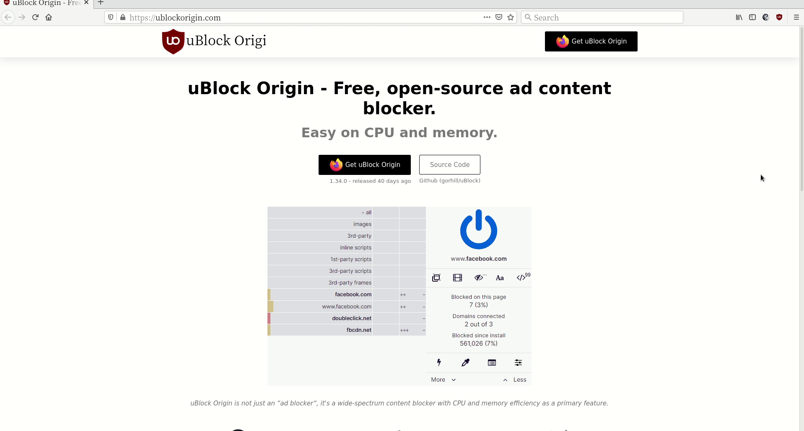
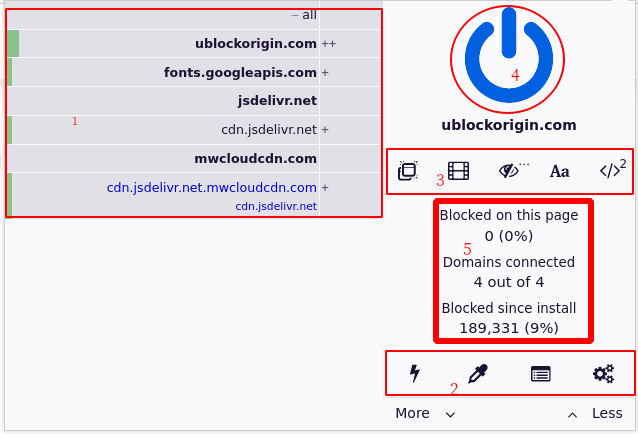
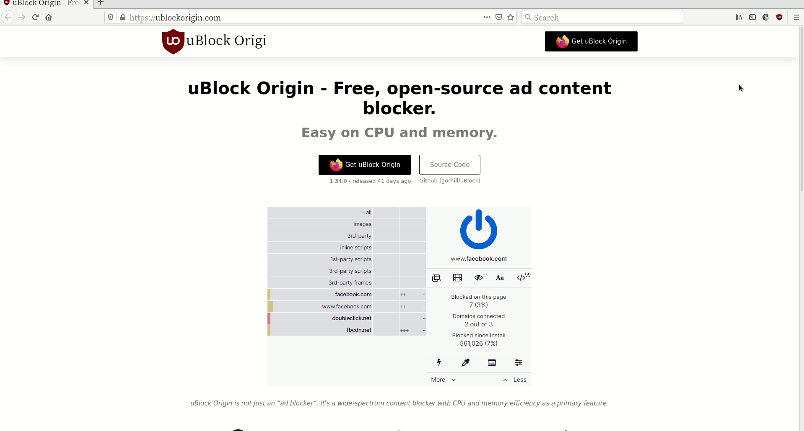
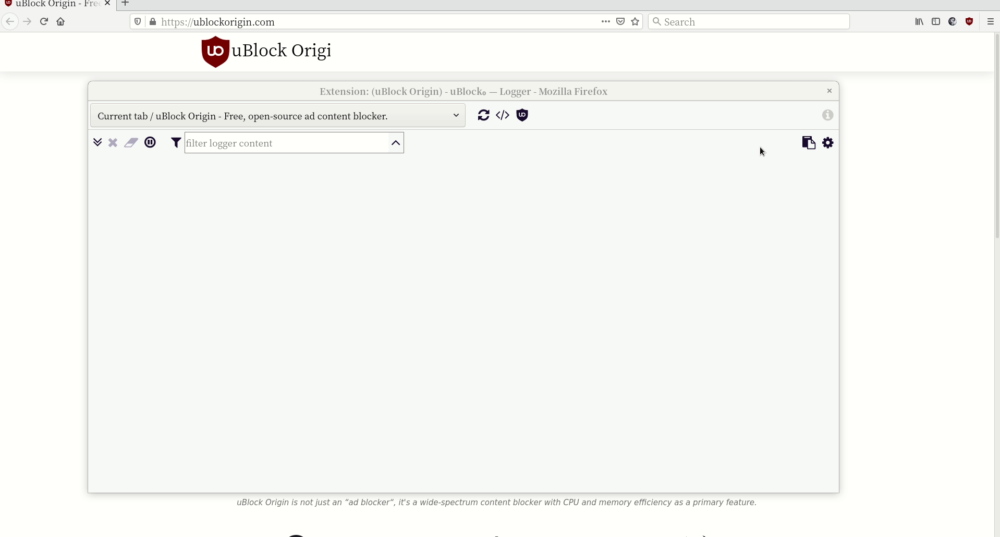
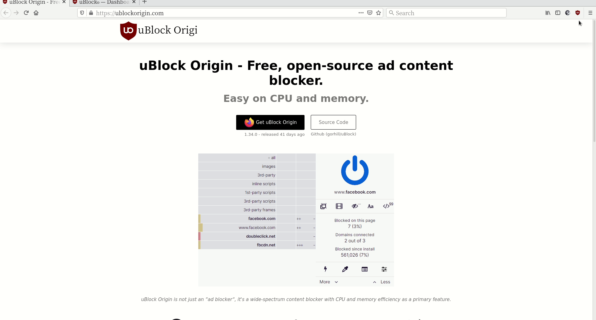
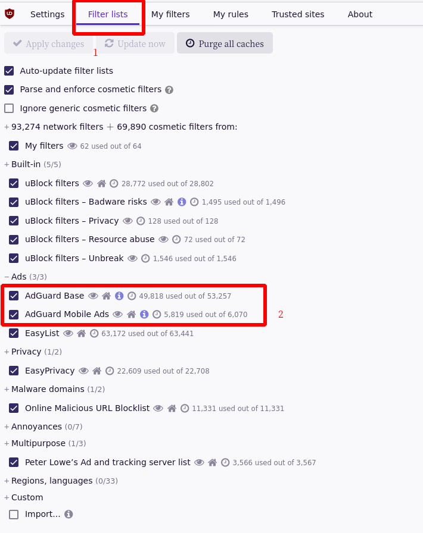
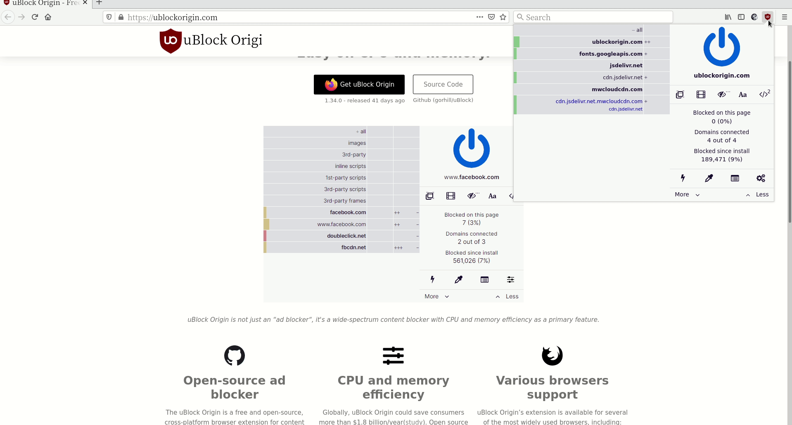
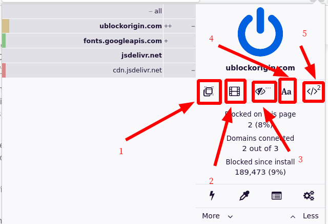

---

# uBlock Origin Tutorial

## 不知为何接触到了 uBlock Origin

什么时候开始接触 [uBlock Origin](https://ublockorigin.com/)？在浏览Firefox插件安装商店的排行榜时，发现**uBlock Origin**
插件使用人数挺多的，于是就安装了！当时看见 **uBlock**就默认为是拦截广告的插件，为了避免广告就安装了！实际最初使用拦截广
告的插件是**AdBlocker Ultimate**, AdBlocker也挺不错的，尝试一下新的广告拦截插件，况且uBlock的酒红色我更偏爱就试试它吧！
以为 **uBlock Origin**和 **AdBlocker Ultimate**一样，安装完无需配置就可以使用！事实上这句话，算正确，也算不正确。如果两者
相同，为什么 **uBlock Origin**作为后来者，增长速度较快于 **AbBlocker Ultimate**? 说明 **uBlock Origin**有它的优势，故我们
要探索探索它的优点。

喂！喂！喂！朋友该进入正题了，不要说这些废话！

客官，好的！开胃菜马上呈上。抱歉！

---

## uBlock Origin Introduction

去官网[uBlock Origin](https://ublockorigin.com/)，发现 uBlock Origin 简介。简单的说就是，免费 开源 的广告拦截器，且低CPU低
Memery 内存消耗,支持各种主流的浏览器。当然少不了去 **Github**查查，Github [uBlock Origin](https://ublockorigin.com/)地址，
同样有介绍！uBlock Origin 哲学"uBlock Origin (or uBlock₀) is not an ad blocker; it's a general-purpose blocker. " 翻译成中文
就是 **uBlock Origin 不只是一个广告拦截器，更是一个通用拦截器。** 恰恰是这句话吸引我去研究它。感觉有一定道理。

## uBlock Origin Install

对于 **uBlock Origin** 安装，最简单的就是取个浏览器插件应用商店安装，这里给出 [Firefox插件应用商店](https://addons.mozilla.org/en-US/firefox/)
地址。官网和Github上也有安装教程，就不做详细介绍了。

---

## uBlock Origin Tricks

有一天天气不错，是个好天气好日子。吃完晚饭，闲来无事，那就研究研究搁下已久的 **uBlock Origin**插件。


>uBlock Origin (or uBlock₀) is not an ad blocker; it's a general-purpose blocker.


### uBlock Origin 菜单快速浏览



### uBlock Origin 菜单概要



如图所示为 uBlock Origin 的菜单概要，并对各功能块编号。

1. 访问该网站请求了网址。

2. uBlock 高级使用菜单栏

3. uBlock 快速功能使用菜单

4. uBlock 开关机按钮

5. uBlock 的信息概要

### uBlock Origin zapper mode



zapper mode 为快速Block当前网页的内容, 但只适用于当前时刻的网页，重新加载网页，阻塞的功能失效。
主要用于仅访问一次的网页，当前时刻不想看见网页的部分内容，可以使用该功能。


### uBlock Origin picker mode


picker mode主要选取该网页想要永久Block的内容（不显示选取的内容），进行快速的选取。选取后，右下角
会弹出一个对话框，其中 **preview** 为预览概选取的内容，有点类似于 zapper mode。 **quit**放弃本次
选取内容， **create** 确认本次选取内容，相当于确认按钮， **pick**重新选取。该功能的选取还是挺方便
Block 自己不想看的内容。


### uBlock Origin logger



uBlock Origin 的日志功能主要查看该网页加载的资源，可以详细的查看，如上述演示，为查看该网站的图片。
更高级的使用技巧，请自己探索探索。


### uBlock Origin dashboard



uBlock Origin dashboard 主要是一些uBlock的设置和自己的过滤规则。可以自己修改过滤的内容。上述演示
内容中，把uBlock网站的Block规则删除，在重新加载网页，恢复原来的面貌了。


在 dashboard 中点击 **Filter lists**，然后把 **Ad** 中的 **AdGuard Base** 和 **AdGuard Mobile Ads**
勾选了，用于 Block 广告。主要该软件是外国人写的，对国外的网站的广告过滤比较友好，对于国内还是自己定制
自己的过滤规则。 也就是 **My filters**的内容，自己添加修改。如果你学过html和css，那么自己过滤内容就挺
方便，因为有些广告用picker无法准确的筛选内容，会存在过滤不准确。




### uBlock Origin Customs

如下是我自己的过滤规则表，可以添加到 **My filters**中。只是我目前使用的，随着你使用的越久，定制的内容就
会越多。可供参考，但不完全正确。

```css
! 2021-03-15 https://www.zhihu.com
www.zhihu.com##.Question-sideColumn--sticky.Question-sideColumn > div > .Sticky

! 2021-03-15 https://www.nfmovies.com
||www.nfmovies.com/static/*.jpg$image

! 2021-03-15 http://www.bimiacg.com
||v.taiqingjiu.com/syjpc/*.gif$image
||v2.taiqingjiu.com/syjpc/*.gif$image
||v.taiqingjiu.com/syjpc/*.gif$image
||ddcdn.jd.com/ddimg/*/*.png$image
||cdn.u1.huluxia.com/g4/*/*.jpg$image

! 2021-03-15 https://blog.csdn.net
blog.csdn.net##.recommend-box
blog.csdn.net##.recommend-tit-mod
blog.csdn.net###asideNewComments > .aside-content
blog.csdn.net###asideHotArticle > .aside-content

! 2021-03-15 https://book.douban.com
book.douban.com##.aside

! 2021-03-15 https://blog.csdn.net
blog.csdn.net###asideHotArticle > .aside-content

! 2021-03-15 https://www.zhihu.com
||pic*.zhimg.com/*.jpeg$image
www.zhihu.com##.Footer

! 2021-03-16 https://blog.csdn.net
blog.csdn.net##.toolbox-list
blog.csdn.net###asideHotArticle > .aside-title
blog.csdn.net###asideNewComments > .aside-title

! 2021-03-16 https://mathworld.wolfram.com
||www.wolframcdn.com/side-images/*$image

! 2021-03-16 https://www.jianshu.com
www.jianshu.com##._3Pnjry
www.jianshu.com##a._1OhGeD.hM7XFL:nth-of-type(2)
www.jianshu.com##._13lIbp
www.jianshu.com##.d0hShY
www.jianshu.com##section.ouvJEz:nth-of-type(2)
www.jianshu.com##._2xr8G8

! 2021-03-17 https://blog.csdn.net
blog.csdn.net###copyright-box
blog.csdn.net##.template-box
||kunpeng-sc.csdnimg.cn/?timestamp=*/$subdocument
blog.csdn.net##.toolbar-container

! 2021-03-17 https://www.jianshu.com
www.jianshu.com##._1CSgtu
www.jianshu.com##.VYwngI
www.jianshu.com##div > ._3Z3nHf

! 2021-03-18 https://www.cnblogs.com
www.cnblogs.com##.RecentCommentBlock > ul
www.cnblogs.com###TopViewPostsBlock > ul
www.cnblogs.com###TopFeedbackPostsBlock > ul
www.cnblogs.com###TopDiggPostsBlock > ul
www.cnblogs.com##.catList > .catListTitle
www.cnblogs.com###recent_comments_wrap > .catListTitle
www.cnblogs.com###topview_posts_wrap > .catListTitle
www.cnblogs.com###topfeedback_posts_wrap > .catListTitle
www.cnblogs.com##.catListView > .catListTitle

! 2021-04-16 https://mail.163.com
mail.163.com##.nui-closeable
mail.163.com##.js-component-link.tL2
mail.163.com###_mail_component_106_106
mail.163.com###_mail_tabitem_3_121
mail.163.com##.mailgg

! 2021-04-16 https://mail.126.com

mail.126.com##.mailgg
mail.126.com###_mail_tabitem_3_121
mail.126.com##.gWel-bottom
mail.126.com###_mail_component_106_106
mail.126.com###_mail_component_113_113

```


### uBlock Origin 快速功能使用





快速功能使用各模块解释

1. 阻止所有该网站的弹出窗口
2. 阻止该网站的大的媒体文件元素
3. 关闭Cosmetic filters的过滤功能
4. 阻止网站使用远程字体（网页显示的字体可能是远程下载的，也可能是本地加载的）
5. 禁止网站javascript(对于有些网站，禁止js，会出现显示异常或无法加载网页)

点击 **锁** 一样的图片，指永久改变该网站的阻塞内容。


---

## 备注

I would greatly appreciate hearing about any error in this article, even minor ones.
I welcome your suggestions for improvements, even tiny one. You can give advice on
the following comment area and email to me!. Have fun!


## 参考连接

[uBlock Origini Official site](https://ublockorigin.com/)

[uBlock Origin Github](https://github.com/gorhill/uBlock)


	

